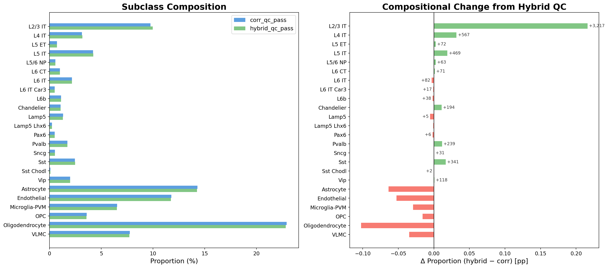

# Cell Type Mapping Pipeline: Methods and Validation

## 1. Overview

We mapped cell types in 24 human DLPFC Xenium sections (12 SCZ, 12 control; 1.3M cells; 300-gene panel) to the SEA-AD MTG taxonomy (24 subclasses, 137 supertypes). The core challenge is cross-platform label transfer: Xenium's 300 genes capture only ~1% of the transcriptome measured by the snRNA-seq reference (137,303 cells x 36,601 genes), and platform-specific artifacts (optical detection limits, probe specificity) make standard integration approaches unreliable.

Our solution is a self-referencing correlation classifier that operates entirely within the Xenium feature space, combined with nuclear-informed doublet resolution that rescues cells conservatively excluded by initial QC. The pipeline produces 1,302,631 QC-pass cells with cell type assignments validated against an independent MERFISH reference.

---

## 2. Pipeline Summary

```
Step 00: Create h5ad from raw Xenium data
Step 01: Spatial QC (negative probes, gene counts, total counts)
    → 1,298,687 cells pass basic QC (24 samples)

Step 02: MapMyCells HANN label transfer
    → class/subclass/supertype labels + confidence scores
    → Used as input for exemplar selection, not as final labels

Step 02b: Two-stage correlation classifier
    → Build centroids from top-100 HANN exemplars per type (from Xenium data)
    → Stage 1: Subclass assignment via Pearson correlation (24 types)
    → Stage 2: Supertype assignment within subclass
    → QC: Flag bottom 1% margin per sample + spatial doublets
    → Save centroids to disk for step 04

Step 03: Export transcript coordinates (feeds step 04 + viewer)

Step 04: Nuclear doublet resolution (hybrid QC)
    → Build nuclear count matrices from transcript coordinates
    → Reclassify doublets using nuclear-only counts
    → Rescue high-UMI cells, reinstate resolved doublets
    → 1,302,631 cells pass hybrid_qc_pass (76% doublet resolution rate)

Step 05: Cortical depth model (trained on MERFISH, uses hybrid_qc_pass)
Step 06: Spatial domain annotation + layer assignment (uses hybrid_qc_pass)

Step 07: Viewer export (per-sample JSON + standalone HTML)
Step 08: Cell + nucleus boundary polygon export

Analysis: Cortical cells → crumblr compositional regression (SCZ vs Control)
```

| QC Step | Cells | Lost | % Lost |
|---------|-------|------|--------|
| Raw (all cells) | 1,339,151 | — | — |
| Step 01: spatial QC | 1,298,687 | 40,464 | 3.0% |
| Step 02b: corr_qc_pass | 1,297,413 | 41,738 | 3.1% |
| **Step 04: hybrid_qc_pass (final)** | **1,302,631** | **36,520** | **2.7%** |

*Cell counts reflect all 24 samples. The hybrid_qc_pass count exceeds corr_qc_pass because nuclear doublet resolution rescues resolved doublets and high-UMI cells. Br2039 is excluded from downstream disease comparisons due to high white matter content (54%).*

---

## 3. Correlation Classifier

### Centroid construction from HANN exemplars

Allen Institute's MapMyCells HANN classifier provides initial cell type labels with bootstrap-based confidence scores (100 iterations, 0.5 subsampling). Rather than using these labels directly — HANN confidence thresholds aggressive enough to be useful removed ~25% of cells, disproportionately deep excitatory neurons and rare interneurons — we use the top 100 highest-confidence HANN exemplars per type (pooled across all Xenium samples) to build per-type centroid expression vectors. Expression is normalized (counts per 10k, log1p) and averaged. Because centroids are built from Xenium data itself, they inherently capture platform-specific expression characteristics, eliminating cross-platform normalization issues.

### Two-stage hierarchical Pearson correlation

**Stage 1 (Subclass):** Each cell's normalized expression is correlated against all 24 subclass centroids. The winning subclass is assigned along with the correlation value and *margin* (best minus second-best correlation). Both cell and centroid vectors are z-scored before correlation.

**Stage 2 (Supertype):** Within the assigned subclass, each cell is correlated against only the supertype centroids belonging to that subclass. This prevents biologically impossible assignments (e.g., an L2/3 IT cell being called an Sst supertype).

The 300-gene panel provides sufficient marker resolution to validate assignments at the single-molecule level:


*Figure 1. Transcript-level cell type identity for six exemplar subclasses. Each panel shows a single cell with individual marker transcript molecules (e.g., CUX2 for L2/3 IT, PVALB+GAD1+GAD2 for Pvalb). Scale bar = 10 um.*

### QC: margin filtering and spatial doublet detection

**Margin filtering:** The bottom 1st percentile of subclass correlation margins per sample are flagged as low-confidence (~12,350 cells total). Per-sample thresholds account for variation in data quality across sections.

**Spatial doublet detection** identifies cells with biologically implausible marker co-expression:
- *Glut+GABA doublets:* Cells expressing 4+ of 7 GABAergic markers (GAD1, GAD2, SLC32A1, SST, PVALB, VIP, LAMP5) while also expressing glutamatergic markers. False-positive rate validated at 0.098% in snRNA-seq.
- *GABA+GABA doublets:* GABAergic cells co-expressing SST + PVALB + LAMP5 simultaneously (<0.01% in snRNA-seq).

Flagged cells show the expected doublet signatures: mixed marker expression from both neuronal classes and ~1.7-1.9x elevated UMI counts.


*Figure 2. Marker detection rates comparing normal cells and doublets. Glut+GABA doublets express markers from both neuronal classes — a pattern expected from two co-captured cells.*

Transcript-level visualization directly confirms that doublet cells contain interleaved GABAergic and glutamatergic marker molecules within a single segmented cell body:


*Figure 3. Individual transcript molecules within cell boundaries. Red = GABAergic markers; blue = glutamatergic markers. Normal cells show transcripts from one class only; doublets contain both.*

### Why not Harmony?

We benchmarked against Harmony + kNN label transfer (the standard cross-dataset integration approach). Harmony showed systematic failure modes with 300-gene Xenium data: Sst was inflated to 12.1% of cells (vs 2.5% expected), driven by non-neuronal cells (VLMC, Astrocyte) being misassigned into GABAergic space. Overall subclass agreement with both the correlation classifier and HANN was only 69%. The fundamental issue is that Harmony corrects batch effects between same-technology datasets, but cross-modality integration (snRNA-seq vs Xenium) introduces systematic differences — detection budgets, probe specificity, and PCA on 300 curated marker genes — that go beyond batch effects. Self-referencing centroids built from Xenium data avoid these problems entirely.


*Figure 4. Subclass proportions across classification methods. Note Sst inflation and non-neuronal distortion in Harmony results.*

---

## 4. Nuclear Doublet Resolution

### Motivation

Inspection of doublet cells revealed that mixed-type marker transcripts concentrate in the cytoplasmic compartment, suggesting most doublets arise from mRNA spillover between neighboring cells during segmentation rather than true co-expression. Since nuclei are spatially more isolated, nuclear-restricted transcripts should be less affected by spillover.

### Method

For each sample, the pipeline builds a nuclear-only count matrix by intersecting per-molecule transcript coordinates with nucleus boundary polygons (Shapely STRtree spatial indexing). Each doublet-flagged cell is reclassified using nuclear-only counts against the pre-built correlation centroids:
- **Resolved:** Nuclear classification agrees with the non-doublet class identity (cytoplasmic spillover confirmed)
- **Persistent:** Nuclear classification still shows mixed-class identity (true doublet)
- **Nuclear-only:** Not flagged by whole-cell, but nuclear classification reveals a different class
- **Insufficient:** <50 nuclear UMIs

The hybrid QC mask combines: basic QC (with high-UMI-only failures rescued), correlation margin filter, resolved doublets reinstated to PASS, and persistent/nuclear-only/insufficient set to FAIL.

### Results across 24 samples

| Category | Count | % of Flagged |
|----------|-------|-------------|
| Whole-cell doublets (QC-pass) | 10,505 | 100% |
| Resolved (cytoplasmic spillover) | 7,941 | 75.6% |
| Persistent (true doublets) | 2,539 | 24.2% |
| Insufficient evidence | 25 | 0.2% |
| Nuclear-only (new detections) | 2,128 | — |

The overall resolution rate is **75.8%** (range: 68-83% across samples). Resolved doublets show high marker scores in the whole-cell compartment but low scores in the nuclear compartment, directly confirming cytoplasmic spillover as the mechanism.


*Figure 5. Nuclear doublet resolution outcomes across all 24 samples. The majority of whole-cell doublets (75.8%) are resolved by nuclear-only classification.*


*Figure 6. Marker expression evidence for doublet resolution. Resolved doublets show high whole-cell but low nuclear marker scores. Persistent doublets maintain high scores in both compartments.*

### Rescue impact on cell composition

The hybrid QC filter passes 26,453 more cells than the original corr_qc_pass, primarily from high-UMI cell rescue (+20,788) and resolved doublet reinstatement (+8,069), offset by persistent doublets confirmed (-2,469) and nuclear-only doublets added (-2,167).


*Figure 7. Subclass composition before and after hybrid QC. Left: paired proportions under corr_qc_pass vs hybrid_qc_pass. Right: differential impact showing which types are preferentially rescued or removed.*

### Validation: disease comparisons unchanged

Hybrid QC produces near-identical SCZ vs Control compositional regression results (crumblr logFC correlation r = 0.9998). The same two types reach FDR < 0.05 under both filters: L6b (increased in SCZ, FDR = 0.005) and Endothelial (decreased in SCZ, FDR = 0.027).


*Figure 8. Compositional regression effect sizes: corr QC vs hybrid QC. The logFC values are nearly identical, and the same disease signals reach significance under both filters.*

---

## 5. External Validation: MERFISH Benchmark

We compared Xenium cell type proportions and laminar depth distributions against the SEA-AD MERFISH dataset (341,595 cortical cells, 27 donors, manual layer annotations) as an independent external validation.

### Cell type proportions

| Level | Correlation Classifier r | Harmony r | n types |
|-------|-------------------------|-----------|---------|
| Subclass (Pearson, log-scale) | **0.80** | 0.73 | 24 |
| Supertype (Pearson, log-scale) | **0.73** | 0.60 | 110 |

The correlation classifier tracks the MERFISH reference more closely than Harmony at both resolution levels, particularly for non-neuronal types where Harmony shows the largest distortions (Sst inflated ~4x, VLMC nearly absent).


*Figure 9. Subclass proportions: Xenium vs MERFISH reference. Left: Correlation Classifier (r = 0.80). Right: Harmony (r = 0.73). Dashed line = perfect agreement.*

### Laminar depth distributions

Median cortical depth per subclass correlates at r = 0.92 with the MERFISH reference, confirming spatially coherent laminar assignments. At supertype resolution, paired depth distributions show close agreement between MERFISH manual depth annotations and Xenium predicted depth across the full laminar gradient:


*Figure 10. Supertype depth distributions for glutamatergic subclasses. Green = MERFISH manual depth, orange = Xenium predicted depth. Supertypes ordered by median MERFISH depth. The correlation classifier recovers the expected superficial-to-deep ordering within each subclass.*

---

## 6. Robustness

The key disease signals — L6b increase in SCZ (FDR = 0.005) and Endothelial decrease in SCZ (FDR = 0.027) — are robust across all cell typing and QC configurations tested:

| Configuration | L6b SCZ FDR | Endothelial SCZ FDR |
|--------------|-------------|---------------------|
| Final pipeline (hybrid QC) | 0.0047 | 0.0267 |
| Flat correlation classifier | ~0.005 | ~0.03 |
| Disable margin filter | 0.0043 | ~0.03 |
| HANN confidence threshold = 0.5 | — | — (removed 25% of cells; abandoned) |
| Harmony (flat or hierarchical) | — | — (69%/60% agreement; not used) |

Both signals persist regardless of classifier hierarchy, QC stringency, or doublet handling, suggesting genuine biological effects rather than artifacts of any particular cell typing approach.
