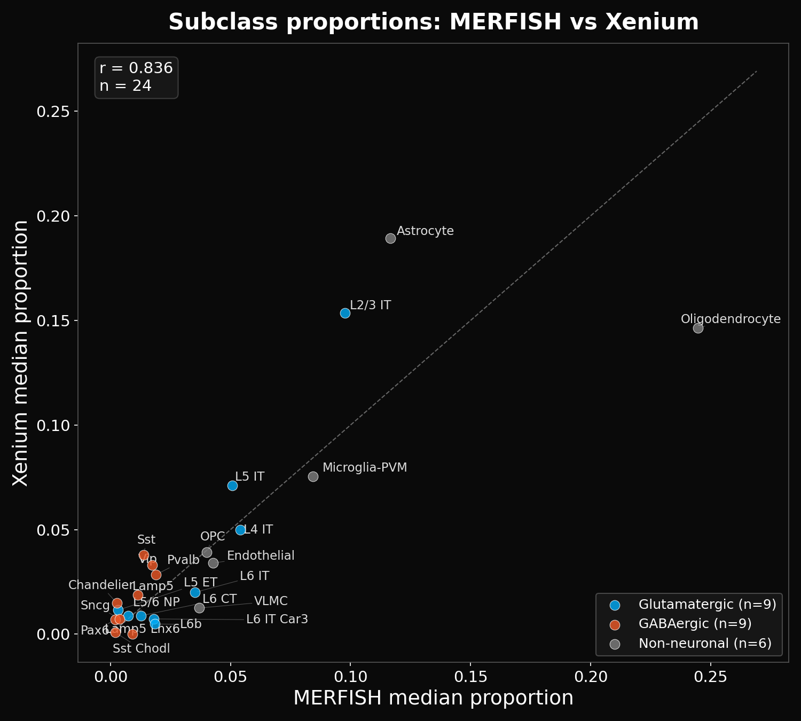
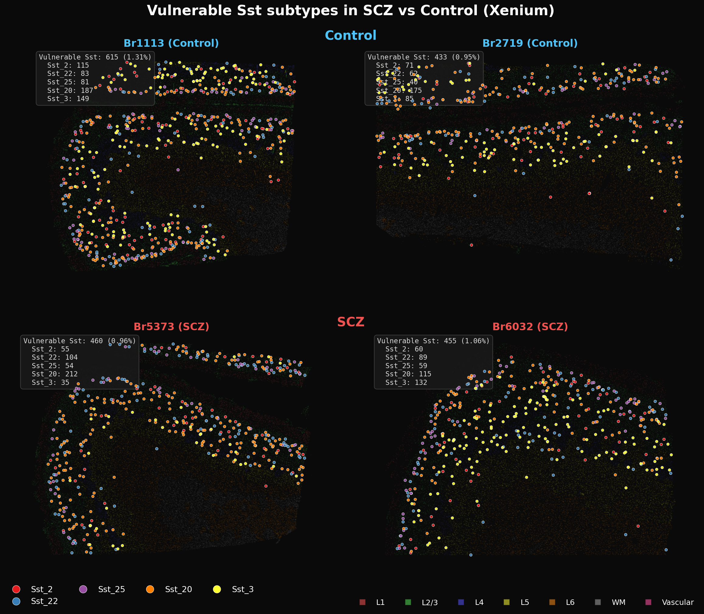

# Cross-Platform Concordance and Interpretation Guide

## Purpose

This document assesses how well the Xenium spatial transcriptomics results agree with independent reference datasets — the SEA-AD MERFISH spatial atlas and a snRNA-seq schizophrenia meta-analysis — and uses that concordance to distinguish findings that can be stated with confidence from those that remain tentative. Read this before exploring the detailed analyses in `output/marker_analysis/` or `output/depth_proportions/`.

---

## 1. Xenium vs SEA-AD MERFISH: Cell Type Proportions

The SEA-AD MERFISH dataset (341,595 cortical cells, 27 neurotypical donors, 180-gene panel, manual layer annotations) provides an independent spatial reference for validating Xenium cell type assignments. Because both platforms measure spatially resolved single cells in human temporal/prefrontal cortex, proportion agreement directly tests whether the correlation classifier produces biologically accurate cell type labels.

### 1.1 Subclass-level concordance

Median subclass proportions correlate at **r = 0.84** between Xenium Control samples (n=12) and MERFISH (n=27). Most subclasses fall near the identity line, with systematic deviations limited to a few types:

- **Oligodendrocyte**: slightly underrepresented in Xenium relative to MERFISH (~15% vs ~25%), likely reflecting the DLPFC vs MTG tissue difference and possibly lower detection efficiency for oligodendrocyte markers in the 300-gene panel
- **Astrocyte**: slightly overrepresented in Xenium (~19% vs ~13%)
- **Microglia-PVM**: overrepresented in Xenium (~8% vs ~4%), consistent with known Xenium detection biases for immune markers

*Figure 1: Subclass proportions — Xenium Control median vs SEA-AD MERFISH median. r = 0.84, n = 24 subclasses. Dashed line = perfect agreement.*

The per-layer concordance is also strong. Within each cortical layer (L2/3, L4, L5, L6), Xenium and MERFISH subclass proportions correlate at r = 0.70–0.92, confirming that the depth model and layer assignments produce biologically accurate laminar distributions.

### 1.2 Supertype-level concordance

At the supertype level (131 types), the concordance is necessarily weaker — the 300-gene Xenium panel lacks discriminating markers for many within-subclass distinctions. Overall accuracy against MERFISH ground truth is **84.9%** at the subclass level when the correlation classifier is applied to MERFISH data directly. Most subclasses achieve >80% accuracy (Astrocyte 95%, Oligodendrocyte 96%, L2/3 IT 90%, Pvalb 90%). Notable exceptions include **L6 IT Car3** (69%), **Lamp5** (55%), **Lamp5 Lhx6** (55%), and **Sst** (69%) — types where the 300-gene panel lacks sufficient within-subclass markers to resolve supertypes cleanly.

### 1.3 Depth profile concordance

Median cortical depth per subclass correlates at **r = 0.96** (subclass) and **r = 0.95** (supertype) between Xenium predicted depth and MERFISH manual annotations, confirming the depth model is well-calibrated:

*Figure 2: Median depth from pia — Xenium vs MERFISH. Left: subclass level (r = 0.96, n = 23). Right: supertype level (r = 0.95, n = 131). Near-perfect agreement confirms spatially coherent laminar assignments.*

Full depth profile comparisons (proportion vs depth curves for all subclasses) show strong agreement between Xenium Control samples and MERFISH reference, with minor divergences only at the WM boundary. See Figures 9–10 in the [Depth-Stratified Analysis Report](output/depth_proportions/DEPTH_STRATIFIED_ANALYSIS_REPORT.md).

### 1.4 Classifier validation summary

The correlation classifier (step 02b) achieves r = 0.81 against MERFISH proportions (Controls only), compared to r = 0.73 for Harmony-based integration. Critically, Harmony misclassified non-neuronal types into GABAergic categories (e.g., VLMC classified as OPC 82% of the time) and inflated Sst proportions to 12.1% vs the expected 2.5%. See [Cell Typing Methods & Benchmarking](cell_typing_methods_writeup.md) for the full comparison.

---

## 2. Xenium vs snRNA-seq Meta-Analysis: SCZ Effects

The critical question is not just whether Xenium measures cell types accurately, but whether the SCZ vs Control compositional differences it detects are real. We compared Xenium SCZ effect sizes against an independent snRNA-seq meta-analysis of schizophrenia (multiple cohorts, dissociation-based single-nucleus profiling).

### 2.1 Supertype-level SCZ effect concordance

Across 106 shared supertypes, Xenium spatial logFC and snRNA-seq meta-analysis beta values correlate at **r = 0.47** (p = 4.3 × 10⁻⁷) for all supertypes, and **r = 0.48** (p = 8.4 × 10⁻⁷) for neuronal supertypes only:

*Figure 3: SCZ effect sizes — snRNA-seq meta-analysis (x) vs Xenium spatial compositional logFC (y). r = 0.47 across 106 supertypes. Labeled points highlight the largest concordant and discordant effects.*

When using cell density (cells/mm²) rather than compositional proportions, the concordance improves to **r = 0.55** (p = 8.0 × 10⁻¹⁰), suggesting that absolute density captures SCZ effects more faithfully than compositional analysis (which is subject to the zero-sum constraint):

*Figure 4: SCZ effect sizes — snRNA-seq meta-analysis (x) vs Xenium spatial density logFC (y). r = 0.55, n = 106 supertypes. Density-based effects show stronger agreement than compositional effects.*

### 2.2 Concordant findings across platforms

The following SCZ effects are detected independently by both Xenium spatial and snRNA-seq meta-analysis, providing the strongest evidence:

| Supertype | snRNAseq direction | Xenium direction | Interpretation |
|-----------|-------------------|------------------|----------------|
| Sst_25 | ↓↓ (β = −0.38) | ↓↓ (logFC = −0.67) | Strong concordance — both platforms detect Sst_25 depletion |
| Sst_22 | ↓ (β = −0.27) | ↓ (logFC = −0.29) | Concordant Sst depletion |
| L6b_4 | ↑↑ (β = +0.27) | ↑↑ (logFC = +0.90) | Strong concordance — L6b increase |
| L6b_1, L6b_2 | ↑ | ↑↑ | Concordant L6b increase |
| L6 CT_1 | ↑ (β = +0.35) | ↑↑ (logFC = +0.63) | Concordant deep-layer increase |

### 2.3 Discordant findings: classification artifacts

Some supertypes show **discordant** SCZ effects between platforms — where one shows an increase and the other a decrease. These are red flags for classification artifacts:

| Supertype | snRNAseq | Xenium | Likely explanation |
|-----------|----------|--------|-------------------|
| Sst_20 | ↓ (β = −0.08) | ↑ (logFC = +0.10) | Classification confusion with Sst_3; margin drops significantly in SCZ (p = 2.3 × 10⁻¹⁶). See [Supertype Classification Confidence Report](output/marker_analysis/SUPERTYPE_CLASSIFICATION_CONFIDENCE_REPORT.md) |
| Sst_2, Sst_3 | ↓ | ↓↓ (exaggerated) | Xenium effects larger than expected; possible misclassification spillover from Sst subtypes with low-confidence boundaries |

The Sst subclass is particularly vulnerable because the 300-gene panel contains **0–1 discriminating markers** for most Sst supertypes (see [Panel Design Report](output/marker_analysis/XENIUM_PANEL_DESIGN_AND_SUPERTYPE_CLASSIFICATION.md)). The aggregate Sst depletion signal is real (both platforms agree on overall Sst reduction), but the allocation of that signal across specific supertypes is unreliable.

### 2.4 Supertype-level SCZ effects in Xenium

*Figure 5: Top supertype SCZ effects (proportions). Top row: Sst subtypes. Bottom row: L6b and deep-layer subtypes. Crumblr p-values adjusted for age and sex.*

*Figure 6: Same supertypes, density (cells/mm²). Density effects tend to be larger and more consistent than compositional effects.*

*Figure 7: Aggregated effects for vulnerable Sst subtypes (Sst_2 + Sst_22 + Sst_25 + Sst_20 + Sst_3, top) and all L6b cells at subclass level (bottom). Sst depletion: proportion p = 0.02, density p = 0.17. L6b increase: proportion p = 0.10, density p = 0.08.*

*Figure 8: Spatial distribution of vulnerable Sst subtypes in median-representative Control (top) and SCZ (bottom) sections. Samples chosen as closest to group median Sst proportion (Control: Br1113, Br2719; SCZ: Br5373, Br6032). Layer boundaries shown as colored bands.*

---

## 3. What Can Be Safely Concluded

### 3.1 High-confidence findings (subclass level)

These findings survive multiple independent validations and should be considered robust:

**Oligodendrocyte depletion in SCZ:**
- CLR main diagnosis effect: FDR = 0.0007
- Depth × diagnosis interaction: FDR = 0.045 (concentrated in superficial cortex)
- Per-layer analysis localizes to L2/3: FDR = 0.086 (proportion and density)
- Consistent across compositional (crumblr) and density-based analyses
- Not driven by a single sample or tissue geometry confound

*Figure 9: Deep dive on the Oligodendrocyte L2/3 finding. (A) Depth profile by diagnosis. (B–C) L2/3-specific proportion and density. (D) Proportion across all layers. (E) Per-sample ranked comparison. (F) Oligodendrocyte count vs L2/3 size (confound check).*

The depth-stratified analysis reveals that oligodendrocyte depletion is not uniform across cortex — the non-neuronal depth profiles show clear SCZ–Control separation for oligodendrocytes, with the effect concentrated in superficial layers where oligodendrocytes are normally sparse:

*Figure 10: Non-neuronal subclass depth profiles (% of non-neuronal class). SCZ (red) vs Control (blue). Oligodendrocyte and OPC show clear separation between SCZ and Control curves. Stars indicate per-bin significance.*

*Figure 11: Non-neuronal subclass density profiles (cells/mm²). Endothelial cells show increased density across nearly all depth bins in SCZ.*

**Neuronal laminar architecture is preserved:**
- No neuronal subclass shows a significant depth × diagnosis interaction
- 22/23 subclasses have significant depth main effects (FDR < 0.05)
- Whatever drives SCZ compositional changes operates on the non-neuronal compartment

**Depth model and layer assignments are well-calibrated:**
- Subclass depth concordance with MERFISH: r = 0.96
- Supertype depth concordance: r = 0.95
- All MERFISH-derived layer boundaries validated within ±0.03

The layer-specific density heatmap shows the full pattern of SCZ effects across all subclasses and layers:

*Figure 12: Layer-specific density changes (log₂FC, SCZ vs Control). Layers on y-axis, pia at top. Oligodendrocyte depletion strongest in L2/3. Endothelial increases across multiple layers. See [Depth-Stratified Analysis Report](output/depth_proportions/DEPTH_STRATIFIED_ANALYSIS_REPORT.md) for full per-layer model results.*

### 3.2 Moderate-confidence findings (subclass/supertype level)

These show consistent trends but do not reach FDR significance in all analyses:

**OPC trend in SCZ:**
- Nominally significant in both per-layer and CLR interaction analyses
- Consistent with a broader oligodendrocyte-lineage effect
- FDR = 0.20 (CLR main effect), FDR = 0.35 (interaction) — suggestive but not definitive

**Endothelial density increase:**
- Widespread density increases across L2/3–L5 (multiple nominal p < 0.01)
- Consistent direction across layers (visible in Figure 11 and 12), but no individual test survives FDR

**L6b subclass increase:**
- All L6b supertypes (L6b_1–L6b_6) aggregated at subclass level show increased proportion and density in SCZ
- Aggregated L6b effect: p = 0.10 (proportion), p = 0.08 (density) — see Figure 7
- Concordant with snRNA-seq meta-analysis direction
- But L6b classification has known issues (7.2% still misplaced in upper layers)

### 3.3 Findings that require caution (supertype level)

These should be interpreted carefully due to classification limitations:

**Individual Sst supertype effects:**
- The overall Sst depletion signal appears real (concordant with snRNA-seq)
- But allocation across specific supertypes (Sst_20 vs Sst_3 vs Sst_25) is unreliable
- Only 0–1 within-subclass markers available for most Sst supertypes in the 300-gene panel
- Classification margins for Sst_3 drop significantly in SCZ, indicating diagnosis-dependent misclassification

**Any supertype with LOW classification confidence:**
- 15 of 20 nominally significant supertype effects have LOW confidence ratings
- See the [Supertype Classification Confidence Report](output/marker_analysis/SUPERTYPE_CLASSIFICATION_CONFIDENCE_REPORT.md) for per-supertype ratings

**Non-neuronal supertype distinctions:**
- Astro_3, Oligo_1 vs Oligo_2, Micro-PVM_2 — these show interesting effects but the supertype boundaries are defined by markers largely absent from the Xenium panel
- Subclass-level conclusions (Oligodendrocyte depleted, Astrocyte trending) are safer than supertype-level ones

---

## 4. Hierarchy of Evidence

| Level | What | Concordance | Confidence |
|-------|------|-------------|------------|
| **Subclass proportions** | Xenium vs MERFISH | r = 0.84 | High — both are spatial platforms measuring same tissue types |
| **Subclass depth** | Xenium vs MERFISH | r = 0.96 | High — near-perfect laminar agreement |
| **SCZ effects (density)** | Xenium vs snRNAseq | r = 0.55 | Moderate — independent platforms, different cohorts, different tissue regions |
| **SCZ effects (composition)** | Xenium vs snRNAseq | r = 0.47 | Moderate — compositional constraint attenuates some effects |
| **Per-layer proportions** | Xenium vs MERFISH | r = 0.70–0.92 | High within layers, lower for sparse types |
| **Supertype proportions** | Xenium vs MERFISH | r = 0.35 (per-donor) | Low — insufficient markers for many supertype distinctions |
| **Supertype SCZ effects** | Xenium vs snRNAseq | variable | Type-dependent — check [confidence ratings](output/marker_analysis/SUPERTYPE_CLASSIFICATION_CONFIDENCE_REPORT.md) |

---

## 5. Recommendations for Downstream Use

1. **Report subclass-level results as primary findings.** The Oligodendrocyte depletion, neuronal preservation, and depth-stratified effects are well-validated and should be the headline conclusions.

2. **Use supertype results to generate hypotheses, not confirm them.** Any supertype finding from the 300-gene Xenium panel should be validated in an independent dataset (snRNA-seq, MERFISH, or a higher-coverage spatial platform) before being considered definitive.

3. **Always check the supertype confidence rating** before interpreting a supertype-level result. The [Supertype Classification Confidence Report](output/marker_analysis/SUPERTYPE_CLASSIFICATION_CONFIDENCE_REPORT.md) provides HIGH/MEDIUM/LOW ratings for each supertype based on within-subclass marker coverage in the Xenium panel.

4. **Prefer density over composition for SCZ comparisons.** Density-based effects (cells/mm²) are not subject to the compositional zero-sum constraint and show stronger concordance with snRNA-seq (r = 0.55 vs r = 0.47).

5. **Be skeptical of Sst supertype allocations.** The aggregate Sst reduction is likely real, but the specific supertypes driving it cannot be determined from this panel. The Sst_20/Sst_3 discordance with snRNA-seq is a documented classification artifact.

---

## 6. Related Documents

| Document | Focus |
|----------|-------|
| [Cell Typing Methods & Benchmarking](cell_typing_methods_writeup.md) | Pipeline methods, classifier validation, QC calibration |
| [Depth & Layer Inference Methods](depth_layer_methods_writeup.md) | Depth model, BANKSY domains, layer boundary derivation |
| [Depth-Stratified Analysis Report](output/depth_proportions/DEPTH_STRATIFIED_ANALYSIS_REPORT.md) | Per-layer and CLR depth × diagnosis results with figures |
| [Supertype Classification Confidence](output/marker_analysis/SUPERTYPE_CLASSIFICATION_CONFIDENCE_REPORT.md) | Per-supertype confidence ratings and Sst fragility analysis |
| [Panel Design & Supertype Classification](output/marker_analysis/XENIUM_PANEL_DESIGN_AND_SUPERTYPE_CLASSIFICATION.md) | Cross-platform marker adequacy, add-on gene recommendations |
