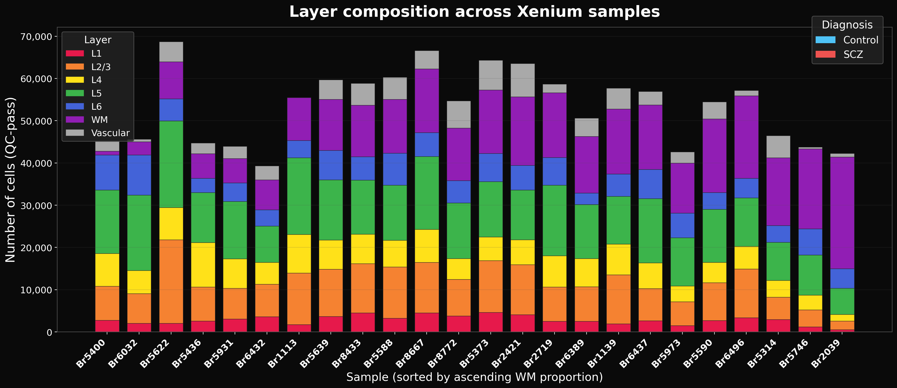
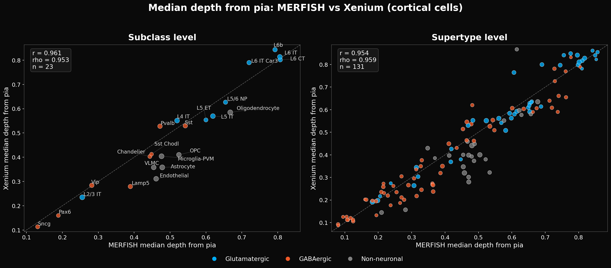
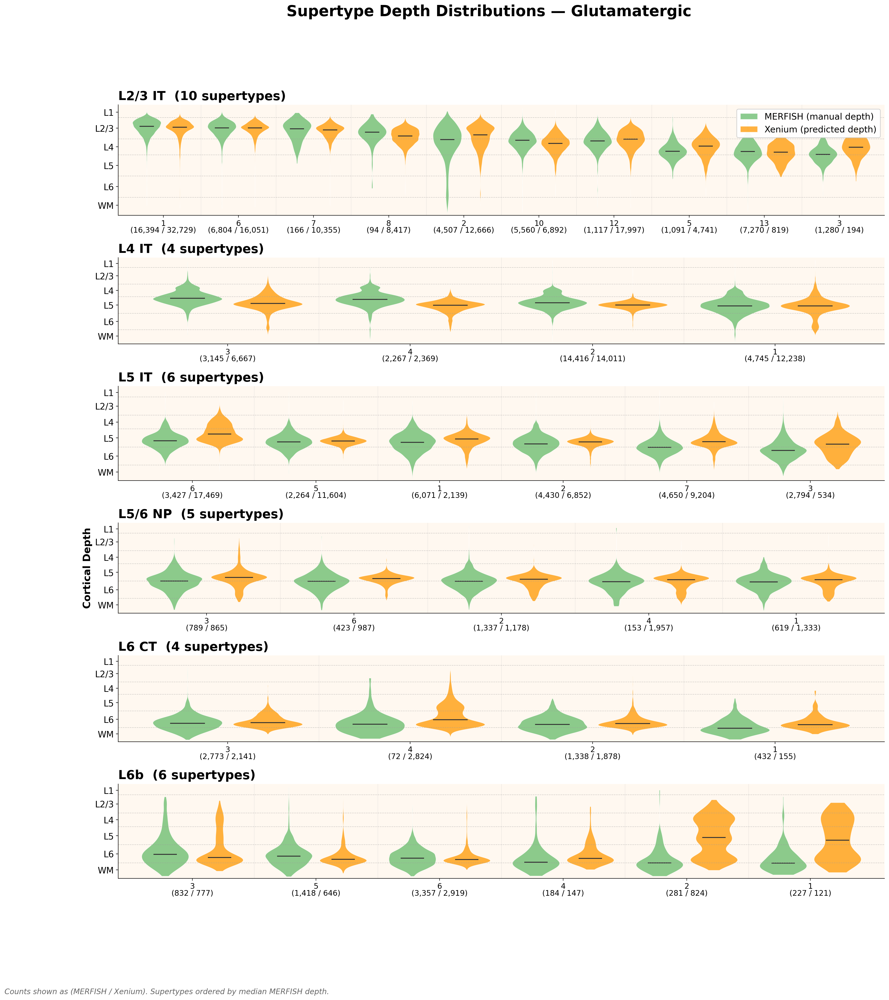
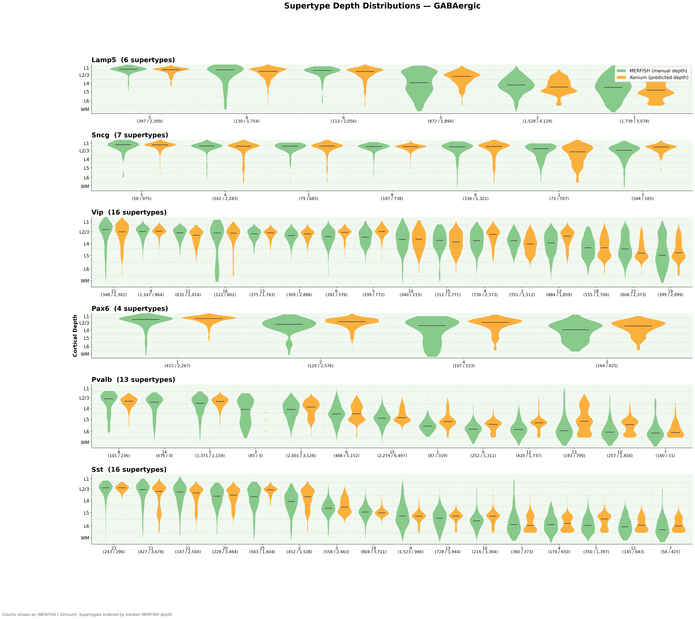
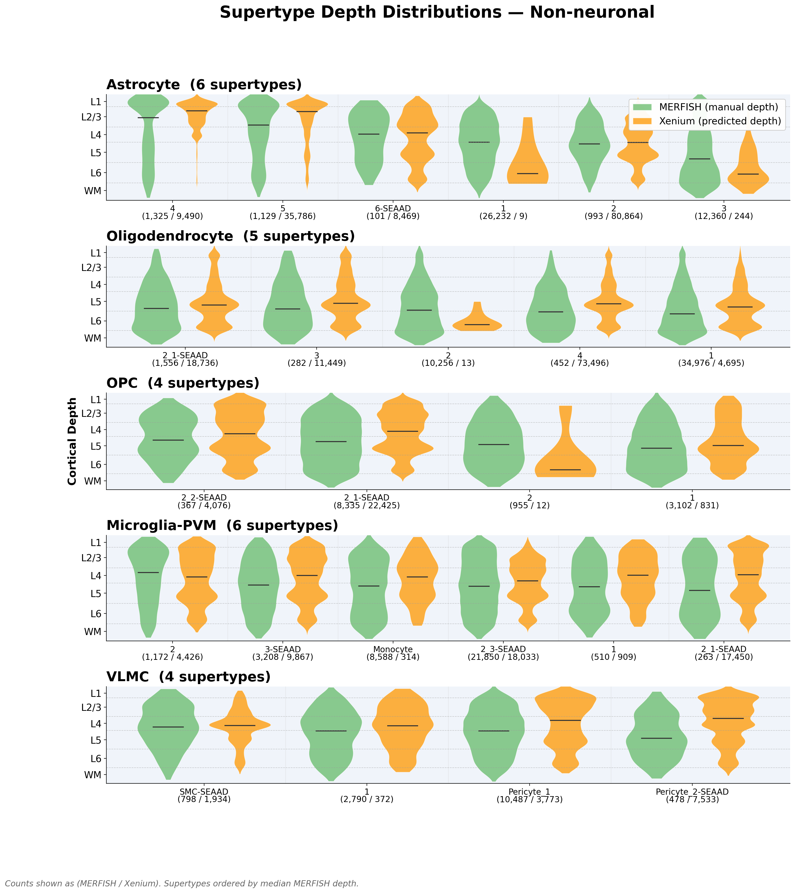

# Cortical Depth and Layer Inference: Methods and Validation

## 1. Overview

Assigning cortical depth and layer identity to spatially resolved cells requires either labor-intensive manual annotation or a computational model that can generalize across tissue sections with variable geometry. We use a neighborhood composition-based depth model trained on the SEA-AD MERFISH reference (which has manual cortical depth annotations) to predict normalized cortical depth for every Xenium cell, then combine this with unsupervised spatial domain classification to assign discrete layer labels and identify non-cortical tissue regions (pia/meninges, vascular clusters).

The pipeline produces three annotations per cell: a continuous depth value (0 = pia, 1 = white matter boundary), a spatial domain label (Cortical, Vascular, or WM), and a spatially-smoothed discrete layer assignment (L1 through WM, or Vascular). A 3-step spatial smoothing pipeline refines the raw depth-bin layers to produce spatially contiguous layer boundaries.

---

## 2. Depth Prediction Model

### Feature construction

Rather than predicting depth from a cell's own gene expression (which would be sensitive to individual cell misclassification), the model uses **local neighborhood composition** as features. For each cell, the K=50 nearest spatial neighbors are identified (ball tree algorithm), and the fraction of each subclass among those neighbors is computed. This produces a feature vector of length 2 x n_subclass: the first half encodes neighbor composition fractions, the second half is a one-hot encoding of the cell's own subclass. The key insight is that neighborhood composition captures local tissue context — a region dominated by L2/3 IT neurons is likely superficial cortex regardless of any individual cell's label — making the model robust to sporadic cell misclassification.

### MERFISH reference training

The model is trained on SEA-AD MERFISH data (cells with manual "Normalized depth from pia" annotations). Training uses a donor-level split: the 3 donors with the fewest depth-annotated cells are held out for testing; the remaining donors form the training set. This ensures the model generalizes across individuals rather than memorizing section-specific patterns.

### Model and performance

The depth model is a `GradientBoostingRegressor` (n_estimators=300, max_depth=5, learning_rate=0.1, subsample=0.8, min_samples_leaf=20). Performance on the held-out MERFISH test donors:

| Metric | Train | Test |
|--------|-------|------|
| R^2 | 0.93 | 0.89 |
| MAE | 0.050 | 0.069 |
| Pearson r | 0.96 | 0.95 |

Predictions are deliberately **not clamped** to [0, 1]. Cells in white matter receive depth > 1 and cells above the pia receive depth < 0, providing natural tissue boundary detection without requiring hard cutoffs.

*Figure 1. Depth model training and validation. Predicted vs actual normalized depth for train and test (held-out donor) sets, with R^2 and MAE metrics.*

### Depth coordinate system

| Normalized depth | Cortical region |
|-----------------|----------------|
| < 0.00 | Above pia (meninges) |
| 0.00 - 0.10 | Layer 1 |
| 0.10 - 0.30 | Layer 2/3 |
| 0.30 - 0.45 | Layer 4 |
| 0.45 - 0.65 | Layer 5 |
| 0.65 - 0.85 | Layer 6 |
| > 0.85 | White matter |

*Figure 2. Spatial depth maps comparing MERFISH manual annotations and Xenium model predictions. Viridis colormap encodes normalized depth (dark = superficial, bright = deep).*

---

## 3. Spatial Domain Classification

### Motivation

Not all tissue on a Xenium section is cortex. Sections may include pia/meningeal tissue (cell-sparse, dominated by astrocytes and microglia), vascular clusters (concentrated Endothelial and VLMC cells), and white matter. The depth model is trained on cortical tissue from MERFISH, so its predictions for non-cortical regions are unreliable. Spatial domain classification identifies these regions so they can be handled appropriately.

### Method: BANKSY spatial clustering

We use BANKSY (Singhal et al., Nature Genetics 2024) for spatial domain classification. BANKSY augments each cell's gene expression with spatial neighbor expression and expression gradients, then performs dimensionality reduction and Leiden clustering in this augmented feature space. This produces spatially coherent clusters by construction — neighboring cells with similar expression are grouped together, naturally recovering tissue domains without requiring separate neighborhood feature engineering.

**BANKSY parameters:** λ=0.8 (spatial weighting), Leiden resolution=0.3, k_geom=15 spatial neighbors, 20 PCA dimensions. Preprocessing: library-size normalization (target 10,000), log1p, z-scoring.

Each resulting cluster is classified by its cell type composition and mean predicted depth (from step 05):

| Domain | Rule |
|--------|------|
| **Vascular** | >50% Endothelial + VLMC |
| **White Matter** | >40% Oligodendrocyte AND mean depth > 0.80 |
| **L1 Border** | >50% non-neuronal AND mean depth < 0.20 → classified as **Cortical** with `banksy_is_l1=True` flag |
| **Neuronal Cortex** | Neuronal fraction > 20% AND 0 ≤ mean depth ≤ 0.90 |
| **Deep WM** | Mean depth > 0.80 (fallback) |
| **Cortical** | Default |

Key advantages of this approach:

1. **L1 border detection**: Shallow non-neuronal-dominated BANKSY clusters are correctly identified as L1 cortex rather than pia/meninges. This is validated by MERFISH comparison: L1 has ~81% non-neuronal composition (astrocytes, microglia, endothelial), yet is cortical tissue. The `banksy_is_l1` flag marks these cells for downstream use.

2. **White matter detection**: BANKSY clusters with high oligodendrocyte fraction (>40%) and deep mean depth (>0.80) are classified as WM, providing explicit white matter identification.

3. **Lower vascular threshold**: BANKSY clusters are spatially coherent by construction, so a 50% Endo+VLMC threshold reliably identifies vascular regions without false positives from scattered cortical vascular cells.

### Aggregate domain breakdown

Across all 24 samples (1,225,037 QC-pass cells), the BANKSY domain distribution is:

| Domain | Cells | % |
|--------|-------|---|
| Cortical (including L1 border) | 744,878 | 60.8% |
| Vascular | 219,030 | 17.9% |
| White Matter | 261,129 | 21.3% |

Note: The Vascular domain fraction (17.9%) is larger than the final Vascular layer fraction (6.8%) because BANKSY captures spatially coherent vascular-associated tissue including border cells. Spatial smoothing (Section 4) subsequently reassigns most border Vascular cells to cortical layers. Similarly, the L1 border flag (6.5% of cells) is used to promote additional cells to L1 during smoothing.

*Figure 3. Per-sample layer composition showing the proportion of cells in each cortical layer, white matter, and vascular domains.*

---

## 4. Layer Assignment

Discrete layer labels are assigned by binning the continuous depth predictions:

| Layer | Depth range |
|-------|------------|
| L1 | < 0.10 |
| L2/3 | 0.10 - 0.30 |
| L4 | 0.30 - 0.45 |
| L5 | 0.45 - 0.65 |
| L6 | 0.65 - 0.85 |
| WM | > 0.85 |

Vascular-domain cells are overridden to "Vascular" regardless of predicted depth, since depth predictions are unreliable for spatially isolated vascular clusters. L1 border cells (identified by BANKSY with `banksy_is_l1=True`) retain their depth-bin layer, which is typically L1 given their shallow position.

### Spatial layer smoothing

Raw depth-bin layers produce noisy boundaries: individual cells may receive incorrect layer assignments due to local depth prediction noise, and border Vascular cells may be classified as Vascular despite being surrounded by cortical tissue. A 3-step spatial smoothing pipeline (`smooth_layers_spatial()` in `depth_model.py`) addresses these issues:

**Step 1: Within-domain majority vote (k=30, 2 rounds).** For each cell, the layer labels of its k=30 spatial nearest neighbors *within the same BANKSY domain* are tallied, and the cell is reassigned to the majority layer. This smooths noisy cortical layer boundaries without allowing reassignments to cross BANKSY domain borders (e.g., a cortical cell cannot be voted into Vascular). Two rounds of voting are applied for convergence.

**Step 2: Vascular border trim.** Border Vascular cells — those with >33% of spatial neighbors in cortical layers (L2/3, L4, L5, L6) — are reassigned to the most common non-Vascular layer among their neighbors. A secondary rule reassigns Vascular cells with >66% of neighbors in any non-Vascular layer (including WM and L1). This trims the Vascular domain from 17.9% (BANKSY domain) to 6.8% (smoothed layer), removing spurious Vascular assignments at domain boundaries while preserving truly spatially contiguous blood vessel regions.

**Step 3: BANKSY-anchored L1 contiguity.** Two sub-steps refine L1 assignment: (a) *Promotion*: cells flagged as `banksy_is_l1` with predicted depth < 0.20 and at least 5% L1 neighbors are promoted to L1, recovering cells that depth binning alone missed. (b) *Removal*: isolated L1 cells (non-BANKSY L1 cells with <20% L1 neighbors, or BANKSY L1 cells with <5% L1 neighbors) are reassigned to their neighbors' majority layer.

The pre-smoothing layers are preserved as `layer_unsmoothed` (depth bins + Vascular override) and `layer_depth_only` (depth bins only, no domain override) for comparison.

### Aggregate layer distribution (spatially smoothed)

| Layer | Cells | % |
|-------|-------|---|
| L1 | 64,119 | 5.2% |
| L2/3 | 215,592 | 17.6% |
| L4 | 146,614 | 12.0% |
| L5 | 284,402 | 23.2% |
| L6 | 124,079 | 10.1% |
| WM | 306,926 | 25.1% |
| Vascular | 83,305 | 6.8% |

### Output columns

Each annotated h5ad file receives the following depth/domain/layer columns:

| Column | Values | Description |
|--------|--------|-------------|
| `predicted_norm_depth` | float | Continuous depth (0 = pia, 1 = WM boundary) |
| `banksy_cluster` | int | BANKSY cluster ID (-1 for QC-failed cells) |
| `banksy_domain` | Cortical / Vascular / WM | BANKSY-based tissue domain |
| `banksy_is_l1` | bool | True if cell in L1 border cluster (shallow, non-neuronal) |
| `spatial_domain` | Cortical / Vascular / Unassigned | Backward-compatible domain (WM mapped to Cortical) |
| `layer` | L1 / L2/3 / L4 / L5 / L6 / WM / Vascular / Unassigned | Discrete layer (spatially smoothed: depth bins + Vascular override + 3-step smoothing) |
| `layer_unsmoothed` | L1 / L2/3 / L4 / L5 / L6 / WM / Vascular / Unassigned | Pre-smoothing layer (depth bins + Vascular override) |
| `layer_depth_only` | L1 / L2/3 / L4 / L5 / L6 / WM | Depth-bin-only layers (no domain override, no smoothing) |

---

## 5. Validation

### Median depth per cell type: Xenium vs MERFISH

The primary validation is whether cell types end up at the expected cortical depths. Comparing median predicted depth per subclass against the MERFISH reference:

| Level | Pearson r | n types |
|-------|-----------|---------|
| Subclass | 0.92 | 24 |

The strong correlation confirms that the depth model recovers biologically meaningful laminar positions. Excitatory neurons show the expected superficial-to-deep ordering: L2/3 IT is shallowest (median depth ~0.24 in Xenium, ~0.26 in MERFISH), progressing through L4 IT, L5 IT, L5 ET, L5/6 NP, L6 IT, L6 CT, to L6b (median depth ~0.80 in both datasets). Non-neuronal types show more variable depths due to their distribution across all layers.

*Figure 4. Median cortical depth per cell type: Xenium predictions vs MERFISH reference. Left: subclass level. Right: supertype level. Strong correlation at both resolution levels confirms the model recovers biologically meaningful depth assignments.*

### Supertype-level depth distributions

At finer resolution, we compare depth distributions for every supertype within each subclass (for subclasses with ≥4 supertypes). Supertypes are ordered by median MERFISH depth, and paired MERFISH (manual depth) and Xenium (predicted depth) violins are shown side by side:

*Figure 5. Supertype depth distributions for glutamatergic subclasses. Green = MERFISH manual depth, orange = Xenium predicted depth. Counts shown as (MERFISH / Xenium). Within each subclass, supertypes are ordered by median MERFISH depth (shallowest left, deepest right).*

*Figure 6. Supertype depth distributions for GABAergic subclasses. Interneuron supertypes show broader depth distributions than excitatory types, consistent with their wider laminar spread, but the overall ordering and distribution shapes are well-matched between MERFISH and Xenium.*

*Figure 7. Supertype depth distributions for non-neuronal subclasses. Non-neuronal types are distributed across all cortical depths, with astrocytes and microglia spanning the full column and oligodendrocytes concentrated in deep cortex/white matter.*

### Key design decisions

1. **Neighborhood-based features for depth** rather than per-cell expression: robust to individual cell misclassification; captures local tissue context
2. **Unclamped predictions**: naturally detects cells outside the cortical column (depth < 0 or > 1) without arbitrary thresholds
3. **Donor-level train/test split**: ensures the model generalizes to new individuals, not just new cells from the same donors
4. **BANKSY for domain classification**: spatially aware clustering (gene expression + spatial context) produces coherent domains without manual neighborhood feature engineering, enabling correct L1 border detection and explicit WM identification
5. **L1 as cortex, not meninges**: MERFISH validation showed L1 has ~81% non-neuronal composition — it is cortex, not pia/meninges. The `banksy_is_l1` flag preserves this distinction for downstream analyses
6. **Spatial smoothing over raw depth bins**: individual cell depth predictions are noisy; spatial majority voting within BANKSY domains produces layer boundaries that are spatially coherent without requiring manual curation. The 3-step pipeline (within-domain vote, vascular trim, L1 contiguity) addresses distinct error modes: noisy cortical boundaries, over-extended vascular domains, and fragmented L1 assignment
