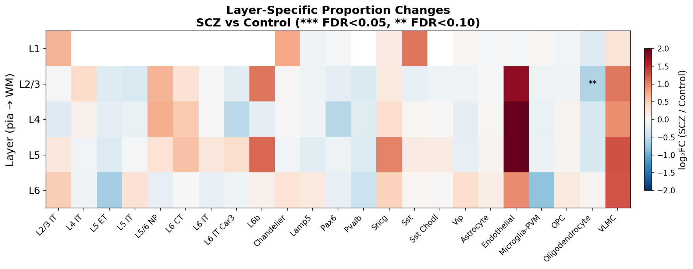
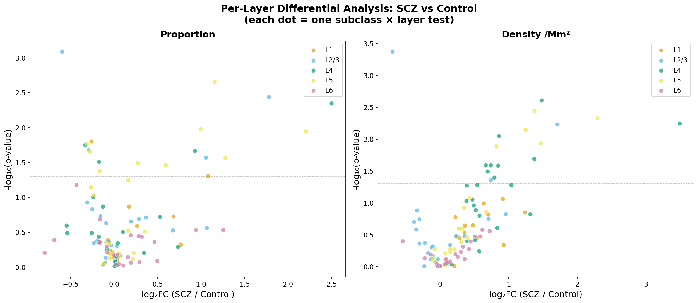
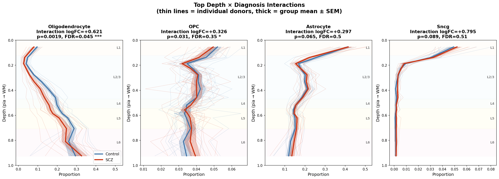
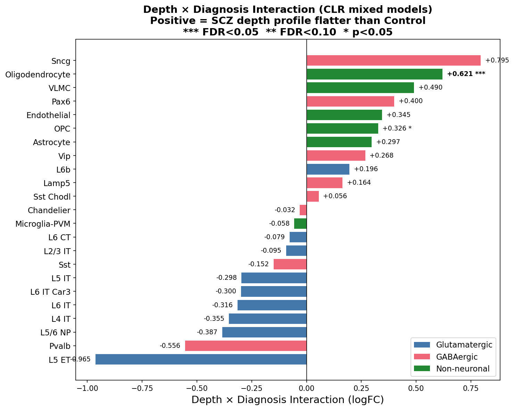

# Depth-Stratified Cell Type Analysis: SCZ vs Control

## 1. Motivation

Standard compositional analyses (e.g., crumblr) collapse cell type proportions across the full cortical section. But cortical cell types have highly non-uniform depth distributions — L2/3 IT neurons concentrate in superficial cortex, while L6 CT neurons and oligodendrocytes concentrate deep. If SCZ selectively affects certain cortical depths (e.g., superficial depletion), a whole-cortex analysis may miss depth-specific effects or attribute them incorrectly.

We developed a depth-stratified analysis framework that uses our predicted normalized depth from pia (trained on SEA-AD MERFISH manual annotations) to test:

1. **Per-layer models**: Does the proportion or density of each cell type differ between SCZ and Control within specific cortical layers (L1, L2/3, L4, L5, L6)?
2. **Depth × diagnosis interaction**: Does the *shape* of a cell type's depth profile differ between SCZ and Control, using CLR compositional analysis across 15 density-adaptive depth bins?

## 2. Methods

### 2.1 Depth prediction and layer boundaries

Normalized depth from pia (0 = pia, 1 = white matter) was predicted for every Xenium cell using a GradientBoostingRegressor trained on SEA-AD MERFISH cells with manual depth annotations. Features: K-nearest-neighbor (K=50) subclass composition + cell's own type.

**Layer boundary derivation**: Boundaries were derived from pairwise excitatory neuron marker crossovers, validated against the SEA-AD MERFISH reference (see `derive_layer_boundaries.py`). For each pair of adjacent layers, the boundary is the depth where the smoothed fraction A/(A+B) = 0.5 using excitatory marker neurons (L2/3 IT, L4 IT, L5 IT/ET/NP, L6 CT/IT/Car3/b). L1/L2-3 boundary uses onset of excitatory density (>25% of peak); L6/WM uses dropoff (<10% of peak).

| Layer | Depth range | Width |
|-------|-------------|-------|
| L1 | 0.000 – 0.123 | 0.123 |
| L2/3 | 0.123 – 0.470 | 0.347 |
| L4 | 0.470 – 0.544 | 0.075 |
| L5 | 0.544 – 0.708 | 0.164 |
| L6 | 0.708 – 0.928 | 0.220 |
| WM | 0.928 – 1.000 | 0.073 |

These boundaries closely match the MERFISH ground truth crossovers (within ±0.03 for all boundaries), confirming the depth model predictions are well-calibrated.

### 2.2 Per-layer models

For each (subclass × layer × outcome) combination:

```
logit(proportion) ~ diagnosis + sex + scale(age) + scale(pmi)
log(density + 1)  ~ diagnosis + sex + scale(age) + scale(pmi)
```

OLS regression, global FDR correction (Benjamini-Hochberg) across all 210 tests.

### 2.3 CLR depth × diagnosis interaction

Cells were binned into 15 **density-adaptive (quantile-based) depth bins**, where bin edges are set so each bin contains approximately equal numbers of cells across the full cohort (~49,000 cells per bin). This gives more resolution in cell-dense regions (L2/3, L5) and less in sparse regions (L1, deep L6).

For each (donor × depth_bin), cell type counts were CLR-transformed (centered log-ratio with pseudocount 0.5). Per-cell-type mixed models:

```
CLR(proportion) ~ depth * diagnosis + sex + scale(age) + scale(pmi) + (1|donor)
```

Where `depth` is the continuous bin midpoint. The `depth:diagnosisSCZ` interaction coefficient tests whether the compositional depth profile differs by diagnosis. FDR correction across 23 tested subclasses.

### 2.4 Cohort

24 Xenium samples (12 SCZ, 12 Control), cortical cells only (spatial_domain == 'Cortical'), correlation-classifier QC-pass. 742,103 total cells with depth predictions.

## 3. Results

### 3.1 Per-layer model results

210 total tests (24 subclasses × 5 layers × 2 outcomes). **0 FDR-significant hits at FDR<0.05; 2 at FDR<0.10**, both involving Oligodendrocyte in L2/3:

| Layer | Subclass | Outcome | log₂FC | p-value | FDR |
|-------|----------|---------|--------|---------|-----|
| L2/3 | Oligodendrocyte | Density | -0.69 | 4.2e-4 | 0.086 |
| L2/3 | Oligodendrocyte | Proportion | -0.60 | 8.1e-4 | 0.086 |

**Interpretation**: Oligodendrocytes are depleted specifically in L2/3 in SCZ — a layer where they are normally present at low density. The wider L2/3 (0.12–0.47 vs old 0.10–0.40) slightly dilutes the effect but the trend remains strong.

Nominally significant trends (p < 0.05 but FDR > 0.05): L6b ↑ in L5 (p=0.002), L6 CT ↑ in L4 density (p=0.002), Sncg ↑ in L5 (p=0.004), Endothelial ↑ in L2/3–L5 (multiple p<0.01). 36 tests at nominal significance, but none survive FDR correction below 0.10.


*Figure 1: Layer-specific proportion changes (log₂FC). Layers on y-axis, pia at top.*


*Figure 2: Layer-specific density changes. Oligodendrocyte depletion strongest in L2/3.*


*Figure 3: Volcano plots for per-layer proportion and density tests.*

### 3.2 CLR depth × diagnosis interaction results

23 subclasses tested with density-adaptive quantile bins.

#### Main diagnosis effect (CLR model)

The CLR model also estimates a main diagnosis effect (averaged across depths). **1 FDR-significant hit**:

| Celltype | Diagnosis logFC | p-value | FDR |
|----------|----------------|---------|-----|
| Oligodendrocyte | -0.718 | 2.9e-5 | 0.0007 *** |

OPC (p=0.018, FDR=0.20) and Astrocyte (p=0.033, FDR=0.25) are nominally significant.

#### Depth × diagnosis interaction

**1 FDR-significant interaction**:

| Celltype | Interaction logFC | p-value | FDR |
|----------|-------------------|---------|-----|
| Oligodendrocyte | +0.621 | 0.002 | 0.045 *** |
| OPC | +0.326 | 0.031 | 0.351 |

With the updated MERFISH-derived layer boundaries, the Oligodendrocyte depth × diagnosis interaction is now FDR-significant (FDR=0.045). The corrected boundaries improved statistical power by better aligning depth bins with true laminar architecture.

**Positive interaction** means the SCZ depth profile is *flatter* than Control — the normal deep-layer concentration is reduced, with relatively more cells in superficial layers.


*Figure 4a: Neuronal subclass depth profiles (% of neuronal class). Stars indicate per-bin significance (Wilcoxon rank-sum, * p<0.05, ** p<0.01, *** p<0.005).*


*Figure 4b: Non-neuronal subclass depth profiles (% of non-neuronal class). Oligodendrocyte and OPC show clear separation between SCZ and Control curves.*


*Figure 4c: Neuronal subclass density profiles (cells/mm²).*


*Figure 4d: Non-neuronal subclass density profiles (cells/mm²). Endothelial cells show increased density across nearly all depth bins in SCZ.*


*Figure 5: Detailed depth profiles for the top 4 interaction hits.*


*Figure 6: Depth × diagnosis interaction effect sizes. Positive = SCZ depth profile flatter.*

### 3.3 Convergence of the two approaches

The per-layer and CLR interaction analyses are methodologically independent but converge:

- **Both identify Oligodendrocyte** as the primary affected cell type
- **Per-layer analysis** localizes the effect to L2/3 (FDR = 0.086 for both proportion and density)
- **CLR model** captures it as a strong overall depletion (main effect FDR = 0.0007) with a significant depth gradient change (interaction FDR = 0.045)
- **OPC** shows nominally significant trends in both analyses, consistent with a broader oligodendrocyte-lineage effect
- **Endothelial** cells show widespread density increases across L2/3–L5 in per-layer models (multiple p<0.01)

### 3.4 Depth model validation

22/23 subclasses show highly significant depth main effects (FDR < 0.05), confirming the predicted depth values faithfully capture known laminar architecture. With updated boundaries, even Chandelier now reaches significance (FDR=0.048). Sst is the only subclass without a significant depth effect, consistent with its known broad distribution across cortical layers.

### 3.5 Layer boundary validation

Layer boundaries were derived from excitatory neuron marker crossovers (see `derive_layer_boundaries.py`), using the pairwise A/(A+B) = 0.5 method. Key improvements over the original hand-set boundaries:

| Boundary | Old | New | Impact |
|----------|-----|-----|--------|
| L2-3/L4 | 0.40 | 0.47 | +7% — largest correction. Many cells were misclassified as L4 that are actually L2/3. |
| L6/WM | 0.90 | 0.93 | +3% — recovers ~15% of L6 cells that were being classified as WM. |
| L1/L2-3 | 0.10 | 0.12 | +2% — minor adjustment. |
| L4/L5 | 0.55 | 0.54 | -1% — essentially unchanged. |
| L5/L6 | 0.70 | 0.71 | +1% — essentially unchanged. |

Xenium crossovers closely match MERFISH ground truth crossovers (within ±0.03 for all boundaries), confirming the depth model predictions are well-calibrated against the reference.

## 4. Key Findings

1. **Oligodendrocyte depletion in SCZ is the most robust finding** — FDR-significant in CLR main diagnosis effect (FDR=0.0007) and depth × diagnosis interaction (FDR=0.045), with strong per-layer trend in L2/3 (FDR=0.086). The depletion is concentrated in superficial cortex.

2. **OPC shows a consistent but weaker trend** — nominally significant in both per-layer and CLR interaction analyses, suggesting the oligodendrocyte-lineage effect extends to precursor cells.

3. **Endothelial cells show widespread density increases** — nominally significant in multiple layers (L2/3, L4, L5) for both proportion and density. Not FDR-significant individually but the pattern is consistent across layers.

4. **Neuronal laminar distributions are preserved** — no neuronal subclass shows a significant depth × diagnosis interaction. Whatever drives the SCZ compositional changes operates on the non-neuronal compartment.

5. **MERFISH-derived layer boundaries improve results** — updating boundaries from hand-set values to excitatory crossover-derived values improved the Oligodendrocyte interaction from FDR=0.105 to FDR=0.045, demonstrating the importance of accurate laminar parcellation.

6. **The depth model works** — 22/23 subclasses show highly significant depth main effects (FDR < 0.05), confirming the predicted depth values faithfully capture known laminar architecture.

## 5. Methods Summary

| Analysis | Script | Output |
|----------|--------|--------|
| Layer boundary derivation | `derive_layer_boundaries.py` | `proposed_layer_boundaries.csv` |
| Layer boundary update | `update_layer_boundaries.py` | Updated h5ad files |
| Data preparation | `build_depth_proportion_input.py` | `cell_level_data.csv`, `layer_counts.csv` |
| Per-layer models | `run_layer_stratified_models.py` | `layer_model_results.csv` |
| CLR depth input | `build_crumblr_depth_input.py` | `crumblr_depth_input_subclass.csv` |
| CLR mixed models | `run_crumblr_depth.R` | `crumblr_depth_results_subclass.csv` |
| Density models | `run_density_models.py` | `density_results_supertype_{cortical,L1-L6}.csv` |
| Depth profile figures | `plot_depth_profiles_clean.py` | 4 PNG figures (neuronal/non-neuronal × proportion/density) |
| Layer heatmap/volcano | `plot_depth_stratified_results.py` | 5 PNG figures |
| Xenium vs MERFISH | `plot_depth_xenium_vs_merfish.py` | 3 PNG figures |

## 6. Caveats

- **Sample size**: n=12 per group limits power for subtle effects
- **Depth prediction**: Based on a model trained on MERFISH reference data; prediction errors could attenuate depth-specific effects
- **Multiple comparisons**: With 210 per-layer tests and 23 interaction tests, only strong effects survive FDR correction
- **Compositional constraint**: CLR analysis models proportions, so an apparent flattening of oligodendrocyte depth profile could partly reflect compositional shifts in other cell types. The per-layer density analysis (which models absolute cell counts per mm²) confirms the effect is real, not purely compositional.
- **Binning sensitivity**: Interaction effect sizes depend on the binning strategy. Equal-width bins amplify effects in sparse regions; quantile bins provide equal statistical weight per bin but may dilute effects concentrated in specific depth ranges.
- **Layer boundary sensitivity**: Results are mildly sensitive to boundary placement. The MERFISH-derived boundaries used here are well-validated but imperfect; the depth model itself has prediction error (~MAE 0.05).
