# Cell Type Mapping in Xenium Spatial Transcriptomics: Methods, Iterations, and Benchmarking

## Overview

Cell type assignment in spatial transcriptomics presents a fundamentally different challenge than in single-cell RNA-seq. Xenium measures only 300 genes per cell (vs ~20,000+ in snRNAseq), introduces platform-specific technical artifacts (optical detection limits, off-target probe binding), and lacks the full transcriptomic context that standard integration methods rely on. Through extensive iteration and benchmarking, we developed a two-step pipeline that outperforms more "standard" approaches for this specific dataset and gene panel.

This document describes the approaches we evaluated, what we settled on, and why.

---

## 1. The Challenge: 300 Genes, 1.3 Million Cells, 24 Subclasses

Our Xenium dataset comprises 24 tissue sections from 12 SCZ and 12 control donors (middle temporal gyrus), totaling ~1.3 million cells assayed with a 300-gene panel. The goal is to assign each cell to one of 24 subclasses (9 glutamatergic, 9 GABAergic, 6 non-neuronal) and 137 supertypes from the SEA-AD MTG taxonomy.

The reference data available for label transfer includes:
- **SEA-AD snRNAseq**: 137,303 cells x 36,601 genes (5 donors, full transcriptome)
- **SEA-AD MERFISH**: 1,887,729 cells x 140 genes (with spatial coordinates and cortical depth annotations)
- **MapMyCells precomputed taxonomy**: Allen Institute hierarchical cell type taxonomy

All 300 Xenium panel genes are present in the snRNAseq reference (100% overlap), but only 23 overlap with the MERFISH panel.

---

## 2. Approach 1: MapMyCells HANN (Hierarchical Approximate Nearest Neighbor)

### Method
Allen Institute's MapMyCells tool assigns cells to the SEA-AD taxonomy using a hierarchical bootstrapped approach. For each cell:
1. Gene symbols are converted to Ensembl IDs
2. The cell is classified at three hierarchical levels (class, subclass, supertype)
3. Classification uses 100 bootstrap iterations with a 0.5 subsampling factor
4. Confidence is computed as the fraction of bootstrap iterations agreeing on the winning label

### Configuration
- Bootstrap iterations: 100
- Bootstrap factor: 0.5
- Genes per utility marker: 30
- Input: raw counts (normalization handled internally)

### Strengths
- Well-validated against the SEA-AD taxonomy
- Hierarchical structure respects the biological taxonomy
- Bootstrap-based confidence scores

### Limitations observed
- Confidence thresholds were initially set at 0.5 for subclass, but this removed ~25% of cells — disproportionately deep excitatory neurons and rare interneurons (types concentrated in deeper cortical layers where the 300-gene panel has lower discriminating power)
- Ultimately set to 0.0 (disabled) because the threshold was too aggressive for the Xenium gene panel

---

## 3. Approach 2: Correlation Classifier (Our Final Pipeline)

### Motivation
MapMyCells operates as a black box with precomputed reference statistics. We wanted a transparent, tunable classifier that operates entirely within the Xenium feature space, avoiding cross-platform normalization issues.

### Method: Two-Stage Hierarchical Pearson Correlation

**Centroid Construction:**
For each cell type, we select the top 100 highest-confidence MapMyCells exemplar cells (ranked by HANN confidence score) from across all Xenium samples. Expression profiles are normalized (counts per 10k + log1p) and averaged to produce per-type centroid vectors. This "self-referencing" approach means centroids are built from the Xenium data itself, inherently matching the platform's expression characteristics.

**Stage 1 — Subclass Classification:**
Each cell's normalized expression is correlated (Pearson) against all 24 subclass centroids. The winning subclass is assigned, along with the correlation value and the *margin* (difference between best and second-best correlation). Both the cell and centroid vectors are z-scored before correlation, and computation proceeds in chunks of 10,000 cells for memory efficiency.

**Stage 2 — Supertype Classification:**
Within the assigned subclass, each cell is correlated against only the supertype centroids belonging to that subclass. This constrained search space prevents impossible assignments (e.g., an L2/3 IT cell being called an Sst supertype).

#### Transcript-level validation of cell type identity

The 300-gene Xenium panel provides sufficient marker resolution to identify cell types at the single-molecule level. The figure below shows exemplar cells from six subclasses with their characteristic marker transcripts visualized as individual molecules within cell segmentation boundaries. Each cell shows a clear, distinct marker profile consistent with its assigned identity:

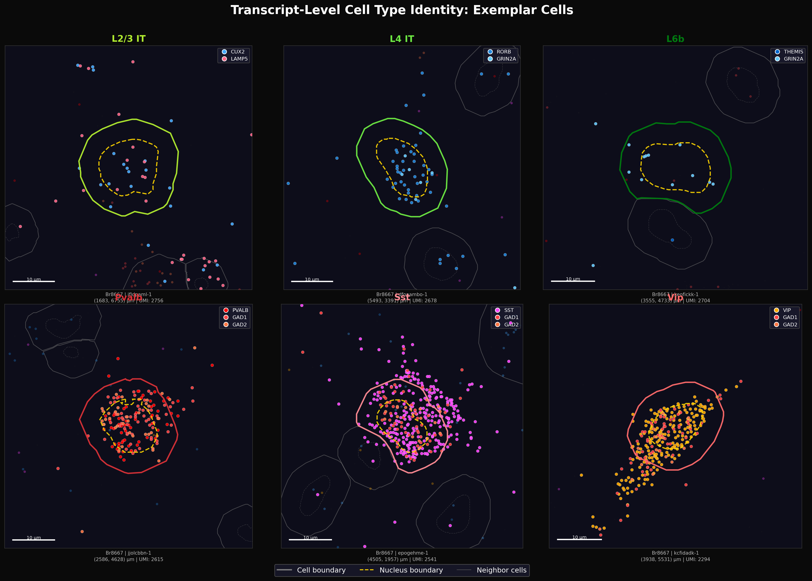
*Figure 3-pre. Transcript-level cell type identity for six exemplar subclasses. Each panel shows a single cell (colored outline) with individual marker transcript molecules. Bright dots indicate characteristic markers for that subclass (e.g., CUX2 for L2/3 IT, PVALB+GAD1+GAD2 for Pvalb interneurons, SST+GAD1+GAD2 for Sst interneurons). Neighboring cell boundaries shown in gray. Scale bar = 10 µm.*

### QC Layer 1: Margin-Based Filtering
The subclass correlation margin (best - second-best correlation) measures classification certainty. We flag the bottom 1st percentile of margin values *per sample*, yielding ~12,350 low-confidence cells. Per-sample thresholds account for variation in data quality across tissue sections.

### QC Layer 2: Spatial Doublet Detection
Xenium's subcellular resolution enables spatial doublet detection based on marker co-expression patterns that are biologically implausible in single cells:

- **Glut+GABA doublets**: Cells expressing 4+ of 7 GABAergic markers (GAD1, GAD2, SLC32A1, SST, PVALB, VIP, LAMP5) while also expressing glutamatergic markers (CUX2, RORB, GRIN2A, THEMIS). Validated against snRNAseq where the false-positive rate at this threshold is 0.098%.
- **GABA+GABA doublets**: GABAergic cells co-expressing SST + PVALB + LAMP5 simultaneously (triple co-expression that occurs in <0.01% of snRNAseq cells).

Combined, doublet detection flags ~9,720 cells. The union of low-margin and doublet flags produces the final `corr_qc_pass` filter, removing 22,075 cells (1.8% of QC-pass cells).

#### Evidence that flagged cells are true doublets

The marker co-expression approach is validated by three lines of evidence from a representative control sample (Br8667, 68,976 cells, 851 doublets):

**1. Mixed marker expression profiles.** Glut+GABA doublets express both GABAergic markers (GAD1, GAD2, SST, PVALB, etc.) and Glutamatergic markers (CUX2, RORB, GRIN2A, THEMIS) — a pattern that is biologically implausible in single neurons but expected when two cells of different classes are captured as one. The bar plot below shows that Glut+GABA doublets have detection rates for GABAergic markers approaching those of normal GABAergic cells, while retaining high Glutamatergic marker expression:

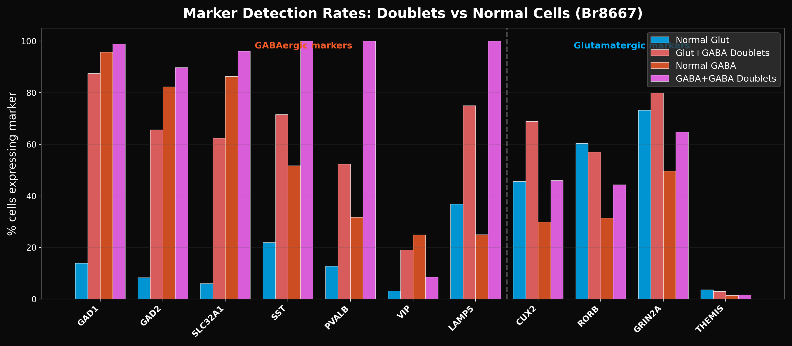
*Figure 3a. Percentage of cells expressing each marker gene, comparing normal Glutamatergic cells, Glut+GABA doublets, normal GABAergic cells, and GABA+GABA doublets. Glut+GABA doublets show the signature "both sides" expression pattern — high detection of both GABAergic (left) and Glutamatergic (right) markers.*

The heatmap below shows individual cells, confirming that the mixed expression is present at the single-cell level, not just in aggregate:

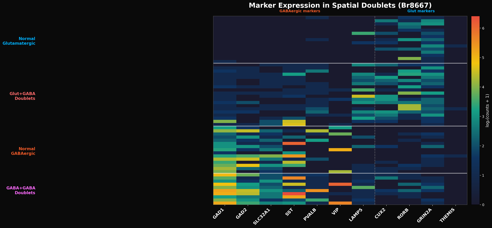
*Figure 3b. log₂(counts+1) heatmap of marker expression for individual cells. Top: normal Glutamatergic cells (express only Glut markers). Upper-middle: Glut+GABA doublets (express markers from both classes). Lower-middle: normal GABAergic cells (express only GABA markers). Bottom: GABA+GABA doublets (co-express SST + PVALB + LAMP5).*

**2. Elevated UMI counts.** Doublet cells have approximately 1.7–1.9x the total UMI counts of normal single cells, consistent with the signal from two captured cells:

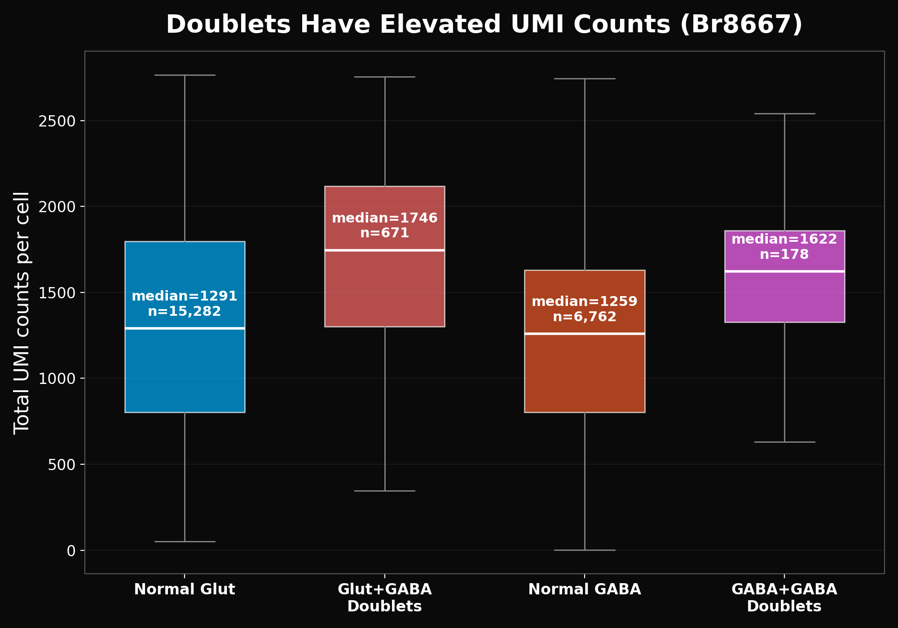
*Figure 3c. Total UMI count distributions for doublets vs normal cells. Both Glut+GABA and GABA+GABA doublets show elevated transcript counts, consistent with two cells' worth of RNA being captured.*

**3. Transcript-level evidence.** Visualizing individual marker molecules within cell boundaries directly demonstrates the mixed identity of doublet cells. Normal cells show transcripts from only one neuronal class, while doublets contain interleaved GABAergic (red) and Glutamatergic (blue) marker molecules within a single segmented cell body:

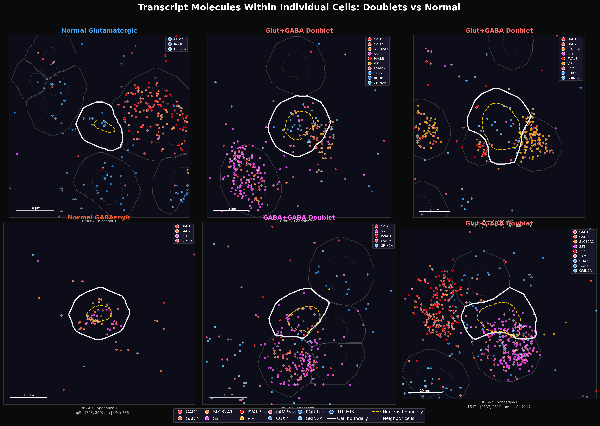
*Figure 3e. Individual transcript molecules within cell boundaries for doublet vs normal cells. Red dots = GABAergic marker transcripts (GAD1, GAD2, SST, PVALB, etc.); blue dots = Glutamatergic marker transcripts (CUX2, RORB, GRIN2A, THEMIS). White outlines = cell boundaries. Normal Glutamatergic cells (top-left) show only blue dots; normal GABAergic cells (bottom-left) show only red dots. Glut+GABA doublets contain both colors — direct molecular evidence that two cells' transcriptomes are captured within one segmentation boundary.*

**4. Spatial context.** Doublets are found at the boundaries between cell type domains, where two adjacent cells are most likely to be captured as a single segmented object:

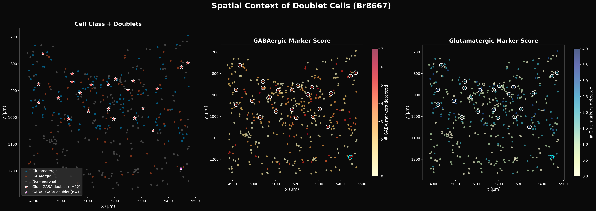
*Figure 3d. Spatial zoom (600 µm region) showing doublet cells (white-circled stars) in tissue context. Left: cells colored by class, with doublets overlaid. Center: GABAergic marker score per cell — doublets (white circles) show high GABA marker scores despite being classified as Glutamatergic. Right: Glutamatergic marker score — the same doublets also retain high Glut marker expression, confirming mixed identity.*

### Cell Count Summary

| QC Step | Cells | Lost | % Lost |
|---------|-------|------|--------|
| Raw (all cells) | 1,293,253 | — | — |
| Step 01: spatial QC | 1,275,006 | 18,247 | 1.4% |
| Step 02b: corr_qc_pass | 1,233,859 | 41,147 | 3.2% |
| Step 06: hybrid_qc_pass (final) | 1,257,887 | 17,119 | 1.3% |

*See Section 10 for full hybrid nuclear doublet resolution details.*

---

## 4. Approach 3: Harmony + kNN Label Transfer (Benchmarking Comparison)

### Motivation
Harmony-based integration followed by kNN label transfer is the most widely cited "standard" approach for cross-dataset cell type annotation in the scRNA-seq field. The original Harmony paper demonstrated cross-modality integration between 10X scRNA-seq and MERFISH using 154 shared genes. We tested this approach to benchmark our custom pipeline against the field standard.

### Method A: Flat Harmony
1. Subset the snRNAseq reference (137K cells) to the 300 Xenium panel genes
2. Normalize both datasets (counts per 10k + log1p), scale, PCA (30 components)
3. Run Harmony to correct for source modality (theta=4, higher than default to force cross-modality mixing)
4. Train a distance-weighted kNN classifier (k=15) on reference cells in the corrected embedding space
5. Predict subclass and supertype for all Xenium cells

### Method B: Hierarchical Harmony
Same as flat, but applied in three stages with fresh PCA and Harmony at each level:
1. Stage 1: Classify into 3 classes (Glutamatergic, GABAergic, Non-neuronal)
2. Stage 2: Within each class, classify into subclasses (fresh PCA + Harmony on class subset)
3. Stage 3: Within each subclass, classify into supertypes (fresh PCA + Harmony on subclass subset)

The rationale was that recomputing PCA within each branch would allocate more variance to within-group distinctions rather than wasting principal components on the broad neuronal/non-neuronal axis.

### Results

| Metric | Flat Harmony | Hierarchical Harmony |
|--------|-------------|---------------------|
| Subclass agreement with Corr Classifier | 69.4% | 59.7% |
| Subclass agreement with HANN | 66.5% | 55.8% |
| Runtime | 7.3 min | 12.5 min |
| Sst proportion | 12.1% (expected ~2.5%) | 12.8% |
| Endothelial proportion | 8.1% | 0.0% (complete loss) |


*Figure 4a. Subclass proportions across the three classification methods (Correlation Classifier, HANN, Flat Harmony). Note the massive Sst inflation and Endothelial distortion in the Harmony results.*


*Figure 4b. Confusion matrix showing subclass agreement between the Correlation Classifier and Flat Harmony. Off-diagonal entries reveal systematic misassignments — e.g., non-neuronal types (VLMC, Astrocyte) being assigned to Sst by Harmony.*

### Failure Modes

**Sst inflation**: Both Harmony approaches massively over-assign Sst. In the flat approach, 12.1% of cells are called Sst (vs 2.5% by correlation classifier). Diagnosis revealed that many non-neuronal cells (VLMC, Astrocyte, OPC, Microglia) are misassigned to Sst. Of cells Harmony labels as Sst, only 29% are labeled Sst by the correlation classifier; the rest are VLMC (19%), Astrocyte (20%), OPC (3%), and other non-neuronal types.

**Endothelial/VLMC collapse**: In the flat approach, Endothelial is inflated to 8.1% (vs ~1-2% expected). In the hierarchical approach, the opposite occurs: Endothelial disappears entirely (0.0%). Diagnosis showed that Endothelial cells correctly classified as Non-neuronal in Stage 1 were then uniformly reassigned to OPC in Stage 2 (92% of correctly-routed Endothelial cells became OPC within the Non-neuronal branch).

**Cross-class leakage in hierarchical approach**: ~49% of VLMC cells and ~28% of OPC cells were misclassified as GABAergic at the class level (Stage 1), after which they inevitably became Sst (the "catch-all" GABAergic type). Once a cell enters the wrong branch, the error is irrecoverable.

**Types with high agreement** (>90%): Pvalb (98%), Vip (98%), Sst (94%) — types with strong, distinctive marker signatures in the 300-gene panel.

**Types with poor agreement** (<30%): L5 ET (1-3%), Lamp5 Lhx6 (0.4-7%), Chandelier (7-8%) — rare types or types with subtle transcriptomic signatures.

### Per-Sample Agreement
Agreement rates varied by sample (49-78% for flat Harmony), with SCZ samples showing systematically lower agreement (mean 66%) vs controls (mean 70%). This likely reflects composition differences rather than method instability, but it underscores that Harmony-based labels are noisier for downstream disease comparisons.


*Figure 4c. Per-sample subclass agreement between Harmony and Correlation Classifier. SCZ samples (right) show systematically lower agreement than controls (left).*


*Figure 4d. Confidence score distributions for each classification method. The Correlation Classifier shows high-confidence assignments (correlation values), while Harmony kNN probabilities are more diffuse.*

---

## 5. Why the Correlation Classifier Outperforms Harmony for This Dataset

### The fundamental issue: cross-modality batch effects with 300 genes

Harmony was designed to correct batch effects between datasets measured with the same technology (e.g., two 10X runs). Cross-modality integration — snRNAseq vs. Xenium — introduces systematic differences that go beyond "batch effects":

1. **Detection budget**: Xenium has a finite optical detection budget per cell. Highly expressed genes consume detection capacity, creating expression biases that don't exist in snRNAseq.
2. **Probe specificity**: At least some Xenium probes exhibit off-target binding to paralogous genes, distorting expression profiles.
3. **300 vs 36,000 genes**: When subsetting the reference to 300 genes, cell types distinguishable only by genes outside the panel become conflated in PCA space.
4. **Non-random gene selection**: The 300-gene panel is curated for cell type markers, not a random sample of the transcriptome. PCA on this biased gene set captures marker-driven axes that may not align with the reference's transcriptomic structure.

### Why self-referencing centroids avoid these problems

The correlation classifier builds centroids from Xenium data itself (high-confidence HANN exemplars). This means:
- Centroids inherently reflect Xenium-specific expression characteristics
- No cross-platform normalization is needed
- The correlation metric operates in the same feature space as the query cells
- Platform-specific biases cancel out (both centroid and query are measured on the same platform)

### The hierarchy matters — but only when the base classifier is reliable

The two-stage approach (subclass then supertype within subclass) is valuable because it constrains the search space: a cell classified as L2/3 IT can only be assigned to L2/3 IT supertypes, preventing biologically impossible assignments. But this hierarchy only works when Stage 1 is highly accurate. The correlation classifier achieves this because it operates in a single feature space with clean centroids. Harmony's Stage 1, by contrast, operates in a noisy cross-modality embedding where class boundaries are blurred — and errors propagate irrecoverably down the hierarchy.

---

## 6. Benchmarking Against MERFISH Reference

To provide an independent, external validation of both cell typing approaches, we compared Xenium cell type proportions and laminar depth distributions against the SEA-AD MERFISH dataset — a spatially-resolved reference with manual cortical layer annotations.

### Benchmarking setup

- **MERFISH reference**: 341,595 cortical cells from 27 donors, restricted to cells with manual Layer annotations (L1–L6). This provides gold-standard cell type proportions and depth distributions within a defined cortical column.
- **Xenium data**: 911,984 cortical cells (all QC-pass cells assigned to cortical layers by the depth model, with `corr_qc_pass` filter applied). Proportions pooled across all 23 samples (both SCZ and control), since we are benchmarking cell typing accuracy, not disease effects.
- **Harmony labels**: Flat Harmony (69.4% agreement) used for comparison; hierarchical Harmony was excluded due to its worse overall performance.

### Cell type proportions: Subclass level

At the subclass level, the Correlation Classifier achieves substantially better agreement with MERFISH proportions than Harmony:

| Method | Pearson r (log-scale) | Spearman ρ | n types |
|--------|----------------------|------------|---------|
| Correlation Classifier | **0.80** | **0.84** | 24 |
| Flat Harmony | 0.73 | 0.74 | 24 |

The largest deviations in the Harmony results are driven by the same failure modes identified in Section 4: Sst is inflated ~4x relative to MERFISH expectations (11.8% vs 2.0%), while VLMC is nearly absent (0.03% vs 4.5%). The Correlation Classifier, while not perfectly matching MERFISH (e.g., Endothelial is over-represented due to uncropped tissue including white matter), produces proportions that are far more consistent with the independent MERFISH reference.

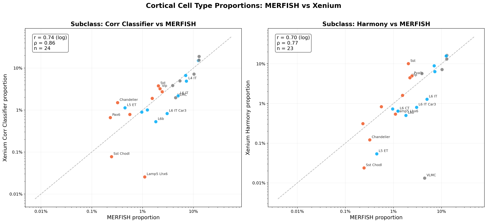
*Figure 6a. Subclass-level cell type proportions: Xenium (y-axis) vs MERFISH reference (x-axis). Left: Correlation Classifier. Right: Flat Harmony. Points are colored by cell class (glutamatergic, GABAergic, non-neuronal). Dashed line = perfect agreement. The Correlation Classifier (r = 0.80, ρ = 0.84) tracks the MERFISH reference more closely than Harmony (r = 0.73, ρ = 0.74), particularly for non-neuronal types.*

### Cell type proportions: Supertype level

At the finer supertype level, differences between methods become more pronounced:

| Method | Pearson r (log-scale) | Spearman ρ | n types |
|--------|----------------------|------------|---------|
| Correlation Classifier | **0.73** | **0.80** | 110 |
| Flat Harmony | 0.60 | 0.63 | 110 |

The Correlation Classifier maintains reasonable agreement even at this granular level (110 matched supertypes), while Harmony's correlation drops substantially — reflecting the compounding effect of subclass-level misassignments on finer-grained type resolution.

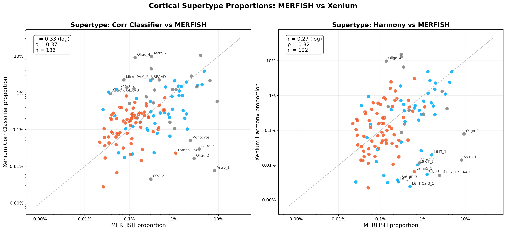
*Figure 6b. Supertype-level cell type proportions: Xenium vs MERFISH reference. The Correlation Classifier (left, r = 0.73, ρ = 0.80) maintains stronger agreement at this finer resolution compared to Harmony (right, r = 0.60, ρ = 0.63).*

### Laminar depth distributions

Cell type assignments should produce spatially coherent laminar distributions — e.g., L2/3 IT neurons should be in superficial layers, L6b in deep layers. We compared the median cortical depth of each subclass in Xenium against the MERFISH reference:

| Method | Pearson r (median depth) | n types |
|--------|-------------------------|---------|
| Correlation Classifier | **0.92** | 24 |
| Flat Harmony | 0.94 | 23* |

*\*Harmony is missing Endothelial and VLMC depth estimates due to near-zero cell counts for those types in cortical regions.*

Both methods produce spatially coherent depth distributions (r > 0.9), confirming that even where type assignments disagree, the spatial signal is largely preserved. This is expected: most of the depth information comes from the dominant excitatory types (L2/3 IT, L4 IT, L5 IT, L6 CT, L6b), which both methods assign with reasonable accuracy.

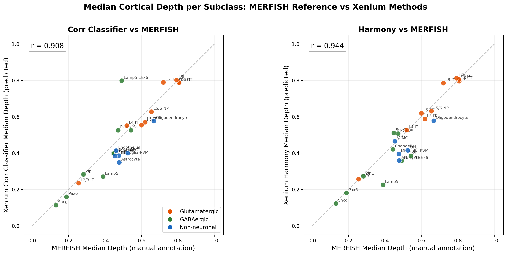
*Figure 6c. Median cortical depth per subclass: Xenium vs MERFISH reference. Both methods show strong agreement (r > 0.9), but the Correlation Classifier provides estimates for all 24 subclasses while Harmony is missing two types (Endothelial, VLMC).*

The excitatory neuron depth distributions provide particularly clean validation — these types have well-defined laminar positions, and both Xenium classifiers recover the expected superficial-to-deep ordering:

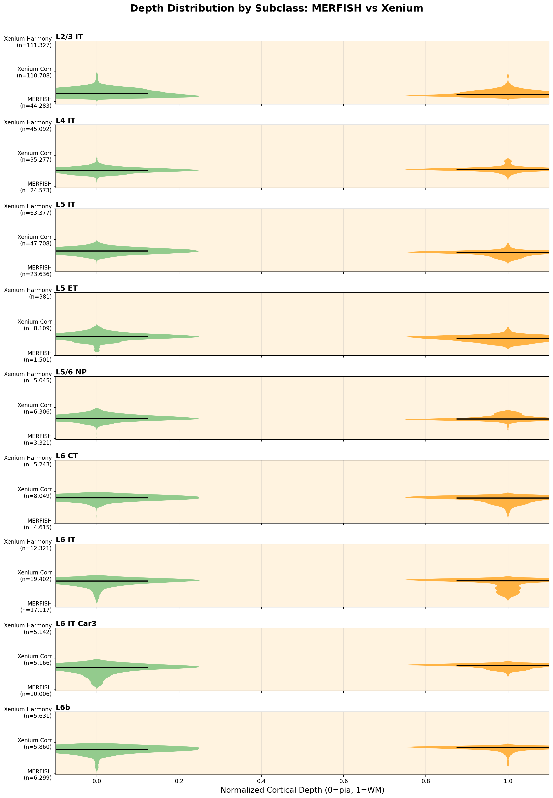
*Figure 6d. Cortical depth distributions for excitatory neuron subclasses. Left: MERFISH reference. Center: Xenium Correlation Classifier. Right: Xenium Harmony. All three show the expected progression from superficial (L2/3 IT) to deep (L6b), but the Correlation Classifier distributions more closely match the MERFISH shapes, particularly for deeper types (L5 ET, L6 IT, L6b).*

### Spatial coherence across all types


*Figure 6e. Full depth distributions for all subclasses, comparing Correlation Classifier (blue) vs Harmony (orange) assignments. Most types show overlapping distributions, confirming spatial coherence, but types with high cross-method disagreement (e.g., Sst, VLMC) show divergent depth profiles.*

---

## 7. Ablation Summary

Throughout development, we tested multiple configurations to ensure robustness:

| Ablation | L6b SCZ FDR | Endothelial SCZ FDR | Notes |
|----------|-------------|---------------------|-------|
| Final pipeline (hierarchical corr classifier + QC) | 0.0047 | 0.0267 | Current default |
| Flat correlation classifier | ~0.005 | ~0.03 | Similar results; hierarchical preferred for interpretability |
| Disable corr_qc_pass filter | 0.0043 | ~0.03 | Minimal impact; filter removes only 1.8% of cells |
| HANN subclass confidence threshold = 0.5 | — | — | Removed 25% of cells; abandoned |
| Harmony flat | — | — | 69% agreement; Sst inflated 5x; not used for downstream |
| Harmony hierarchical | — | — | 60% agreement; Endothelial lost entirely; not used |

Key finding: The L6b increase in SCZ (FDR ~0.004-0.005) and Endothelial decrease in SCZ (FDR ~0.03) are robust across all classifier configurations tested, suggesting these are genuine biological signals rather than artifacts of any particular cell typing approach.

---

## 8. Pipeline Summary (Pre–Nuclear Doublet Resolution)

*Note: This section describes the pipeline as it stood before the addition of nuclear doublet resolution (step 06). See Section 11 for the current full pipeline summary.*

```
Step 01: Spatial QC (negative probes, gene counts, total counts)
    → 1,275,006 QC-pass cells

Step 02: MapMyCells HANN label transfer
    → class/subclass/supertype labels + confidence scores
    → Used as input for exemplar selection, not as final labels

Step 02b: Two-stage correlation classifier
    → Build centroids from top-100 HANN exemplars per type (from Xenium data)
    → Stage 1: Subclass assignment via Pearson correlation (24 types)
    → Stage 2: Supertype assignment within subclass
    → QC: Flag bottom 1% margin per sample + spatial doublets
    → 1,233,859 cells pass corr_qc_pass

Step 03: Cortical depth model (trained on MERFISH reference)
Step 04: Spatial domain annotation

Analysis: Cortical cells → crumblr compositional analysis
```

The pipeline is intentionally "non-standard" — it uses MapMyCells for initial annotation but then builds a platform-aware classifier that operates entirely within the Xenium feature space. This two-step approach leverages the strengths of both methods: HANN's taxonomy-aware hierarchical classification provides high-quality exemplar cells, while the correlation classifier translates those labels into a Xenium-native framework that avoids cross-platform artifacts.

## 9. Nuclear vs Whole-Cell Classification: Investigating Doublet Origins

### Motivation

Inspection of transcript-level data in cells flagged as spatial doublets revealed that mixed-type markers (e.g., GABAergic transcripts in a Glutamatergic cell) appear to concentrate in the cytoplasmic compartment. This suggests that doublets arise primarily from mRNA spillover between neighboring cells during segmentation — molecules from one cell's cytoplasm are erroneously assigned to an adjacent cell. Since nuclei are spatially more isolated, nuclear-restricted transcripts should be less affected by this spillover. **Hypothesis: classifying cells using only nuclear transcripts should substantially reduce doublet artifacts.**

### Method

For the Br8667 exemplar sample (68,976 cells), we built a nuclear-only count matrix by:

1. Parsing 68,976 nucleus boundary polygons from the Xenium segmentation output (~25 vertices per nucleus)
2. Building a Shapely STRtree spatial index over all nucleus polygons
3. For each of 300 genes, loading per-molecule transcript coordinates (281.9M total molecules) and querying which nucleus polygon each transcript falls within
4. Accumulating per-cell nuclear counts into a new count matrix (same dimensions as whole-cell)

We then ran the same two-stage correlation classifier on the nuclear-only counts using identical centroids (built from all 24 samples' whole-cell data), and compared classifications and doublet rates.

### Nuclear Fraction Characteristics

The median nuclear fraction across QC-pass cells is **0.494** (49.4% of transcripts fall within the nucleus), with an IQR of [0.353, 0.637]. This varies by cell class — neuronal cells (Glutamatergic median: 0.54, GABAergic median: 0.54) tend to have higher nuclear fractions than non-neuronal cells (median: 0.47). The median nuclear UMI per cell is 385, sufficient for correlation-based classification (only 4.7% of cells have fewer than 50 nuclear UMIs).

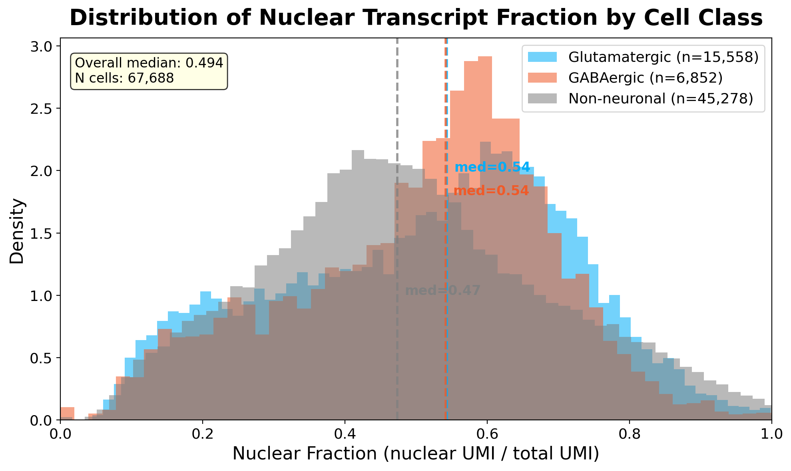

Nuclear fraction also varies by subclass, from ~0.38 (Lamp5 Lhx6, VLMC, Endothelial) to ~0.61 (Oligodendrocyte). Most neuronal subclasses have nuclear fractions in the 0.50–0.60 range.

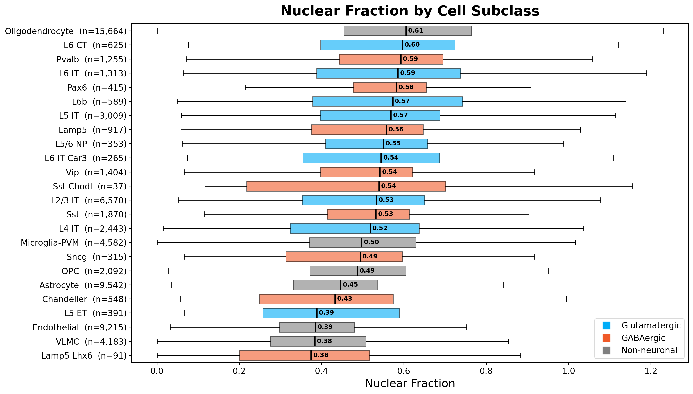

### Classification Concordance

At the **class level** (Glutamatergic / GABAergic / Non-neuronal), nuclear and whole-cell classifications agree for **96.9%** of cells (65,603 / 67,688). At the **subclass level** (24 types), concordance is **89.2%** (60,400 / 67,688). The highest concordance subclasses include Oligodendrocyte (99.2%), Pvalb (95.7%), and Microglia-PVM (94.8%). The lowest concordance types (L5 ET: 41.4%, Lamp5 Lhx6: 49.5%, Chandelier: 57.1%) are rare types where the reduced nuclear UMI count may limit discrimination.

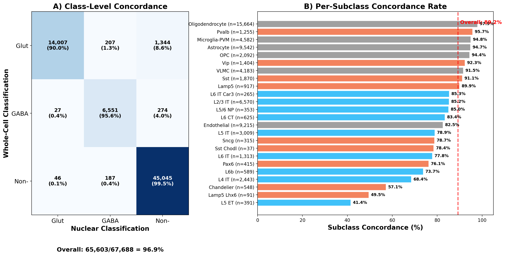

### Doublet Rate Reduction

The key result: nuclear-only classification dramatically reduces detected doublet rates:

| Doublet Type | Whole-Cell | Nuclear | Reduction |
|---|---|---|---|
| Glut+GABA | 675 | 257 | **−62%** |
| GABA+GABA | 176 | 78 | **−56%** |
| Total | 851 | 335 | **−61%** |

This 61% reduction in total doublets strongly supports the hypothesis that the majority of spatial doublets are driven by cytoplasmic mRNA spillover between neighboring cells. The remaining 335 nuclear doublets may represent true biological co-expression, physically overlapping nuclei, or residual segmentation artifacts at the nuclear boundary.

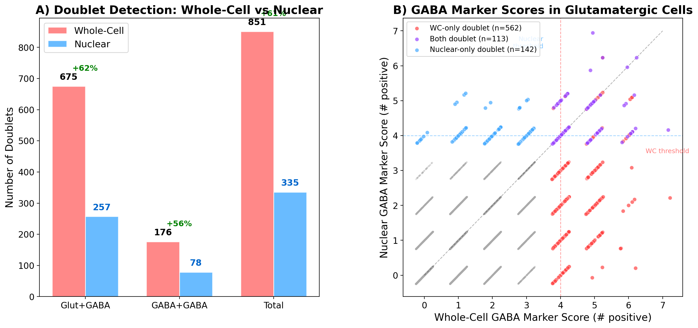

Panel B shows the GABA marker score distribution for Glutamatergic cells. The 562 cells that are doublets by whole-cell but NOT by nuclear counting (red dots) tend to have high whole-cell GABA scores but low nuclear GABA scores — confirming that the GABA transcripts are predominantly in the cytoplasm, not the nucleus. The 113 persistent doublets (purple dots) maintain high GABA scores in both compartments.

### Classification Quality

Despite using ~50% fewer total UMIs, nuclear classification remains robust. The median subclass correlation drops only modestly from 0.805 (whole-cell) to 0.763 (nuclear). Discordant cells tend to have lower nuclear correlations (median ~0.65 vs ~0.77 for concordant cells), suggesting that classification changes are partly driven by the reduced information content of nuclear-only data.

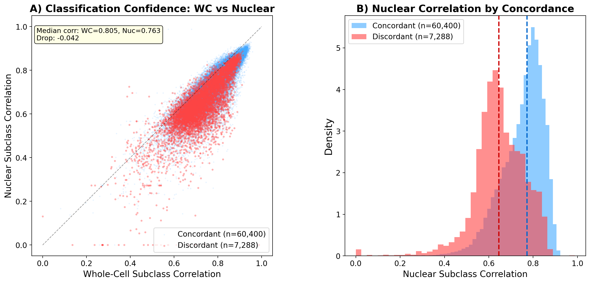

### Implications

This analysis demonstrates that:

1. **Most spatial doublets are segmentation artifacts**, not biological co-expression. The 62% reduction in Glut+GABA doublets when restricting to nuclear transcripts directly shows that cytoplasmic mRNA spillover inflates doublet rates.
2. **Nuclear-only classification is feasible** with the Xenium 300-gene panel, maintaining 97% class-level and 89% subclass-level concordance.
3. **The remaining doublets (~335 cells)** are candidates for true spatial co-localization or nuclear overlap, and deserve focused investigation.
4. **For downstream analyses**, the whole-cell doublet flags provide a conservative (inclusive) filter, while nuclear-only doublet detection may undercount due to reduced statistical power. The current pipeline's approach of flagging then excluding doublets remains appropriate.

---

## 10. Hybrid Nuclear Doublet Resolution: Full Pipeline (All 23 Samples)

### Motivation

The Br8667 pilot (Section 9) demonstrated that nuclear-only classification resolves ~61% of spatial doublets by removing cytoplasmic spillover. We scaled this to all 23 samples as pipeline step 06, producing a **hybrid QC filter** that combines nuclear-informed doublet resolution with the existing correlation-based QC — rescuing cells that were conservatively excluded while maintaining stringent doublet filtering.

### Method

For each of the 23 samples, the pipeline:

1. **Loads transcript coordinates** from step 05 (per-gene JSON files with molecule x/y positions)
2. **Builds nuclear count matrices** by intersecting transcript coordinates with nucleus boundary polygons using Shapely STRtree spatial indexing
3. **Classifies each doublet-flagged cell** using nuclear-only counts against the pre-built correlation centroids (from step 02b):
   - **Resolved**: Nuclear classification agrees with the *non-doublet* class identity (e.g., a Glutamatergic cell flagged as Glut+GABA doublet where the nuclear classification is purely Glutamatergic — confirming the GABA signal came from cytoplasmic spillover)
   - **Persistent**: Nuclear classification still shows mixed-class identity (true doublet or nuclear overlap)
   - **Nuclear-only**: Not flagged as a whole-cell doublet, but the nuclear classification reveals a different class identity
   - **Insufficient**: Fewer than 50 nuclear UMIs — not enough signal for reliable classification
4. **Builds the hybrid QC mask** by combining:
   - Basic cell QC (step 01), but with high-UMI-only failures rescued (cells that failed *only* due to high total counts — likely doublets or large cells, not low-quality)
   - Correlation margin filter retained (bottom 1% margin per sample)
   - **Resolved doublets → PASS** (the key benefit: cytoplasmic spillover confirmed, cell is not a true doublet)
   - **Persistent doublets → FAIL** (nuclear evidence confirms mixed identity)
   - **Nuclear-only doublets → FAIL** (new doublets detected only at the nuclear level)
   - **Insufficient evidence → FAIL** (conservative)

### Aggregate Results Across 23 Samples

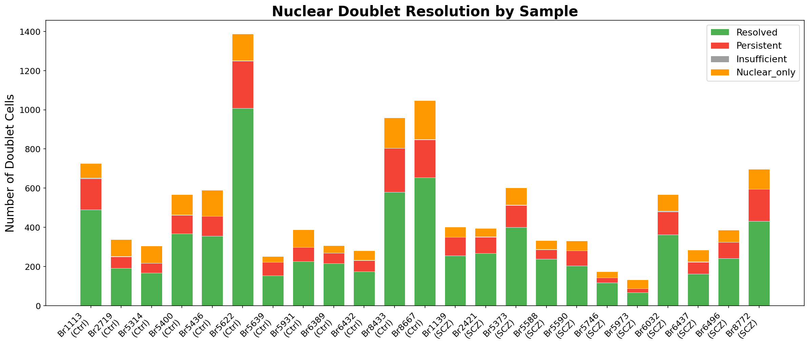
*Figure 10a. Nuclear doublet resolution outcomes across all 23 samples. Left: per-sample counts of resolved (green), persistent (red), insufficient (gray), and nuclear-only (orange) doublets. Right: aggregate resolution rate. The majority of whole-cell doublets (75.8%) are resolved by nuclear-only classification, confirming cytoplasmic spillover as the dominant source.*

| Category | Count | % of Flagged |
|----------|-------|-------------|
| Whole-cell doublets (QC-pass) | 10,505 | 100% |
| Resolved (cytoplasmic spillover) | 7,941 | 75.6% |
| Persistent (true doublets) | 2,539 | 24.2% |
| Insufficient evidence | 25 | 0.2% |
| Nuclear-only (new detections) | 2,128 | — |

The overall resolution rate is **75.8%** (range: 68–83% across samples), consistent with the Br8667 pilot result (76.2%). Resolution rates are similar for both doublet types: Glut+GABA doublets resolve at 73.6% (6,421/8,727) and GABA+GABA doublets at 85.5% (1,520/1,778).

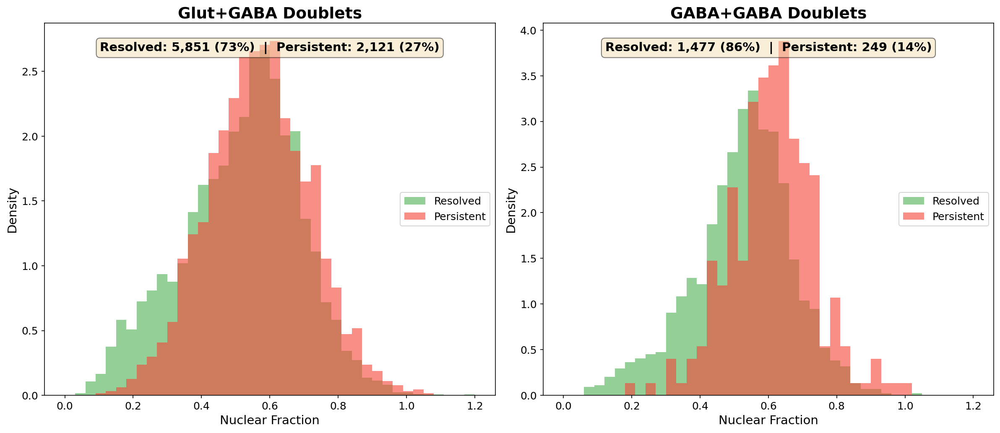
*Figure 10b. Marker expression evidence for doublet resolution. Resolved doublets show high marker scores in the whole-cell compartment but low scores in the nuclear compartment, confirming cytoplasmic spillover. Persistent doublets maintain high marker scores in both compartments.*

### High-UMI Cell Rescue

A key benefit of the hybrid approach is the principled re-evaluation of cells that failed QC solely due to high total UMI counts. These cells were conservatively excluded by the basic MAD-based QC (step 01) because elevated UMI counts can indicate doublets. However, many are simply large cells or cells with high transcriptional activity.

The hybrid pipeline identifies **18,427 high-UMI-only failures** across all samples and re-evaluates them using nuclear evidence. The vast majority pass the nuclear doublet check and are rescued into the final dataset.

### Impact on Cell Counts

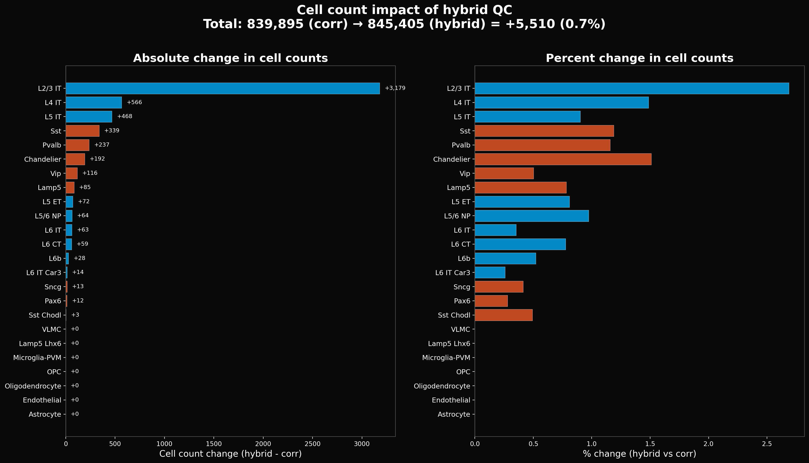
*Figure 10c. Cell count comparison between corr QC (original) and hybrid QC (with nuclear doublet resolution). The hybrid filter is slightly more permissive overall, rescuing high-UMI cells and resolved doublets while adding nuclear-only doublet exclusions.*

| QC Step | Cells |
|---------|-------|
| Raw (all cells) | 1,293,253 |
| Step 01: spatial QC | 1,275,006 |
| Step 02b: corr_qc_pass (original) | 1,233,859 |
| **Step 06: hybrid_qc_pass (nuclear-informed)** | **1,257,887** |
| Net rescued by hybrid | +24,028 |

The hybrid QC filter passes 24,028 more cells than the original corr_qc_pass filter, primarily from:
- High-UMI cell rescue (+18,427)
- Resolved doublets reinstated (+7,941)
- Offset by: persistent doublets confirmed (-2,539), nuclear-only doublets added (-2,128), margin failures retained

### Validation: Disease Comparisons Are Unchanged

The critical validation: hybrid QC produces **near-identical** SCZ vs Control results to the original corr QC, confirming that the rescued cells do not introduce systematic bias.

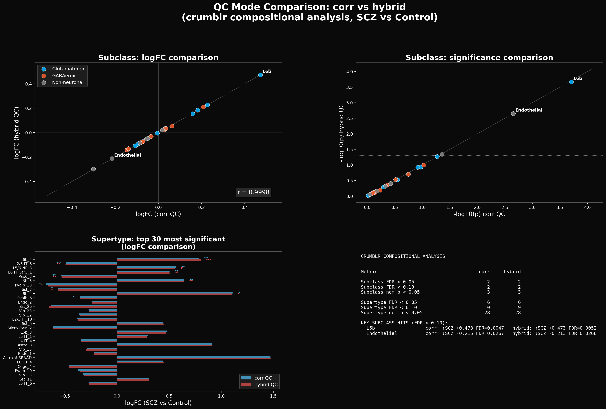
*Figure 10d. Compositional regression (crumblr) effect sizes: corr QC vs hybrid QC. Each point is a cell type (subclass level). The logFC values are nearly identical (r = 0.9998), and the same two types reach FDR < 0.05 under both filters: L6b (increased in SCZ, FDR = 0.005) and Endothelial (decreased in SCZ, FDR = 0.027).*

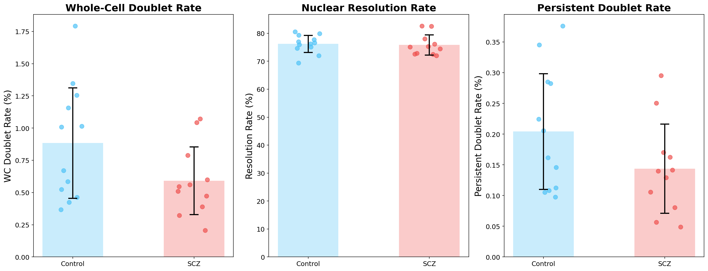
*Figure 10e. Per-subclass SCZ vs Control effect sizes under hybrid QC. L6b shows a consistent increase across SCZ samples (logFC = +0.47, FDR = 0.005), while Endothelial shows a decrease (logFC = −0.21, FDR = 0.027). Both signals are robust to the choice of QC filter.*

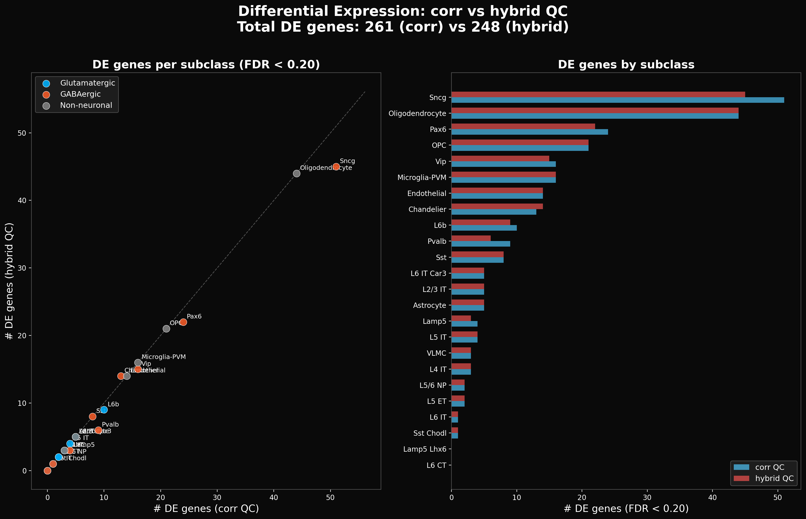
*Figure 10f. Pseudobulk differential expression comparison between QC modes. The per-gene logFC values are highly correlated across all tested cell types, confirming that the hybrid filter does not alter gene-level disease signals.*

### Aggregate Doublet Table

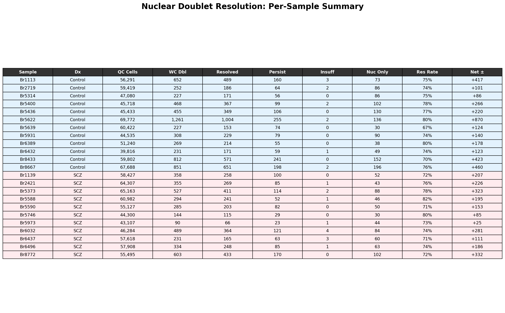
*Figure 10g. Per-sample nuclear doublet resolution statistics. Shows whole-cell doublet counts, resolution outcomes (resolved/persistent/insufficient/nuclear-only), resolution rates, and hybrid QC pass counts for all 23 samples.*

### Updated Cell Count Summary

| QC Step | Cells | Lost | % Lost |
|---------|-------|------|--------|
| Raw (all cells) | 1,293,253 | — | — |
| Step 01: spatial QC | 1,275,006 | 18,247 | 1.4% |
| Step 02b: corr_qc_pass (original) | 1,233,859 | 41,147 | 3.2% |
| **Step 06: hybrid_qc_pass (final)** | **1,257,887** | **17,119** | **1.3%** |

The hybrid QC pipeline is now the default for all downstream analyses. It produces a net gain of 24,028 cells relative to the original corr_qc_pass filter while maintaining identical disease effect estimates — a principled improvement that validates the nuclear doublet resolution approach.

---

## 11. Final Pipeline Summary (Updated)

```
Step 00: Create h5ad from raw Xenium data
Step 01: Spatial QC (negative probes, gene counts, total counts)
    → 1,275,006 cells pass basic QC

Step 02: MapMyCells HANN label transfer
    → class/subclass/supertype labels + confidence scores
    → Used as input for exemplar selection, not as final labels

Step 02b: Two-stage correlation classifier
    → Build centroids from top-100 HANN exemplars per type (from Xenium data)
    → Stage 1: Subclass assignment via Pearson correlation (24 types)
    → Stage 2: Supertype assignment within subclass
    → QC: Flag bottom 1% margin per sample + spatial doublets
    → Save centroids to disk for step 04

Step 03: Export transcript coordinates (feeds step 04 + viewer)

Step 04: Nuclear doublet resolution (hybrid QC)
    → Build nuclear count matrices from transcript coordinates
    → Reclassify doublets using nuclear-only counts
    → Rescue high-UMI cells, reinstate resolved doublets
    → 1,257,887 cells pass hybrid_qc_pass

Step 05: Cortical depth model (trained on MERFISH, uses hybrid_qc_pass)
Step 06: Spatial domain annotation + layer assignment (uses hybrid_qc_pass)

Step 07: Viewer export (per-sample JSON + standalone HTML)
Step 08: Cell + nucleus boundary polygon export

Analysis: Cortical cells → crumblr compositional regression (SCZ vs Control)
```
