# Cross-Platform Comparison of Gene Expression: snRNAseq vs Spatial Transcriptomics

## Overview

This report evaluates the concordance of gene expression profiles between snRNAseq and three spatial transcriptomics platforms measuring human cortical tissue: **MERSCOPE 4K** (4,000-gene panel; Fang et al. 2022), **SEA-AD MERFISH** (180-gene curated panel; Allen Institute), and **SCZ Xenium** (300-gene panel; 10x Genomics). All spatial datasets were annotated using the SEA-AD MTG cell type taxonomy via label transfer from a common snRNAseq reference (137,303 cells, 36,601 genes; Nicole Comfort / SEA-AD). Expression was compared at the pseudobulk level (mean log-normalized expression per subclass) across 24 shared cell type subclasses and up to 3,319 shared genes.

---

## Part 1: MERSCOPE 4K vs snRNAseq — Baseline Comparison

### 1.1 Per-cell-type correlation

We first asked: for each cell type, how well do the expression profiles (across all shared genes) agree between snRNAseq and MERSCOPE?

Pseudobulk mean expression (normalize_total to 10K + log1p) was computed per subclass for both platforms, restricted to 3,319 genes present in both. For each of the 24 subclasses, we computed the Pearson r and Spearman rho of the expression vector (across genes) between platforms.

| Metric | Value |
|--------|-------|
| Mean Pearson r (across 24 subclasses) | 0.484 |
| Median Pearson r | 0.502 |
| Mean Spearman rho | 0.703 |
| Median Spearman rho | 0.724 |
| Best cell type | Endothelial (r = 0.552) |
| Worst cell type | L5 ET (r = 0.306) |

Spearman correlations are consistently higher than Pearson, indicating that the rank order of gene expression is well preserved across platforms even when absolute magnitudes diverge. The weakest cell types (L5 ET: r = 0.306, Sst Chodl: r = 0.306, Pax6: r = 0.327) tend to be among the rarest in either the reference or MERSCOPE data.

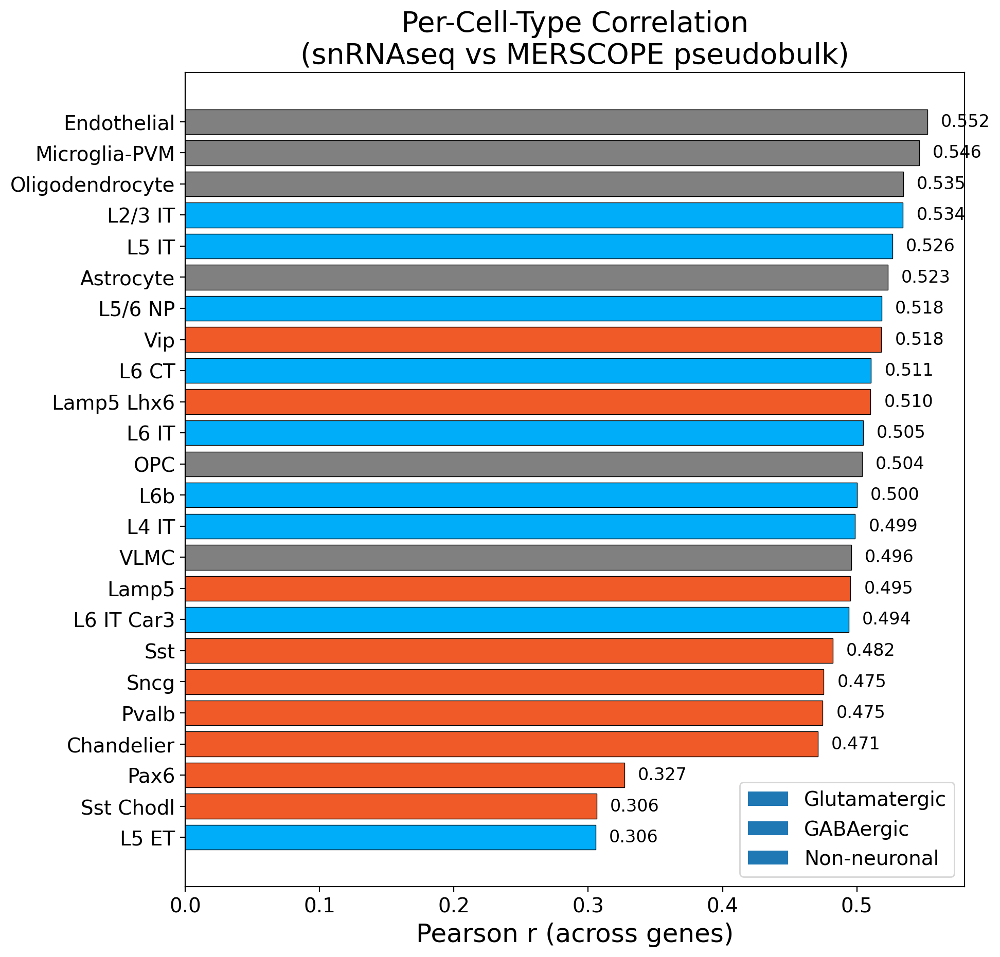

**Figure 1.** Per-cell-type Pearson r (across 3,319 shared genes) between snRNAseq and MERSCOPE pseudobulk. Cell types colored by class: blue = glutamatergic, orange = GABAergic, gray = non-neuronal.

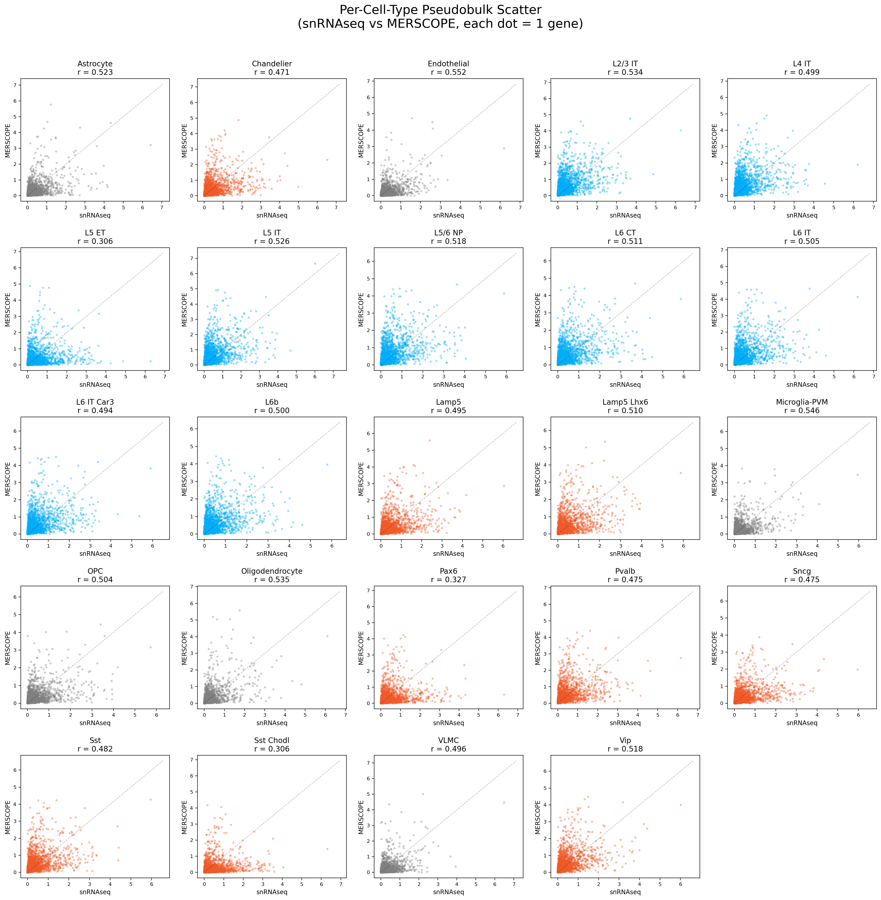

**Figure 2.** Per-cell-type scatter plots (each dot = 1 gene) comparing snRNAseq and MERSCOPE pseudobulk expression for all 24 subclasses.

### 1.2 Overall pseudobulk scatter

Flattening all gene-by-cell-type values into a single vector yields:

| Metric | Value |
|--------|-------|
| Overall Pearson r | 0.483 |
| Overall Spearman rho | 0.695 |
| Shared genes | 3,319 |
| Shared subclasses | 24 |

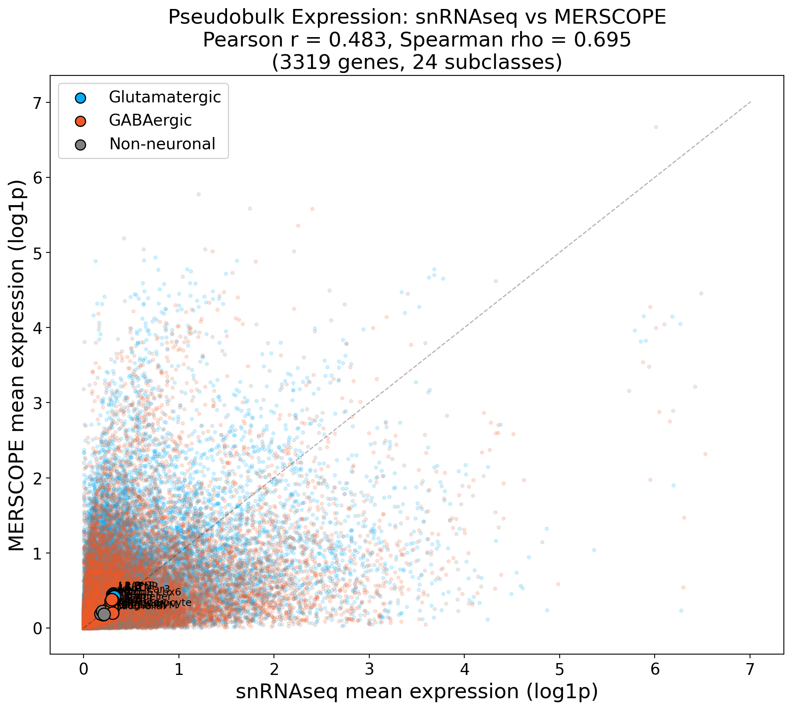

**Figure 3.** Overall pseudobulk scatter: each small dot represents one gene in one cell type, colored by cell class. Large labeled dots show per-subclass means.

### 1.3 Per-gene correlation

For each gene, we computed the Pearson r of its pseudobulk expression across the 24 cell types between snRNAseq and MERSCOPE. This asks: does each gene have the same cell-type expression pattern across platforms?

| Metric | Value |
|--------|-------|
| Genes with valid correlations | 3,317 |
| Median Pearson r | 0.701 |
| Mean Pearson r | 0.624 |
| Fraction r > 0.5 | 70.9% (2,353 genes) |
| Fraction r > 0.8 | 37.4% (1,242 genes) |
| Fraction r < 0 | 4.8% (160 genes) |

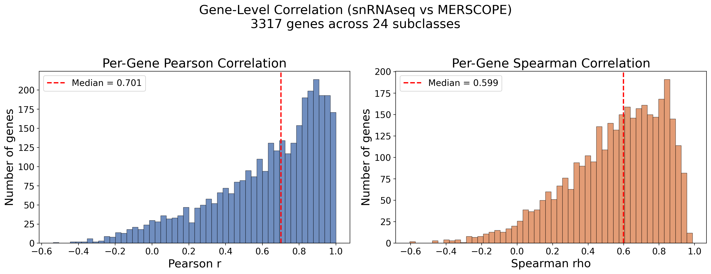

**Figure 4.** Distribution of per-gene Pearson r and Spearman rho between snRNAseq and MERSCOPE pseudobulk. Red dashed line = median.

### 1.4 Heatmap comparison

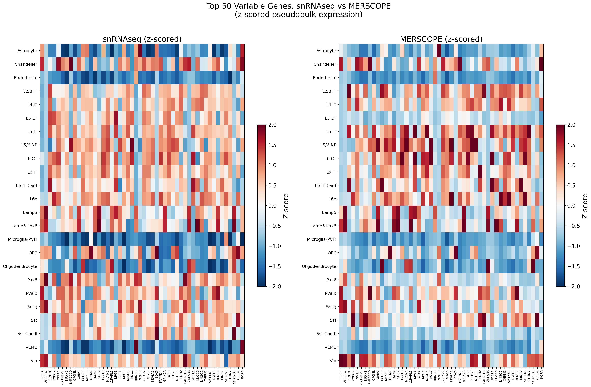

**Figure 5.** Z-scored pseudobulk expression of the top 50 most variable genes (by snRNAseq variance) across 24 subclasses, comparing snRNAseq (left) and MERSCOPE (right). Cell-type-specific patterns are largely preserved across platforms.

---

## Part 2: Characterizing Poorly-Performing Genes

### 2.1 Approach

We analyzed 3,317 genes with valid cross-platform correlations and characterized gene-level properties that predict poor reproducibility. For each gene, we computed:

- **Expression level**: mean pseudobulk expression in each platform
- **Cell-type variability**: variance, coefficient of variation (CV), and Shannon entropy of expression across cell types
- **Detection rate**: fraction of cells expressing each gene (>0) in each platform
- **Platform bias**: log2 fold change of mean expression (MERSCOPE / snRNAseq)
- **Gene biotype**: inferred from gene naming conventions (protein-coding, antisense, lncRNA/novel)
- **Top cell type agreement**: whether the cell type with highest expression matches across platforms

Genes were grouped into quintiles by Pearson r, and properties were compared between the worst (Q1, n=664, median r = 0.162) and best (Q5, n=664, median r = 0.943) quintiles.

### 2.2 Key predictors of poor correlation

| Gene property | Spearman rho with per-gene r | Direction | p-value |
|---------------|------------------------------|-----------|---------|
| Variance (MERSCOPE) | +0.596 | Higher variance = better r | < 10^-300 |
| CV across types (MERSCOPE) | +0.592 | Higher CV = better r | < 10^-300 |
| Variance (snRNAseq) | +0.557 | Higher variance = better r | < 10^-269 |
| CV across types (snRNAseq) | +0.412 | Higher CV = better r | < 10^-136 |
| Mean expression (MERSCOPE) | +0.308 | Higher expression = better r | < 10^-73 |
| Detection rate (MERSCOPE) | +0.296 | Higher detection = better r | < 10^-68 |
| Mean expression (both) | +0.292 | Higher expression = better r | < 10^-66 |
| Mean expression (snRNAseq) | +0.250 | Higher expression = better r | < 10^-48 |
| Detection rate (snRNAseq) | +0.146 | Higher detection = better r | < 10^-17 |
| \|log2FC\| platform bias | -0.104 | Larger bias = worse r | < 10^-9 |
| Expression entropy (snRNAseq) | -0.424 | More uniform = worse r | < 10^-145 |

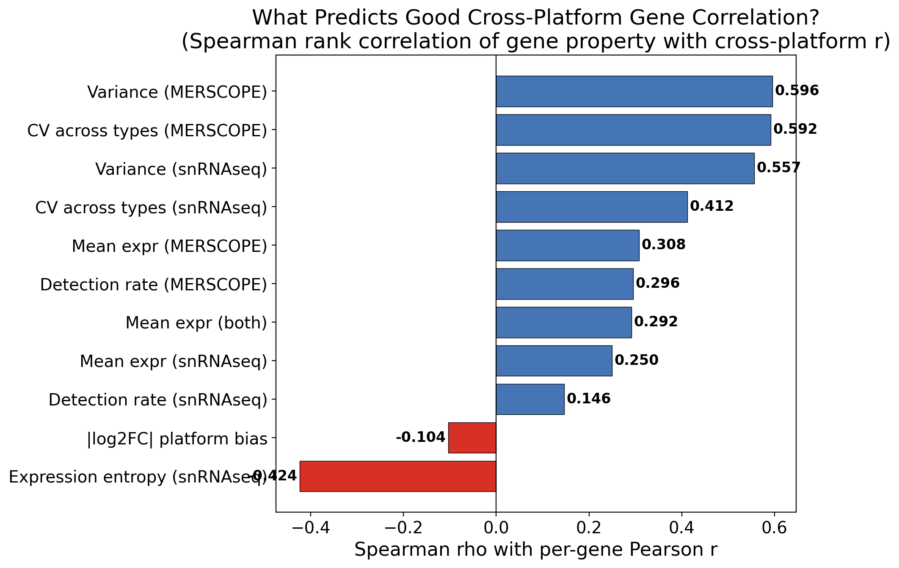

**Figure 6.** Spearman rank correlation between each gene property and cross-platform Pearson r. Blue bars indicate properties where higher values associate with better correlation; red bars indicate the reverse.

### 2.3 The dominant predictor: cell-type variability

The single strongest predictor of cross-platform gene correlation is **how differentially expressed a gene is across cell types**. Genes with high cell-type variability (high CV, high variance, low entropy) reproduce well across platforms because there is a strong biological signal to detect. Genes that are uniformly expressed across all cell types (high entropy, low CV) yield poor cross-platform correlations because the platform-specific noise dominates any signal.

| Property | Bottom 20% (Q1) | Top 20% (Q5) | MWU p-value |
|----------|-----------------|--------------|-------------|
| CV across types (snRNAseq) | 0.47 | 1.41 | < 10^-79 |
| CV across types (MERSCOPE) | 0.49 | 1.14 | < 10^-159 |
| Expression entropy (snRNAseq) | 4.42 | 3.48 | < 10^-82 |
| Variance (snRNAseq) | 0.0004 | 0.042 | < 10^-142 |
| Variance (MERSCOPE) | 0.001 | 0.093 | < 10^-157 |

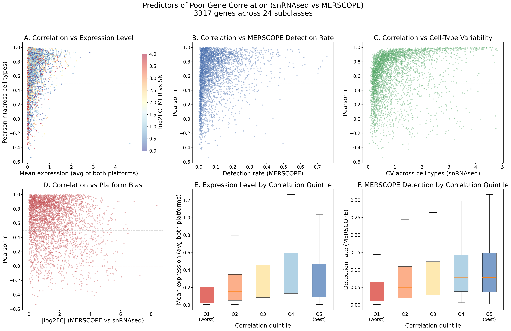

**Figure 7.** Six-panel diagnostic showing relationships between gene properties and cross-platform Pearson r. **(A)** Correlation vs mean expression level, colored by platform bias. **(B)** Correlation vs MERSCOPE detection rate. **(C)** Correlation vs CV across cell types in snRNAseq. **(D)** Correlation vs absolute platform bias. **(E)** Mean expression by correlation quintile. **(F)** MERSCOPE detection rate by correlation quintile.

### 2.4 Secondary predictors: expression level and detection rate

Poorly-performing genes are also less expressed and less frequently detected, particularly in MERSCOPE:

| Property | Bottom 20% (Q1) | Top 20% (Q5) | MWU p-value |
|----------|-----------------|--------------|-------------|
| Mean expression (both platforms) | 0.071 | 0.220 | < 10^-46 |
| Detection rate (MERSCOPE) | 2.2% | 7.8% | < 10^-52 |
| Detection rate (snRNAseq) | 10.4% | 17.8% | < 10^-12 |
| \|log2FC\| platform bias | 1.57 | 1.25 | < 10^-9 |

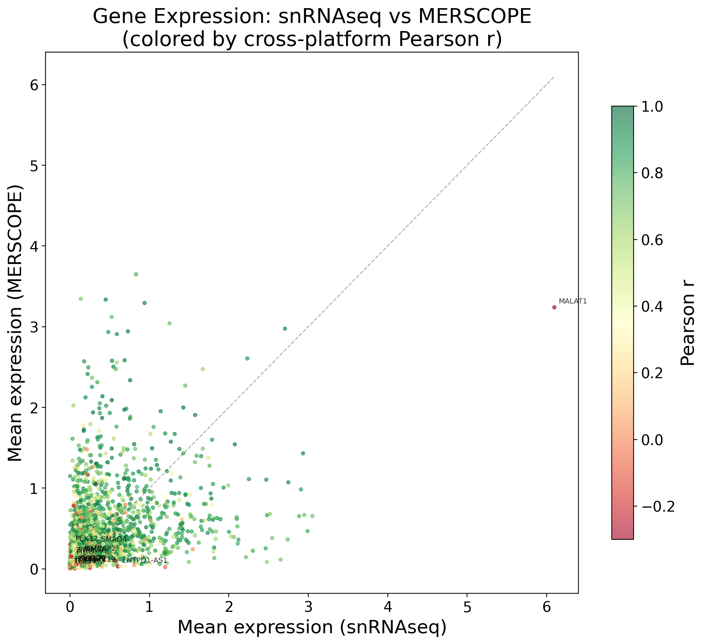

**Figure 8.** Mean expression per gene in snRNAseq (x-axis) vs MERSCOPE (y-axis), colored by cross-platform Pearson r. The worst genes (red/yellow) cluster near the origin (low expression in both) or far from the diagonal (large platform bias). The labeled outlier at top-right is MALAT1 (r = -0.346).

### 2.5 Top cell type agreement

A particularly striking measure of reliability is whether the two platforms agree on which cell type expresses a gene the most:

| Quintile | Agree on top cell type |
|----------|----------------------|
| Q1 (worst, n=664) | **3.6%** |
| Q2 (n=663) | 16.7% |
| Q3 (n=663) | 32.4% |
| Q4 (n=663) | 51.0% |
| Q5 (best, n=664) | **73.8%** |

For bottom-quintile genes, the platforms essentially assign random cell types as the highest-expressing type — the 3.6% agreement is close to chance (1/24 = 4.2%). This confirms that the worst genes have no coherent cell-type profile in MERSCOPE.

### 2.6 Gene biotype effects

Antisense transcripts and lncRNA/novel genes are strongly enriched among poorly-performing genes:

| Quintile | Protein-coding | Antisense | lncRNA/novel |
|----------|---------------|-----------|-------------|
| Q1 (worst) | 86.9% | **7.1%** | **6.0%** |
| Q2 | 95.5% | 2.4% | 2.1% |
| Q3 | 95.9% | 2.1% | 2.0% |
| Q4 | 97.1% | 0.9% | 2.0% |
| Q5 (best) | 98.0% | 0.9% | 1.1% |

The antisense + lncRNA fraction is 13.1% in the worst quintile vs 2.0% in the best — a ~7x enrichment. These non-coding transcripts likely have suboptimal probe design, lower hybridization efficiency, and/or very low abundance in spatial platforms.

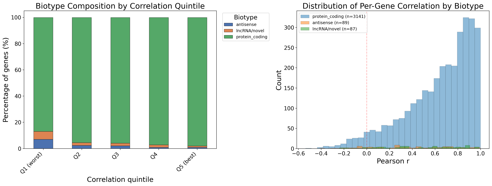

**Figure 9.** Left: Biotype composition by correlation quintile. Right: Distribution of Pearson r by biotype, showing that antisense and lncRNA genes are enriched at low correlations.

### 2.7 Platform bias and notable problem genes

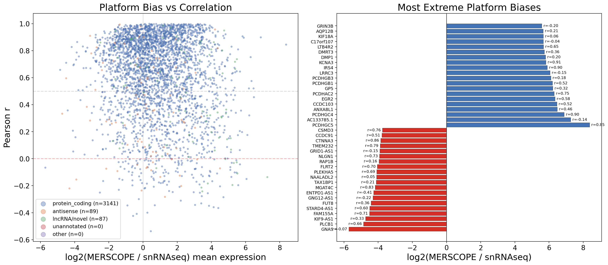

**Figure 10.** Left: Platform bias (log2FC MERSCOPE/snRNAseq) vs Pearson r, colored by biotype. Right: The 20 most MERSCOPE-enriched and 20 most MERSCOPE-depleted genes, with correlation values annotated.

**160 genes showed negative cross-platform correlation.** These fall into three archetypal failure modes:

#### Failure mode 1: Nuclear-retained transcripts (FISH-incompatible localization)

**MALAT1** (r = -0.346) is the most highly-expressed gene in snRNAseq (mean = 6.10) but substantially underdetected in MERSCOPE (mean = 3.24, log2FC = -0.91). MALAT1 is a nuclear-retained long non-coding RNA that is notoriously difficult for FISH-based methods. **GNAS** (r = -0.066) shows an even more extreme bias: mean 1.20 in snRNAseq but only 0.02 in MERSCOPE (log2FC = -5.72).

#### Failure mode 2: Probable probe cross-hybridization (MERSCOPE-enriched artifacts)

Genes like **PEX12** (r = -0.365, log2FC = +4.40), **TMEM92** (r = -0.359, log2FC = +4.13), **TCP10** (r = -0.349, log2FC = +3.85), and **CXCR6** (r = -0.285, log2FC = +4.70) are nearly undetectable in snRNAseq but show moderate MERSCOPE signal. These are likely driven by off-target probe binding or optical crosstalk generating spurious counts with no biological cell-type specificity.

#### Failure mode 3: Low-expression, flat genes (noise-dominated)

Genes like **KRTCAP2** (r = -0.537), **CARD8** (r = -0.423), and **ZNF219** (r = -0.400) have low expression and low cell-type variability in both platforms. Their cross-platform profiles are dominated by stochastic noise, and even modest platform-specific biases can invert the apparent expression pattern.

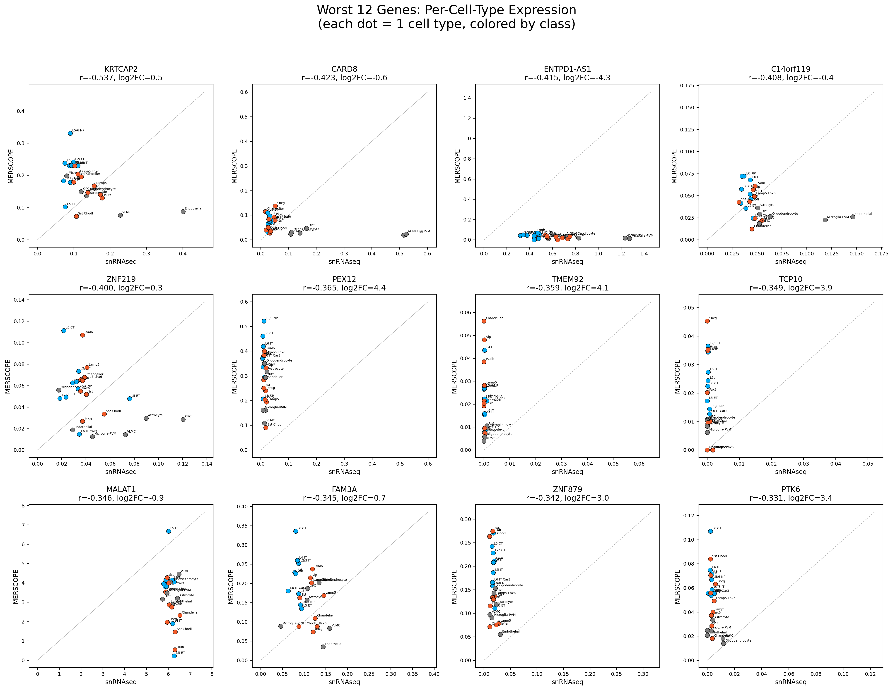

**Figure 11.** Per-cell-type expression scatter plots for the 12 worst-performing genes. Each dot represents one cell type (blue = glutamatergic, orange = GABAergic, gray = non-neuronal). Dashed line = identity. These genes show essentially no agreement between platforms in their cell-type expression patterns.

### 2.8 Top-performing genes

For context, the best-performing genes are highly cell-type-specific markers:

| Gene | Pearson r | Description |
|------|-----------|-------------|
| ITIH5 | 1.000 | Non-neuronal marker |
| APBB1IP | 0.999 | Microglia marker |
| GPR37L1 | 0.999 | Astrocyte/OPC marker |
| FLT1 | 0.999 | Endothelial marker |
| ITGAM | 0.998 | Microglia (CD11b) |
| PTPRC | 0.998 | Microglia (CD45) |

These are all highly specific to a single cell class, confirming that cell-type specificity is the key to reliable cross-platform measurement.

---

## Part 3: Cross-Platform Generalization

### 3.1 Approach

To test whether the findings above generalize beyond the MERSCOPE 4K platform, we repeated the per-gene snRNAseq vs spatial correlation analysis for two additional platforms:

- **SEA-AD MERFISH**: 1,887,729 cells, 180-gene curated panel, Allen Institute MTG reference data. Pre-normalized (ln(spots per 10K + 1)).
- **SCZ Xenium**: 1,225,037 QC-pass cells across 24 sections (12 SCZ, 12 control), 300-gene panel, raw counts normalized (total-count to 10K + log1p).

Both were compared to the same snRNAseq reference using pseudobulk per subclass.

### 3.2 Per-platform summary

| Platform | Genes | Cells | Median r | Mean r | r > 0.5 | r > 0.8 | r < 0 |
|----------|-------|-------|----------|--------|---------|---------|-------|
| **MERSCOPE 4K** | 3,317 | 43,357 | 0.701 | 0.624 | 70.9% | 37.4% | 4.8% |
| **SEA-AD MERFISH** | 140 | 1,887,729 | **0.893** | **0.871** | **98.6%** | **80.7%** | **0.0%** |
| **SCZ Xenium** | 300 | 1,225,037 | **0.891** | 0.771 | 86.0% | 68.0% | 3.3% |

The MERFISH and Xenium panels have dramatically higher median correlations (0.89 vs 0.70) and essentially no negatively-correlated genes. However, this reflects **panel design**, not superior platform chemistry: the 140-300 gene panels were curated to include cell-type-discriminating marker genes — exactly the high-CV, high-variance genes we identified as the strongest performers in Part 2. The MERSCOPE 4K panel includes thousands of additional genes, many with low cell-type variability, which drag the median down.

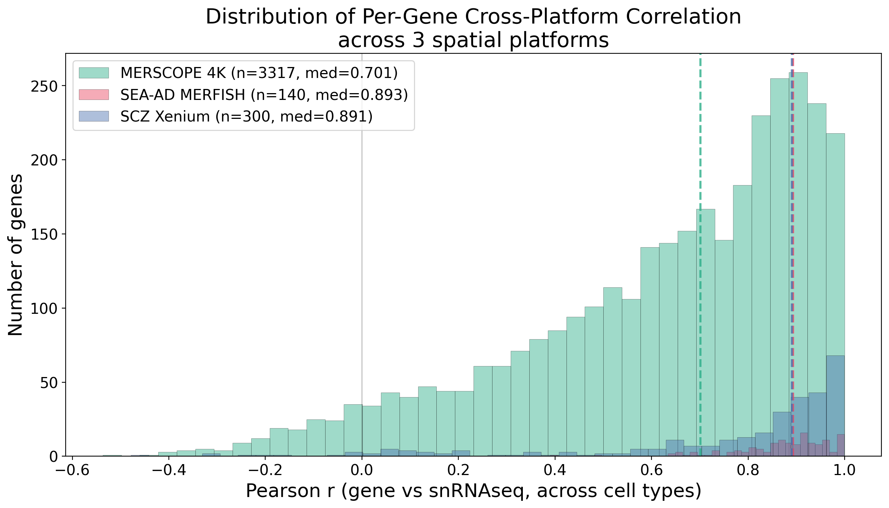

**Figure 12.** Distribution of per-gene Pearson r (vs snRNAseq) across all three spatial platforms. The MERSCOPE 4K distribution (green) has a long left tail of poorly-performing genes; the MERFISH (red) and Xenium (blue) distributions are concentrated at high r values, reflecting their curated probe panels.

### 3.3 Do the same genes perform poorly across platforms?

For genes present in multiple platforms, we asked whether a gene's correlation in one platform predicts its correlation in another:

| Platform pair | Shared genes | Pearson r of r values | Spearman rho of r values |
|---------------|-------------|----------------------|--------------------------|
| MERSCOPE vs MERFISH | 96 | 0.297 | **0.502** |
| MERSCOPE vs Xenium | 71 | **0.650** | **0.659** |
| MERFISH vs Xenium | 23 | 0.194 | **0.511** |

The rank-based agreement (Spearman) is moderate to strong (0.50-0.66), confirming that **genes that correlate poorly in one platform tend to correlate poorly in others**. The MERSCOPE-Xenium comparison shows the strongest agreement (rho = 0.659), possibly because both use FISH-based chemistry in similar tissue preparations.

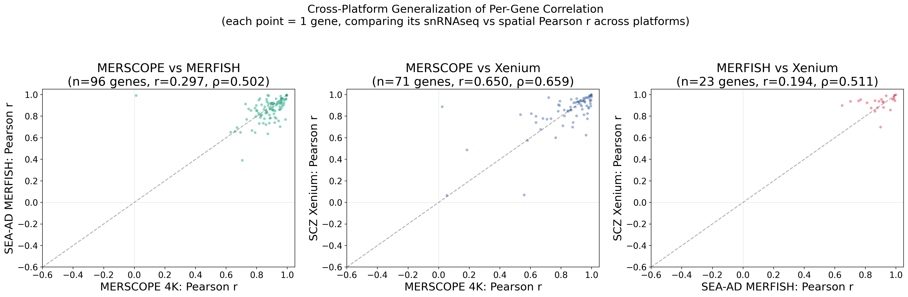

**Figure 13.** Pairwise scatter plots of per-gene Pearson r values across platforms. Each dot represents one gene. The positive trends confirm that gene-level correlation quality is partially a property of the gene itself, not just the platform.

### 3.4 Do the same gene properties predict failure across platforms?

The key question: do the snRNAseq-derived gene properties that predicted poor correlation in MERSCOPE also predict poor correlation in MERFISH and Xenium? Since these properties are computed entirely from the snRNAseq reference, they are **platform-independent** and could serve as a priori predictors of probe reliability.

| snRNAseq property | MERSCOPE 4K | SEA-AD MERFISH | SCZ Xenium |
|-------------------|-------------|----------------|------------|
| Variance | +0.56 | -0.40 | +0.25 |
| CV across cell types | **+0.41** | **+0.57** | **+0.52** |
| Expression entropy | **-0.42** | **-0.56** | **-0.56** |
| Mean expression | +0.25 | -0.51 | -0.17 |
| Detection rate | +0.15 | -0.51 | -0.33 |

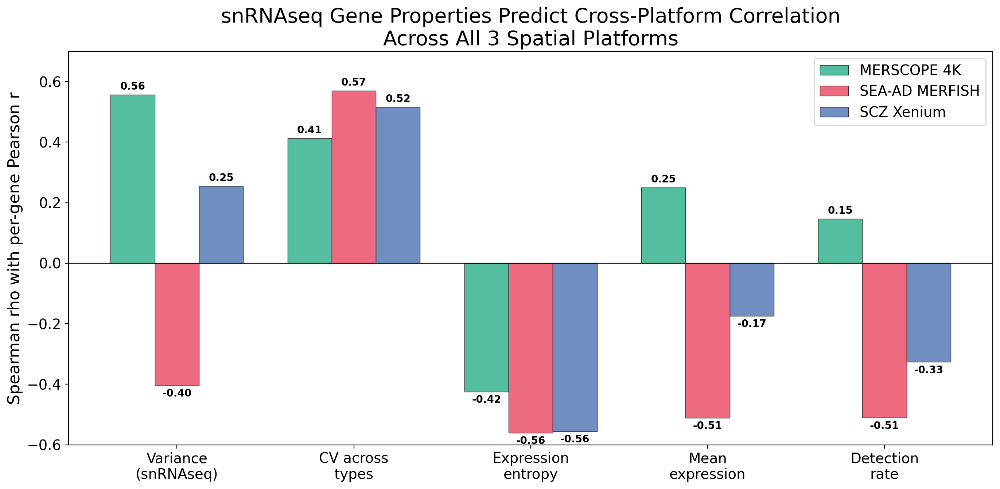

**Figure 14.** snRNAseq gene properties predicting cross-platform Pearson r, compared across all three spatial platforms. Bar height = Spearman rho between the gene property and per-gene r.

**Two properties generalize perfectly across all three platforms:**

1. **Expression entropy** (Shannon entropy of pseudobulk across cell types): Consistently and strongly predicts poor correlation in all three platforms (rho = -0.42, -0.56, -0.56). Higher entropy means more uniform expression = worse cross-platform agreement.

2. **CV across cell types**: The complementary measure — consistently predicts good correlation in all three (rho = +0.41, +0.57, +0.52). Higher CV means more differential expression = better cross-platform agreement.

These are both computable from the snRNAseq reference alone, before any spatial experiment is run.

### 3.5 The reversal of mean expression and detection rate

An interesting nuance: **mean expression and detection rate reverse sign** between MERSCOPE and MERFISH/Xenium:

- In MERSCOPE (3,317 genes): higher expression = better r (rho = +0.25, +0.15)
- In MERFISH (140 genes): higher expression = *worse* r (rho = -0.51, -0.51)
- In Xenium (300 genes): higher expression = *worse* r (rho = -0.17, -0.33)

This is a **selection bias artifact**, not a biological contradiction. The MERFISH and Xenium panels were curated to include cell-type-discriminating marker genes. Within these curated panels, the remaining low-expression genes tend to be specific markers for rare cell types (high CV despite low abundance), so they correlate well. Meanwhile, the highest-expression genes in these panels are often ubiquitously-expressed genes (like MALAT1) with low cell-type specificity — and these are the ones that perform worst.

In contrast, the MERSCOPE 4K panel includes many low-expression genes that are *also* low-variance (non-specific), creating a population of genes where both low expression and low variability combine to produce poor correlations.

This distinction underscores that **cell-type variability is the fundamental predictor** — expression level is merely a confounded proxy whose sign depends on the composition of the gene panel.

---

## Summary and Conclusions

### Key findings

1. **Overall concordance is moderate**: snRNAseq and MERSCOPE 4K pseudobulk profiles correlate with per-cell-type Pearson r of 0.31-0.55 (median 0.50) and per-gene Pearson r of median 0.70. Rank-based correlations are consistently higher (Spearman rho ~0.70-0.74), suggesting monotonic agreement is good despite divergent absolute magnitudes.

2. **Cell-type variability is the dominant predictor of gene-level reproducibility**: Across all three platforms, expression entropy (rho = -0.42 to -0.56) and CV across cell types (rho = +0.41 to +0.57) are the strongest and most consistent predictors of whether a gene's cell-type expression pattern reproduces cross-platform. These properties can be computed from snRNAseq alone.

3. **160 genes (4.8%) show negative cross-platform correlation in MERSCOPE**, falling into three failure modes: nuclear-retained transcripts (e.g., MALAT1), probable probe cross-hybridization artifacts (e.g., PEX12, TMEM92), and noise-dominated low-expression flat genes (e.g., KRTCAP2, CARD8).

4. **Non-coding genes are 7x enriched among the worst performers**: Antisense and lncRNA/novel genes comprise 13.1% of the worst quintile vs 2.0% of the best.

5. **Curated panels (MERFISH 180g, Xenium 300g) perform dramatically better** (median r = 0.89) than the unbiased 4K panel (median r = 0.70), because they are enriched for high-CV marker genes by design.

6. **Poor gene performance is partially gene-intrinsic**: The same genes that perform poorly in MERSCOPE tend to perform poorly in MERFISH and Xenium (Spearman rho of gene-level r values = 0.50-0.66 across platforms).

### Practical implications

- **Probe panel design should prioritize cell-type-variable genes** over sheer panel size. The marginal value of adding genes with low cell-type specificity to a spatial panel is minimal — they contribute noise, not signal.
- **A priori quality filtering is feasible**: Using only the snRNAseq reference, one can compute CV and entropy for candidate genes and predict which will yield reliable spatial expression profiles. Genes with snRNAseq entropy > 4.4 bits (approaching the maximum of log2(24) = 4.58 for 24 cell types) should be flagged as unreliable.
- **Cross-platform analyses should weight genes by reliability**: For differential expression or compositional analyses that aggregate across genes, down-weighting or excluding low-CV genes may improve signal-to-noise.
- **Antisense/lncRNA genes require extra validation**: Non-coding genes should be treated with extra skepticism in spatial platforms and validated independently before inclusion in biological conclusions.

---

## Methods

### Data sources

- **snRNAseq reference**: SEA-AD MTG snRNAseq (Nicole Comfort), 137,303 cells, 36,601 genes, raw integer counts
- **MERSCOPE 4K**: Fang et al. (2022), 4 donors, 14 sections (250g and 4000g panels), 43,357 QC-pass cells (4K sections), 3,999 genes, raw counts
- **SEA-AD MERFISH**: Allen Institute, 27 donors, 69 sections, 1,887,729 cells, 180 genes, pre-normalized (ln(spots/10K + 1))
- **SCZ Xenium**: 24 sections (12 SCZ, 12 control), 1,225,037 QC-pass cells, 300 genes, raw counts

### Normalization

For snRNAseq and MERSCOPE/Xenium (raw counts): scanpy normalize_total (target_sum=10,000) + log1p. SEA-AD MERFISH was used as-is (pre-normalized by Allen Institute using ln(spots/10K + 1)).

### Pseudobulk computation

For each platform, mean expression was computed per subclass (cell type label) across all cells assigned to that subclass. Cell types with fewer than 10 cells were excluded. The 24 subclasses shared across all analyses were: L2/3 IT, L4 IT, L5 IT, L5 ET, L5/6 NP, L6 IT, L6 IT Car3, L6 CT, L6b, Lamp5, Lamp5 Lhx6, Sncg, Vip, Pax6, Chandelier, Pvalb, Sst, Sst Chodl, Astrocyte, Oligodendrocyte, OPC, Microglia-PVM, Endothelial, VLMC.

### Correlation metrics

- **Per-cell-type correlation**: For each subclass, Pearson r and Spearman rho of the expression vector across all shared genes between the two platforms.
- **Per-gene correlation**: For each gene, Pearson r and Spearman rho of the pseudobulk expression across the 24 cell types between platforms. Genes with zero variance in either platform were excluded.
- **Overall correlation**: Pearson r and Spearman rho of the full flattened pseudobulk matrices (genes x cell types).

### Gene property analysis

- **Expression entropy**: Shannon entropy of the pseudobulk expression distribution (after normalizing to proportions) across 24 cell types. Maximum entropy = log2(24) = 4.58 bits.
- **CV**: Standard deviation / mean of pseudobulk expression across cell types.
- **Detection rate**: Fraction of individual cells with expression > 0 for each gene.
- **Platform bias**: log2(mean_MERSCOPE / mean_snRNAseq), computed on pseudobulk means.
- **Gene biotype**: Inferred from gene naming conventions (AC/AL prefix = lncRNA/novel; -AS suffix = antisense; LINC/MIR prefix = lncRNA; standard gene symbols = protein-coding).

### Statistical tests

Mann-Whitney U tests (two-sided) compared gene property distributions between bottom and top quintiles. Spearman rank correlations assessed monotonic relationships between gene properties and cross-platform Pearson r.

### Code

All analyses were performed in Python using scanpy, anndata, scipy, and matplotlib. Analysis scripts are located in `code/analysis/`:
- `compare_snrnaseq_merscope_expression.py` — Baseline MERSCOPE vs snRNAseq comparison
- `characterize_poor_genes.py` — Gene property characterization
- `cross_platform_gene_corr.py` — Cross-platform generalization analysis

### Output files

All figures (.png) and tabular results (.csv) are saved in `output/presentation/`. Key CSVs:
- `snrnaseq_vs_merscope_gene_corr.csv` — Per-gene correlations (3,317 genes)
- `snrnaseq_vs_merfish_gene_corr.csv` — Per-gene correlations (140 genes)
- `snrnaseq_vs_xenium_gene_corr.csv` — Per-gene correlations (300 genes)
- `gene_properties_vs_correlation.csv` — Full gene property table (3,317 genes x 23 properties)
- `snrnaseq_vs_merscope_celltype_corr.csv` — Per-cell-type correlations (24 subclasses)
- `pseudobulk_snrnaseq_by_subclass.csv` — snRNAseq pseudobulk matrix
- `pseudobulk_merscope_by_subclass.csv` — MERSCOPE pseudobulk matrix
