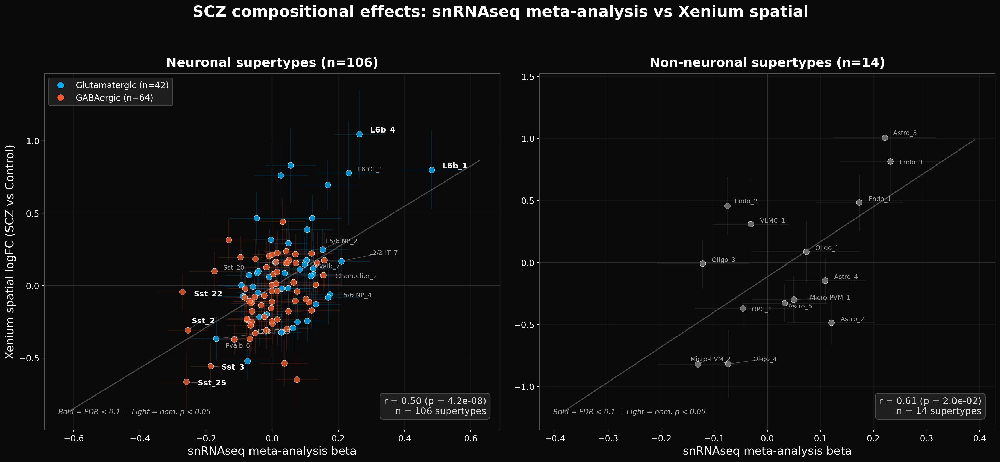
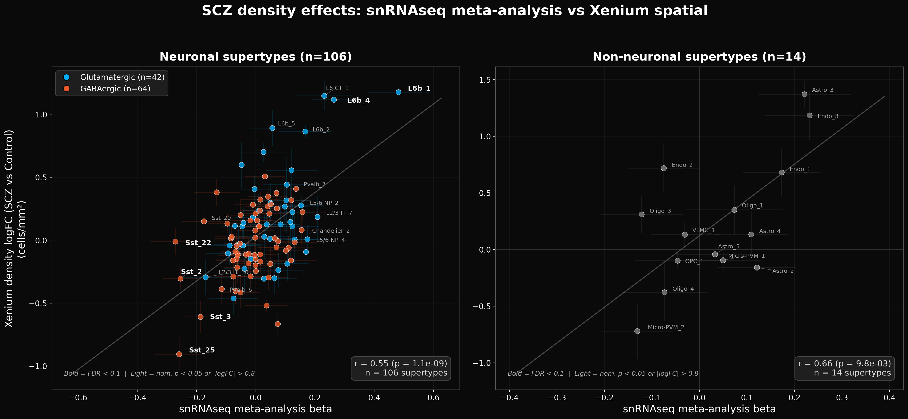

# SCZ Compositional Findings

## Purpose

This document presents the schizophrenia-related compositional differences detected by Xenium spatial transcriptomics, validated against an independent snRNA-seq meta-analysis. It covers concordance with snRNA-seq, depth-stratified findings, confidence tiers, and recommendations for interpretation. For the platform validation that underpins these analyses (Xenium vs MERFISH), see [Cross-Platform Validation](cross_platform_concordance.md).

---

## 1. Xenium vs snRNA-seq Meta-Analysis: SCZ Effects

The critical question is not just whether Xenium measures cell types accurately, but whether the SCZ vs Control compositional differences it detects are real. We compared Xenium SCZ effect sizes against an independent snRNA-seq meta-analysis of schizophrenia (7 cohorts, dissociation-based single-nucleus profiling). Both platforms use stratified crumblr analysis — neuronal and non-neuronal supertypes are analyzed separately, so proportions reflect within-class composition (e.g., Sst proportion out of all neurons, not all cells).

### 1.1 Supertype-level SCZ effect concordance

Across 120 shared supertypes, Xenium spatial logFC and snRNA-seq meta-analysis beta values correlate at **r = 0.51** (p = 2.5 × 10⁻⁹) overall, **r = 0.50** (p = 4.2 × 10⁻⁸) for neuronal supertypes (n = 106), and **r = 0.61** (p = 0.02) for non-neuronal supertypes (n = 14):

*Figure 1: SCZ effect sizes — snRNA-seq meta-analysis (x) vs Xenium spatial compositional logFC (y). Left: neuronal supertypes (r = 0.50, n = 106). Right: non-neuronal supertypes (r = 0.61, n = 14). Both platforms use stratified crumblr (neuronal and non-neuronal analyzed separately). Bold labels = snRNAseq FDR < 0.1.*

When using cell density (cells/mm²) rather than compositional proportions, the concordance improves to **r = 0.57** (p = 1.9 × 10⁻¹¹) overall, **r = 0.55** (p = 1.1 × 10⁻⁹) for neuronal supertypes, and **r = 0.66** (p = 9.8 × 10⁻³) for non-neuronal supertypes, suggesting that absolute density captures SCZ effects more faithfully than compositional analysis (which is subject to the zero-sum constraint):

*Figure 2: SCZ density effects — snRNA-seq meta-analysis (x) vs Xenium spatial density logFC (y). Left: neuronal supertypes (r = 0.55, n = 106). Right: non-neuronal supertypes (r = 0.66, n = 14). Density-based effects show stronger agreement than compositional effects.*

### 1.2 Concordant findings across platforms

The following SCZ effects are detected independently by both Xenium spatial and snRNA-seq meta-analysis, providing the strongest evidence:

| Supertype | snRNAseq direction | Xenium direction | Interpretation |
|-----------|-------------------|------------------|----------------|
| Sst_25 | ↓↓ (β = −0.26, FDR = 0.037) | ↓↓ (logFC = −0.66, FDR = 0.028) | Strong concordance — both platforms detect Sst_25 depletion; FDR-significant in both |
| Sst_3 | ↓ (β = −0.19, FDR = 0.046) | ↓↓ (logFC = −0.56, FDR = 0.028) | Concordant Sst depletion; FDR-significant in both |
| Sst_2 | ↓↓ (β = −0.25, FDR = 0.001) | ↓ (logFC = −0.31, p = 0.028) | Concordant Sst depletion |
| L6b_4 | ↑↑ (β = +0.26, FDR = 0.022) | ↑↑ (logFC = +1.05, FDR = 0.028) | Strong concordance — L6b increase; FDR-significant in both |
| L6b_1 | ↑↑ (β = +0.48, FDR < 0.001) | ↑↑ (logFC = +0.80, FDR = 0.056) | Strong concordance — L6b increase |
| L6b_2 | ↑ (β = +0.17, p = 0.055) | ↑↑ (logFC = +0.70, FDR = 0.028) | Concordant L6b increase; FDR-significant in Xenium |
| L6 CT_1 | ↑ (β = +0.23, p = 0.014) | ↑ (logFC = +0.78, p = 0.039) | Concordant deep-layer increase |

### 1.3 Discordant findings: classification artifacts

Some supertypes show **discordant** SCZ effects between platforms — where one shows an increase and the other a decrease. These are red flags for classification artifacts:

| Supertype | snRNAseq | Xenium | Likely explanation |
|-----------|----------|--------|-------------------|
| Sst_22 | ↓↓ (β = −0.27, FDR = 0.022) | ≈0 (logFC = −0.04, p = 0.72) | Strong snRNAseq depletion not replicated in Xenium; only 0–1 within-subclass markers for Sst supertypes in the 300-gene panel |
| Sst_20 | ↓ (β = −0.17, p = 0.019) | ↑ (logFC = +0.10, p = 0.45) | Classification confusion with Sst_3; margin drops significantly in SCZ (p = 2.3 × 10⁻¹⁶). See [Supertype Classification Confidence Report](output/marker_analysis/SUPERTYPE_CLASSIFICATION_CONFIDENCE_REPORT.md) |

The Sst subclass is particularly vulnerable because the 300-gene panel contains **0–1 discriminating markers** for most Sst supertypes (see [Panel Design Report](output/marker_analysis/XENIUM_PANEL_DESIGN_AND_SUPERTYPE_CLASSIFICATION.md)). The aggregate Sst depletion signal is real (both platforms agree on overall Sst reduction), but the allocation of that signal across specific supertypes is unreliable.

### 1.4 Supertype-level SCZ effects in Xenium

*Figure 3: Top supertype SCZ effects (proportions). Top row: Sst subtypes. Bottom row: L6b and deep-layer subtypes. Crumblr p-values adjusted for age and sex.*

*Figure 4: Same supertypes, density (cells/mm²). Density effects tend to be larger and more consistent than compositional effects.*

*Figure 5: Aggregated effects for vulnerable Sst subtypes (Sst_2 + Sst_22 + Sst_25 + Sst_20 + Sst_3, top, n=12/group) and all L6b cells at subclass level (bottom, n=10/group). Sst depletion: proportion p = 0.02, density p = 0.17. L6b increase: proportion p = 0.009, density p = 0.005. For L6b, 4 samples with insufficient deep cortex coverage (<3% L6 cells: Br2039, Br5973, Br2719, Br5314) were excluded.*

*Figure 6: Spatial distribution of Sst_25 cells in median-representative Control (top) and SCZ (bottom) sections. Samples chosen as closest to group median Sst_25 proportion (Control: Br5400, Br5314; SCZ: Br6496, Br6437). Control median = 0.199%, SCZ median = 0.083%. Layer boundaries shown as colored bands.*

---

## 2. What Can Be Safely Concluded

### 2.1 High-confidence findings (subclass level)

These findings survive multiple independent validations and should be considered robust:

**Oligodendrocyte depletion in SCZ:**
- CLR main diagnosis effect: FDR = 0.0007
- Depth × diagnosis interaction: FDR = 0.045 (concentrated in superficial cortex)
- Per-layer analysis localizes to L2/3: FDR = 0.086 (proportion and density)
- Consistent across compositional (crumblr) and density-based analyses
- Not driven by a single sample or tissue geometry confound

*Figure 7: Deep dive on the Oligodendrocyte L2/3 finding. (A) Depth profile by diagnosis. (B–C) L2/3-specific proportion and density. (D) Proportion across all layers. (E) Per-sample ranked comparison. (F) Oligodendrocyte count vs L2/3 size (confound check).*

The depth-stratified analysis reveals that oligodendrocyte depletion is not uniform across cortex — the non-neuronal depth profiles show clear SCZ–Control separation for oligodendrocytes, with the effect concentrated in superficial layers where oligodendrocytes are normally sparse:

*Figure 8: Non-neuronal subclass depth profiles (% of non-neuronal class). SCZ (red) vs Control (blue). Oligodendrocyte and OPC show clear separation between SCZ and Control curves. Stars indicate per-bin significance.*

*Figure 9: Non-neuronal subclass density profiles (cells/mm²). Endothelial cells show increased density across nearly all depth bins in SCZ.*

**Neuronal laminar architecture is preserved:**
- No neuronal subclass shows a significant depth × diagnosis interaction
- 22/23 subclasses have significant depth main effects (FDR < 0.05)
- Whatever drives SCZ compositional changes operates on the non-neuronal compartment

The neuronal depth profiles confirm this — SCZ and Control curves largely overlap across all neuronal subclasses, with only scattered nominally significant bins that do not survive correction:

*Figure 10: Neuronal subclass depth profiles (% of neuronal class). SCZ (red) vs Control (blue). No neuronal subclass shows systematic SCZ–Control separation, in contrast to the non-neuronal compartment.*

*Figure 11: Neuronal subclass density profiles (cells/mm²). Scattered nominal significance (Pvalb, Sst, L6 CT) but no subclass shows the sustained multi-bin separation seen for oligodendrocytes or endothelial cells.*

The layer-specific density heatmap shows the full pattern of SCZ effects across all subclasses and layers:

*Figure 12: Layer-specific density changes (log₂FC, SCZ vs Control). Layers on y-axis, pia at top. Oligodendrocyte depletion strongest in L2/3. Endothelial increases across multiple layers. See [Depth-Stratified Analysis Report](output/depth_proportions/DEPTH_STRATIFIED_ANALYSIS_REPORT.md) for full per-layer model results.*

### 2.2 Moderate-confidence findings (subclass/supertype level)

These show consistent trends but do not reach FDR significance in all analyses:

**OPC trend in SCZ:**
- Nominally significant in both per-layer and CLR interaction analyses
- Consistent with a broader oligodendrocyte-lineage effect
- FDR = 0.20 (CLR main effect), FDR = 0.35 (interaction) — suggestive but not definitive

**Endothelial increase:**
- FDR-significant in the non-neuronal stratified analysis: logFC = +0.63, FDR = 0.024 (proportion out of non-neuronal cells)
- Widespread density increases across L2/3–L5 (multiple nominal p < 0.01)
- Consistent direction across layers (visible in Figures 9 and 12)

**L6b subclass increase:**
- All L6b supertypes (L6b_1–L6b_6) aggregated at subclass level show increased proportion and density in SCZ
- Aggregated L6b effect (excluding 4 samples with <3% L6 cells): p = 0.009 (proportion), p = 0.005 (density) — see Figure 5
- Effect is attenuated (p ~ 0.07) when including samples with insufficient deep cortex coverage, which contribute near-zero L6b counts
- Concordant with snRNA-seq meta-analysis direction
- But L6b classification has known issues (7.2% still misplaced in upper layers)

### 2.3 Findings that require caution (supertype level)

These should be interpreted carefully due to classification limitations:

**Individual Sst supertype effects:**
- The overall Sst depletion signal appears real (concordant with snRNA-seq)
- But allocation across specific supertypes (Sst_20 vs Sst_3 vs Sst_25) is unreliable
- Only 0–1 within-subclass markers available for most Sst supertypes in the 300-gene panel
- Classification margins for Sst_3 drop significantly in SCZ, indicating diagnosis-dependent misclassification

**Any supertype with LOW classification confidence:**
- 15 of 20 nominally significant supertype effects have LOW confidence ratings
- See the [Supertype Classification Confidence Report](output/marker_analysis/SUPERTYPE_CLASSIFICATION_CONFIDENCE_REPORT.md) for per-supertype ratings

**Non-neuronal supertype distinctions:**
- Astro_3, Oligo_1 vs Oligo_2, Micro-PVM_2 — these show interesting effects but the supertype boundaries are defined by markers largely absent from the Xenium panel
- Subclass-level conclusions (Oligodendrocyte depleted, Astrocyte trending) are safer than supertype-level ones

---

## 3. Hierarchy of Evidence

| Level | What | Concordance | Confidence |
|-------|------|-------------|------------|
| **SCZ effects (density)** | Xenium vs snRNAseq | r = 0.57 (neuronal r = 0.55, non-neuronal r = 0.66) | Moderate — independent platforms, different cohorts, different tissue regions |
| **SCZ effects (composition, stratified)** | Xenium vs snRNAseq | r = 0.51 (neuronal r = 0.50, non-neuronal r = 0.61) | Moderate — stratified analysis improves concordance |
| **Supertype SCZ effects** | Xenium vs snRNAseq | variable | Type-dependent — check [confidence ratings](output/marker_analysis/SUPERTYPE_CLASSIFICATION_CONFIDENCE_REPORT.md) |
| **Subclass proportions** | Xenium vs MERFISH | r = 0.84 | High — see [Cross-Platform Validation](cross_platform_concordance.md) |
| **Subclass depth** | Xenium vs MERFISH | r = 0.96 | High — see [Cross-Platform Validation](cross_platform_concordance.md) |

---

## 4. Recommendations for Downstream Use

1. **Report subclass-level results as primary findings.** The Oligodendrocyte depletion, neuronal preservation, and depth-stratified effects are well-validated and should be the headline conclusions.

2. **Use supertype results to generate hypotheses, not confirm them.** Any supertype finding from the 300-gene Xenium panel should be validated in an independent dataset (snRNA-seq, MERFISH, or a higher-coverage spatial platform) before being considered definitive.

3. **Always check the supertype confidence rating** before interpreting a supertype-level result. The [Supertype Classification Confidence Report](output/marker_analysis/SUPERTYPE_CLASSIFICATION_CONFIDENCE_REPORT.md) provides HIGH/MEDIUM/LOW ratings for each supertype based on within-subclass marker coverage in the Xenium panel.

4. **Prefer density over composition for SCZ comparisons.** Density-based effects (cells/mm²) are not subject to the compositional zero-sum constraint and show stronger concordance with snRNA-seq (r = 0.57 vs r = 0.51). When using composition, analyze neuronal and non-neuronal types separately (stratified crumblr) to avoid cross-compartment confounds.

5. **Be skeptical of Sst supertype allocations.** The aggregate Sst reduction is likely real, but the specific supertypes driving it cannot be determined from this panel. The Sst_20/Sst_3 discordance with snRNA-seq is a documented classification artifact.

---

## 5. Related Documents

| Document | Focus |
|----------|-------|
| [Cross-Platform Validation](cross_platform_concordance.md) | Xenium vs MERFISH measurement validation |
| [Methods: Cell Typing, Depth Inference, and Validation](methods_writeup.md) | Pipeline methods, classifier validation, depth model, QC calibration |
| [Depth-Stratified Analysis Report](output/depth_proportions/DEPTH_STRATIFIED_ANALYSIS_REPORT.md) | Per-layer and CLR depth × diagnosis results with figures |
| [Supertype Classification Confidence](output/marker_analysis/SUPERTYPE_CLASSIFICATION_CONFIDENCE_REPORT.md) | Per-supertype confidence ratings and Sst fragility analysis |
| [Panel Design & Supertype Classification](output/marker_analysis/XENIUM_PANEL_DESIGN_AND_SUPERTYPE_CLASSIFICATION.md) | Cross-platform marker adequacy, add-on gene recommendations |
