# SCZ Compositional Findings

## Purpose

This document presents the schizophrenia-related compositional differences detected by Xenium spatial transcriptomics, validated against an independent snRNA-seq meta-analysis (7 cohorts). It covers cross-platform concordance at the subclass and supertype levels, depth-stratified findings, confidence tiers, and recommendations for interpretation. For the platform validation that underpins these analyses (Xenium vs MERFISH), see [Cross-Platform Validation](cross_platform_concordance.md).

Both platforms use **stratified crumblr analysis** — neuronal and non-neuronal types are analyzed separately, so proportions reflect within-class composition (e.g., Sst proportion out of all neurons, not all cells).

---

## 1. Cross-Platform Concordance: Subclass Level

Subclass-level concordance is the most interpretable comparison because subclass labels are robust (validated against MERFISH at r = 0.84 for proportions, r = 0.96 for depth). Across 23 shared subclasses (17 neuronal, 6 non-neuronal):

### 1.1 Subclass compositional concordance

**Neuronal subclasses show strong concordance: r = 0.70** (p = 1.9 × 10⁻³, n = 17). Deep-layer excitatory types (L6b, L6 CT, L6 IT) are consistently increased and inhibitory types (Sst, Pvalb, Vip) consistently decreased in SCZ across both platforms. Non-neuronal subclasses show no agreement (r = −0.20, p = 0.71, n = 6), driven by discordant Endothelial and Astrocyte effects:

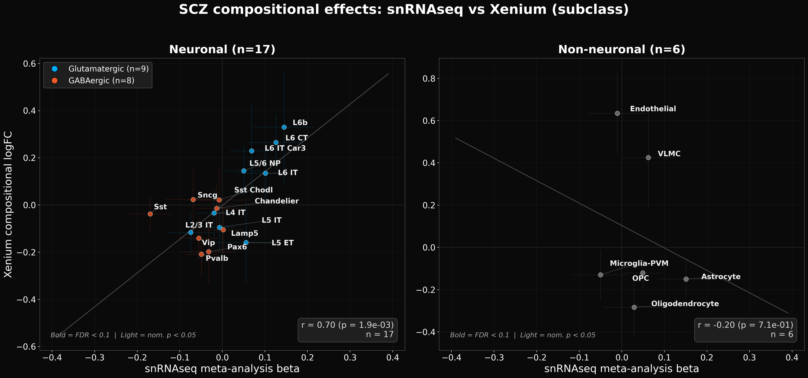
*Figure 1: Subclass-level SCZ compositional effects. Left: neuronal subclasses (r = 0.70, n = 17). Right: non-neuronal subclasses (r = −0.20, n = 6). All points labeled.*

### 1.2 Subclass density concordance

Using cell density (cells/mm²) instead of proportions, neuronal concordance remains strong: **r = 0.68** (p = 2.6 × 10⁻³, n = 17). L6b shows the largest concordant effect — increased in both platforms. Non-neuronal concordance is flat (r = 0.07, n = 6):

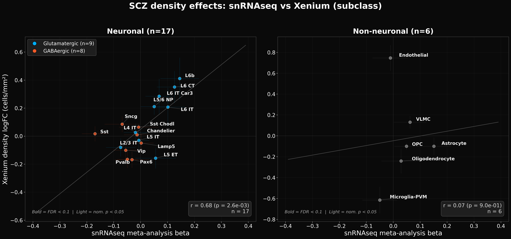
*Figure 2: Subclass-level SCZ density effects. Left: neuronal subclasses (r = 0.68, n = 17). Right: non-neuronal subclasses (r = 0.07, n = 6).*

### 1.3 Subclass-level concordant and discordant effects

Overall, 14/17 neuronal subclasses (82%) show concordant direction of effect across platforms. The strongest concordant and discordant effects are highlighted below:

**Strongest neuronal concordances:**

| Subclass | snRNAseq β | Xenium logFC | Direction | Note |
|----------|-----------|-------------|-----------|------|
| **Sst** | −0.169 (FDR = 0.009) | −0.038 (FDR = 0.81) | ↓↓ | FDR-significant in snRNAseq; concordant Xenium effect |
| **L6b** | +0.145 (FDR = 0.32) | +0.330 (FDR = 0.47) | ↑↑ | Largest concordant effect; concordant in composition and density |
| **L6 CT** | +0.126 (FDR = 0.32) | +0.265 (FDR = 0.37) | ↑↑ | Deep-layer excitatory increase |
| **L6 IT** | +0.101 (FDR = 0.49) | +0.134 (FDR = 0.48) | ↑↑ | Deep-layer excitatory increase |
| **Pvalb** | −0.049 (FDR = 0.49) | −0.208 (FDR = 0.37) | ↓↓ | Concordant inhibitory decrease |
| **Vip** | −0.055 (FDR = 0.49) | −0.141 (FDR = 0.47) | ↓↓ | Concordant inhibitory decrease |

**Notable non-neuronal effects:**

| Subclass | snRNAseq β | Xenium logFC | Direction | Note |
|----------|-----------|-------------|-----------|------|
| **Endothelial** | −0.011 (FDR = 0.87) | +0.634 (FDR = 0.024) | **Discordant** | FDR-significant Xenium increase; snRNAseq ≈ 0. Endothelial cells may be under-sampled in dissociation-based snRNAseq |
| **Oligodendrocyte** | +0.029 (FDR = 0.83) | −0.283 (FDR = 0.16) | **Discordant** | Xenium shows depletion (consistent with depth-stratified L2/3 finding); snRNAseq ≈ 0 |
| **Astrocyte** | +0.151 (FDR = 0.11) | −0.150 (FDR = 0.17) | **Discordant** | Opposite directions, neither FDR-significant |

The non-neuronal discordance (overall r = −0.20) is notable. Two possible interpretations: (1) dissociation-based snRNAseq under-samples endothelial and vascular cells, so spatial platforms may detect effects invisible to snRNAseq; (2) the Xenium non-neuronal composition is influenced by tissue geometry confounds (e.g., white matter inclusion) that don't affect snRNAseq. The oligodendrocyte discordance is particularly interesting — Xenium detects a depletion (consistent with depth-stratified findings showing L2/3 oligodendrocyte loss) that snRNAseq misses.

---

## 2. Cross-Platform Concordance: Supertype Level

At the supertype level (120 shared supertypes, 106 neuronal + 14 non-neuronal), concordance is moderate. Supertype labels are less reliable than subclass labels due to the 300-gene Xenium panel having limited within-subclass discriminating markers, so some attenuation is expected.

### 2.1 Supertype compositional concordance

**Overall r = 0.51** (p = 2.5 × 10⁻⁹), **neuronal r = 0.50** (p = 4.2 × 10⁻⁸, n = 106), **non-neuronal r = 0.61** (p = 0.02, n = 14):

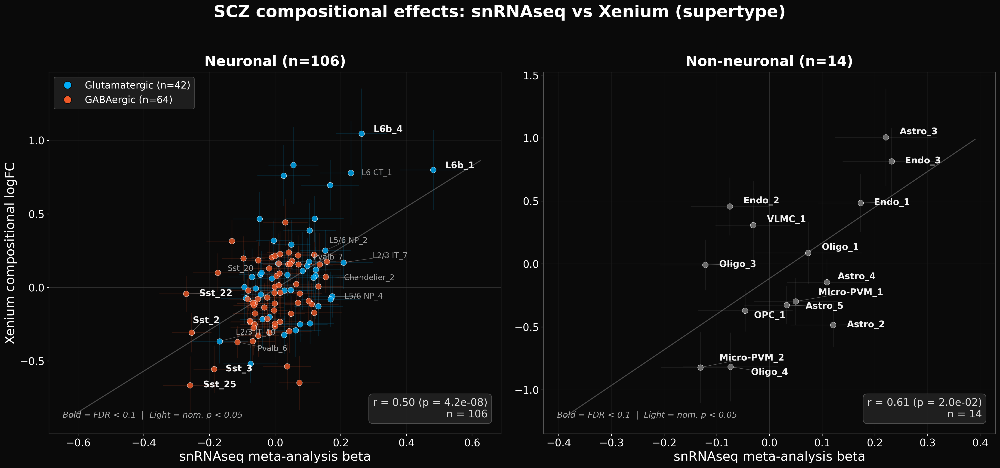
*Figure 3: Supertype-level SCZ compositional effects. Left: neuronal supertypes (r = 0.50, n = 106). Right: non-neuronal supertypes (r = 0.61, n = 14). Bold labels = snRNAseq FDR < 0.1.*

### 2.2 Supertype density concordance

Density-based concordance is stronger: **overall r = 0.57** (p = 1.9 × 10⁻¹¹), **neuronal r = 0.55** (p = 1.1 × 10⁻⁹), **non-neuronal r = 0.66** (p = 9.8 × 10⁻³):

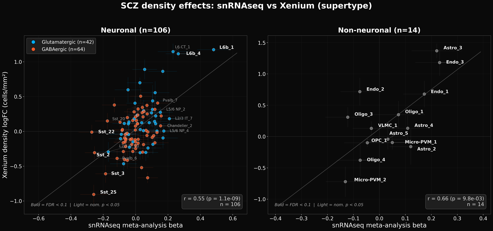
*Figure 4: Supertype-level SCZ density effects. Left: neuronal supertypes (r = 0.55, n = 106). Right: non-neuronal supertypes (r = 0.66, n = 14). Density-based effects show stronger agreement than compositional effects.*

### 2.3 Concordant supertype findings

The following supertypes are detected independently by both platforms, providing the strongest supertype-level evidence:

| Supertype | snRNAseq direction | Xenium direction | Interpretation |
|-----------|-------------------|------------------|----------------|
| Sst_25 | ↓↓ (β = −0.26, FDR = 0.037) | ↓↓ (logFC = −0.66, FDR = 0.028) | FDR-significant in both platforms |
| Sst_3 | ↓ (β = −0.19, FDR = 0.046) | ↓↓ (logFC = −0.56, FDR = 0.028) | FDR-significant in both |
| Sst_2 | ↓↓ (β = −0.25, FDR = 0.001) | ↓ (logFC = −0.31, p = 0.028) | Concordant Sst depletion |
| L6b_4 | ↑↑ (β = +0.26, FDR = 0.022) | ↑↑ (logFC = +1.05, FDR = 0.028) | FDR-significant in both |
| L6b_1 | ↑↑ (β = +0.48, FDR < 0.001) | ↑↑ (logFC = +0.80, FDR = 0.056) | Strong concordance |
| L6b_2 | ↑ (β = +0.17, p = 0.055) | ↑↑ (logFC = +0.70, FDR = 0.028) | Concordant L6b increase |
| L6 CT_1 | ↑ (β = +0.23, p = 0.014) | ↑ (logFC = +0.78, p = 0.039) | Concordant deep-layer increase |

### 2.4 Discordant supertype findings

| Supertype | snRNAseq | Xenium | Likely explanation |
|-----------|----------|--------|-------------------|
| Sst_22 | ↓↓ (β = −0.27, FDR = 0.022) | ≈0 (logFC = −0.04, p = 0.72) | Strong snRNAseq depletion not replicated; 0–1 within-subclass markers for Sst supertypes |
| Sst_20 | ↓ (β = −0.17, p = 0.019) | ↑ (logFC = +0.10, p = 0.45) | Classification confusion with Sst_3; margin drops significantly in SCZ (p = 2.3 × 10⁻¹⁶) |

The Sst subclass is particularly vulnerable because the 300-gene panel contains **0–1 discriminating markers** for most Sst supertypes (see [Panel Design Report](output/marker_analysis/XENIUM_PANEL_DESIGN_AND_SUPERTYPE_CLASSIFICATION.md)). The aggregate Sst depletion signal is real (both platforms agree at subclass level), but the allocation across specific supertypes is unreliable.

---

## 3. Xenium SCZ Effects: Detailed Views

### 3.1 Supertype-level boxplots

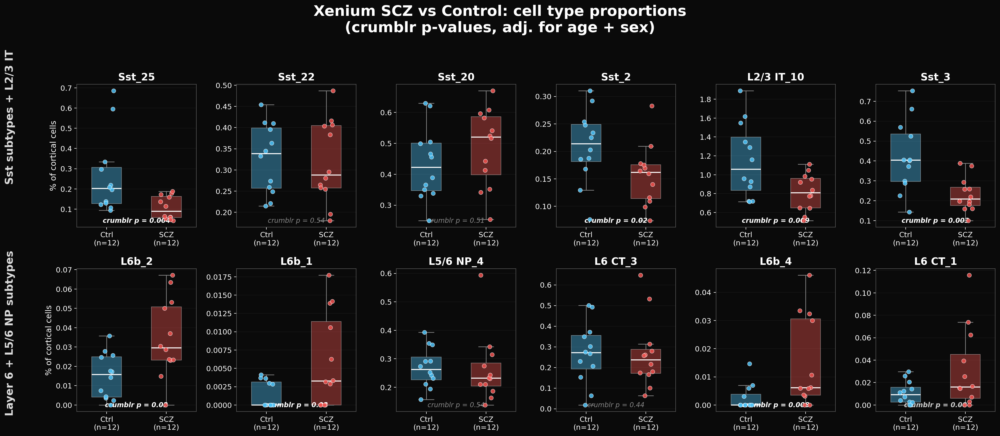
*Figure 5: Top supertype SCZ effects (proportions). Top row: Sst subtypes. Bottom row: L6b and deep-layer subtypes. Crumblr p-values adjusted for age and sex.*

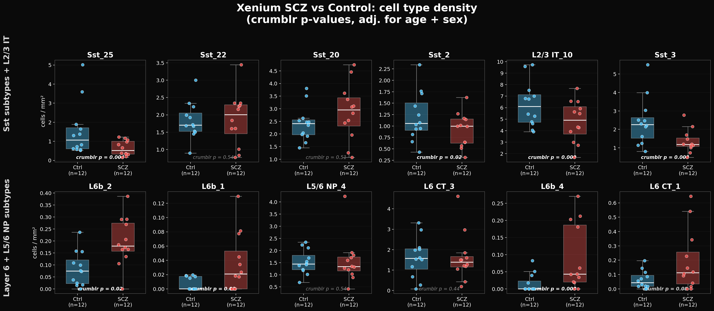
*Figure 6: Same supertypes, density (cells/mm²). Density effects tend to be larger and more consistent than compositional effects.*

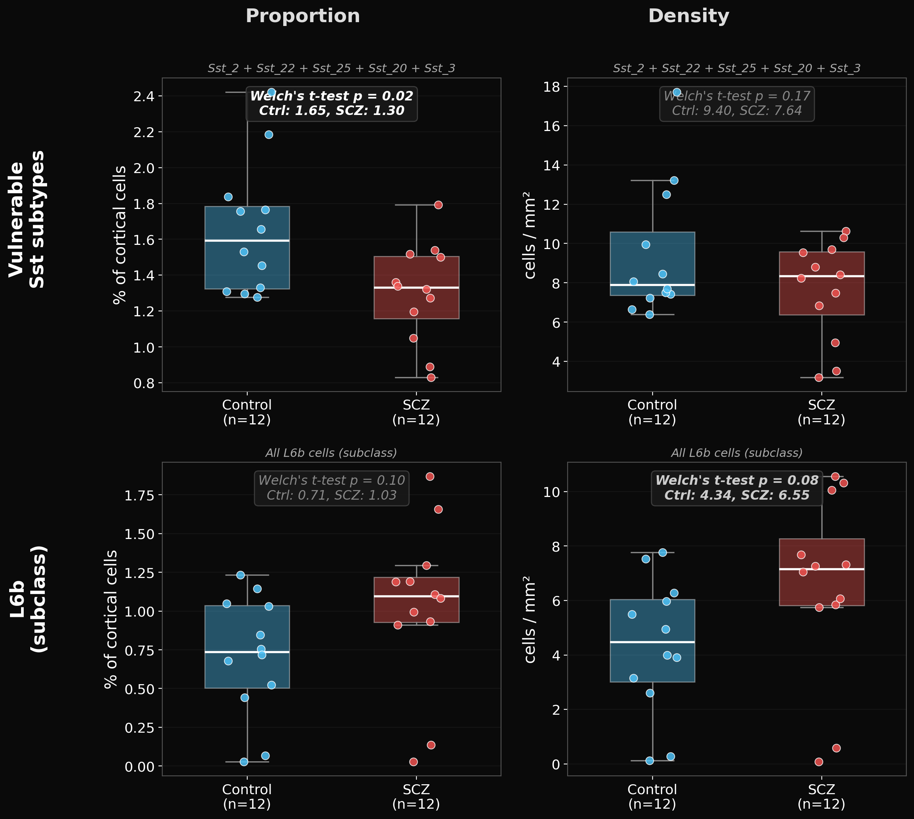
*Figure 7: Aggregated effects for vulnerable Sst subtypes (Sst_2 + Sst_22 + Sst_25 + Sst_20 + Sst_3, top, n=12/group) and all L6b cells at subclass level (bottom, n=10/group). Sst depletion: proportion p = 0.02, density p = 0.17. L6b increase: proportion p = 0.009, density p = 0.005. For L6b, 4 samples with insufficient deep cortex coverage (<3% L6 cells: Br2039, Br5973, Br2719, Br5314) were excluded.*

### 3.2 Spatial distribution

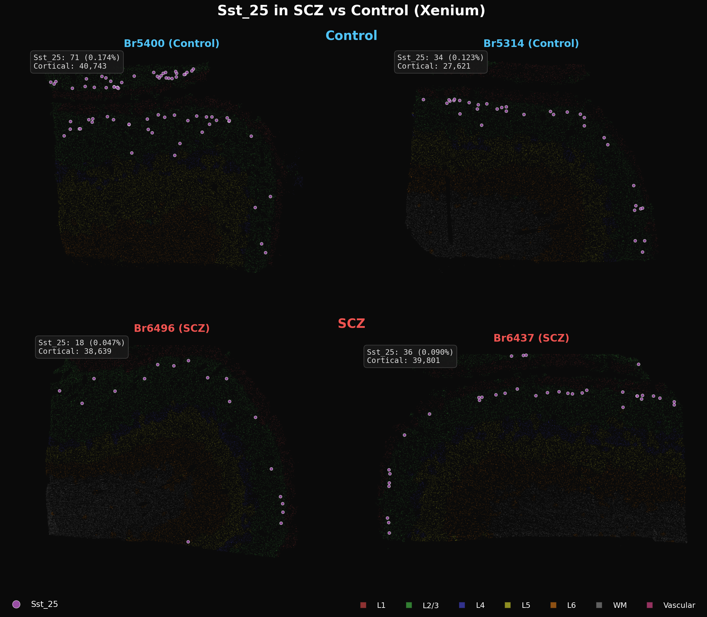
*Figure 8: Spatial distribution of Sst_25 cells in median-representative Control (top) and SCZ (bottom) sections. Samples chosen as closest to group median Sst_25 proportion (Control: Br5400, Br5314; SCZ: Br6496, Br6437). Control median = 0.199%, SCZ median = 0.083%. Layer boundaries shown as colored bands.*

### 3.3 Depth-stratified analysis

**Oligodendrocyte depletion in SCZ (high confidence):**
- CLR main diagnosis effect: FDR = 0.0007
- Depth × diagnosis interaction: FDR = 0.045 (concentrated in superficial cortex)
- Per-layer analysis localizes to L2/3: FDR = 0.086 (proportion and density)
- Consistent across compositional (crumblr) and density-based analyses
- Not driven by a single sample or tissue geometry confound
- Notably, snRNAseq meta-analysis does not detect this effect (β = +0.029, FDR = 0.83), suggesting the spatial component (L2/3-specific depletion) is key

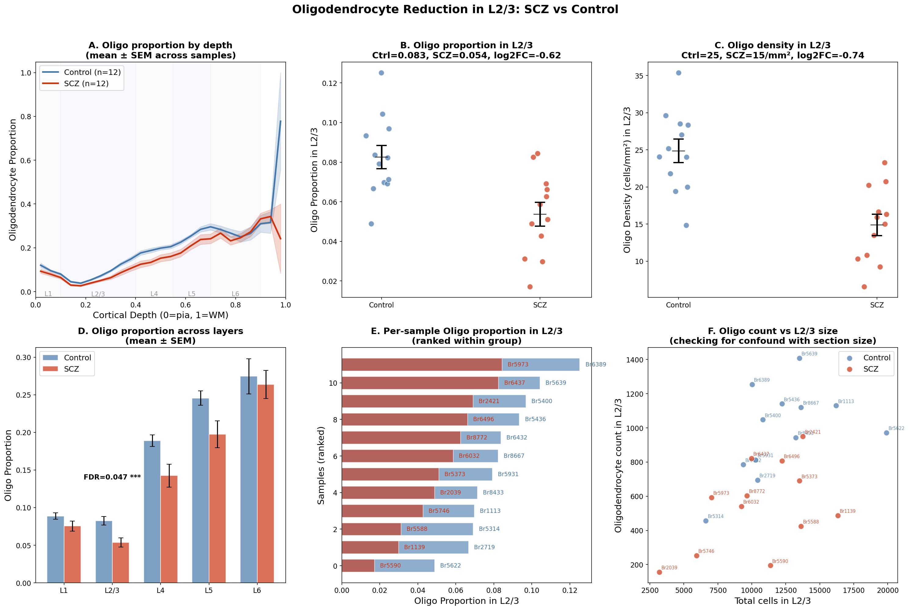
*Figure 9: Deep dive on the Oligodendrocyte L2/3 finding. (A) Depth profile by diagnosis. (B–C) L2/3-specific proportion and density. (D) Proportion across all layers. (E) Per-sample ranked comparison. (F) Oligodendrocyte count vs L2/3 size (confound check).*

**Non-neuronal depth profiles** reveal clear SCZ–Control separation for oligodendrocytes and endothelial cells:

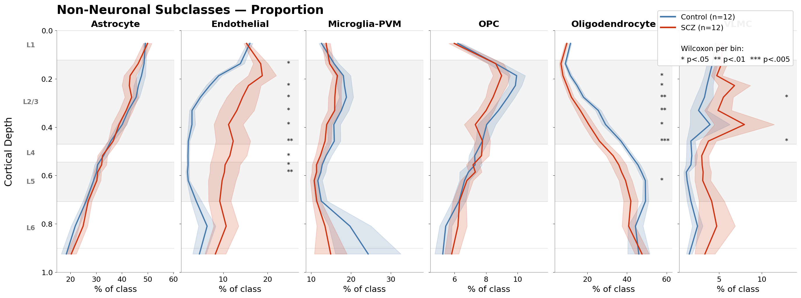
*Figure 10: Non-neuronal subclass depth profiles (% of non-neuronal class). Oligodendrocyte and OPC show clear SCZ–Control separation. Stars indicate per-bin significance.*

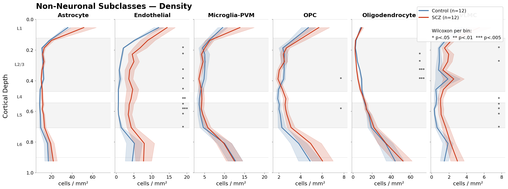
*Figure 11: Non-neuronal subclass density profiles (cells/mm²). Endothelial cells show increased density across nearly all depth bins in SCZ.*

**Neuronal laminar architecture is preserved:**
- No neuronal subclass shows a significant depth × diagnosis interaction
- 22/23 subclasses have significant depth main effects (FDR < 0.05)
- Whatever drives SCZ compositional changes operates on the non-neuronal compartment

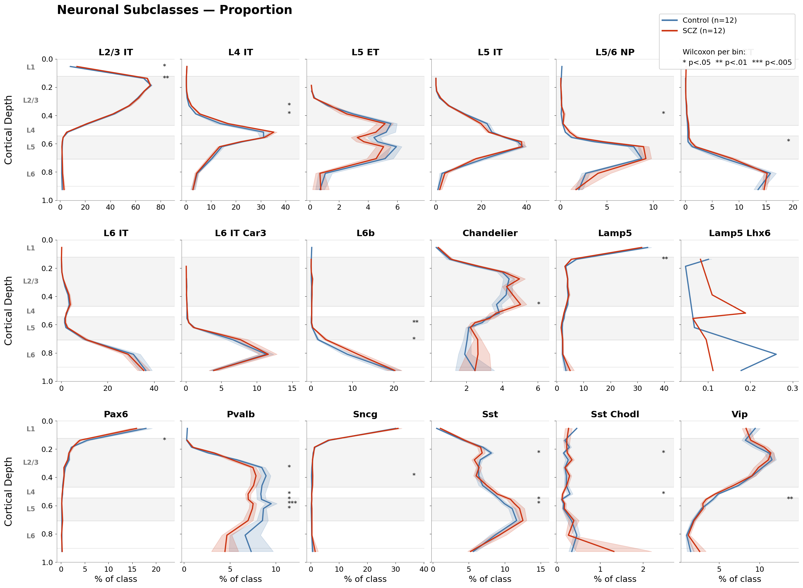
*Figure 12: Neuronal subclass depth profiles (% of neuronal class). No neuronal subclass shows systematic SCZ–Control separation.*

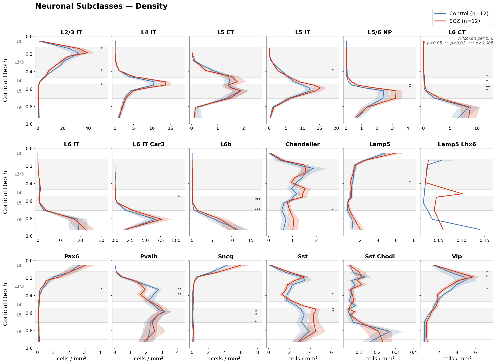
*Figure 13: Neuronal subclass density profiles (cells/mm²). Scattered nominal significance but no sustained multi-bin separation.*

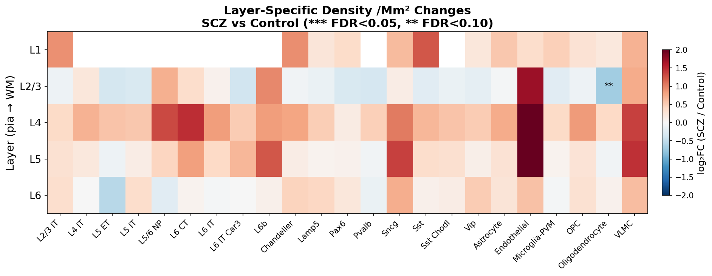
*Figure 14: Layer-specific density changes (log₂FC, SCZ vs Control). Oligodendrocyte depletion strongest in L2/3. Endothelial increases across multiple layers. See [Depth-Stratified Analysis Report](output/depth_proportions/DEPTH_STRATIFIED_ANALYSIS_REPORT.md) for full per-layer model results.*

---

## 4. Confidence Summary

### 4.1 High confidence (subclass level, cross-platform validated)

- **L6b increase**: concordant across platforms (snRNAseq β = +0.145, Xenium logFC = +0.330 composition, +0.412 density); largest neuronal concordant effect at subclass level
- **Sst decrease**: FDR-significant in snRNAseq (FDR = 0.009); concordant in Xenium; aggregate Sst depletion is real
- **Deep-layer excitatory increase**: L6 CT, L6 IT, L6 IT Car3, L5/6 NP all concordantly increased — a systematic pattern, not a single-type artifact
- **Inhibitory decrease**: Pvalb, Vip concordantly decreased — a systematic pattern

### 4.2 Moderate confidence (subclass level, Xenium-only or partially cross-platform)

- **Oligodendrocyte depletion**: FDR = 0.0007 (CLR main effect), depth × diagnosis FDR = 0.045, localized to L2/3. Not detected by snRNAseq (β ≈ 0), possibly because the effect is spatially restricted and diluted in bulk dissociation
- **Endothelial increase**: FDR = 0.024 (non-neuronal stratified composition); density increases across L2/3–L5. Not detected by snRNAseq, possibly because endothelial cells are under-sampled in dissociation-based protocols
- **L6b subclass increase**: Aggregated p = 0.009 (proportion), p = 0.005 (density) — but attenuated when including samples with insufficient deep cortex coverage
- **OPC trend**: Nominally significant, consistent with oligo-lineage effect

### 4.3 Requires caution (supertype level)

- **Individual Sst supertype effects**: The overall Sst depletion is real, but allocation across Sst_20/Sst_3/Sst_25 is unreliable (0–1 within-subclass markers)
- **Any supertype with LOW classification confidence**: 15 of 20 nominally significant supertype effects have LOW confidence ratings. See [Supertype Classification Confidence Report](output/marker_analysis/SUPERTYPE_CLASSIFICATION_CONFIDENCE_REPORT.md)
- **Non-neuronal supertype distinctions**: Astro_3, Oligo_1 vs Oligo_2, Micro-PVM_2 — supertype boundaries defined by markers largely absent from the Xenium panel. Subclass-level conclusions are safer

---

## 5. Hierarchy of Evidence

| Level | Concordance | Confidence |
|-------|-------------|------------|
| **Subclass SCZ effects (composition)** | neuronal r = 0.70 (p = 0.002, n = 17); non-neuronal r = −0.20 (n = 6) | Neuronal: strong. Non-neuronal: weak |
| **Subclass SCZ effects (density)** | neuronal r = 0.68 (p = 0.003, n = 17); non-neuronal r = 0.07 (n = 6) | Neuronal: strong. Non-neuronal: weak |
| **Supertype SCZ effects (density)** | r = 0.57 (neuronal r = 0.55, non-neuronal r = 0.66) | Moderate |
| **Supertype SCZ effects (composition)** | r = 0.51 (neuronal r = 0.50, non-neuronal r = 0.61) | Moderate |
| **Subclass proportions (validation)** | Xenium vs MERFISH r = 0.84 | High — see [Cross-Platform Validation](cross_platform_concordance.md) |
| **Subclass depth (validation)** | Xenium vs MERFISH r = 0.96 | High — see [Cross-Platform Validation](cross_platform_concordance.md) |

---

## 6. Recommendations for Downstream Use

1. **Report subclass-level results as primary findings.** The neuronal concordance (r = 0.70) validates the subclass-level SCZ effects. Deep-layer excitatory increase, inhibitory decrease, and oligodendrocyte depletion are well-supported.

2. **Density-based effects are more reliable than compositional effects.** Density (cells/mm²) is not subject to the compositional zero-sum constraint and shows stronger concordance with snRNAseq at both subclass (r = 0.68 vs 0.70) and supertype (r = 0.57 vs 0.51) levels.

3. **Non-neuronal findings are Xenium-only for now.** The non-neuronal subclass discordance (r ≈ −0.20 composition) means endothelial increase and oligodendrocyte depletion are not cross-platform validated. These may reflect genuine spatial effects invisible to dissociation-based snRNAseq, or tissue geometry confounds.

4. **Use supertype results to generate hypotheses, not confirm them.** Any supertype finding should be validated in an independent dataset before being considered definitive. Always check the [supertype confidence rating](output/marker_analysis/SUPERTYPE_CLASSIFICATION_CONFIDENCE_REPORT.md).

5. **Be skeptical of Sst supertype allocations.** The aggregate Sst reduction is real (concordant at subclass level), but specific supertype assignments are unreliable due to limited within-subclass markers.

6. **When using composition, always stratify neuronal and non-neuronal separately.** This avoids cross-compartment confounds and matches the snRNAseq meta-analysis approach.

---

## 7. Related Documents

| Document | Focus |
|----------|-------|
| [Cross-Platform Validation](cross_platform_concordance.md) | Xenium vs MERFISH measurement validation |
| [Methods: Cell Typing, Depth Inference, and Validation](methods_writeup.md) | Pipeline methods, classifier validation, depth model, QC calibration |
| [Depth-Stratified Analysis Report](output/depth_proportions/DEPTH_STRATIFIED_ANALYSIS_REPORT.md) | Per-layer and CLR depth × diagnosis results with figures |
| [Supertype Classification Confidence](output/marker_analysis/SUPERTYPE_CLASSIFICATION_CONFIDENCE_REPORT.md) | Per-supertype confidence ratings and Sst fragility analysis |
| [Panel Design & Supertype Classification](output/marker_analysis/XENIUM_PANEL_DESIGN_AND_SUPERTYPE_CLASSIFICATION.md) | Cross-platform marker adequacy, add-on gene recommendations |
